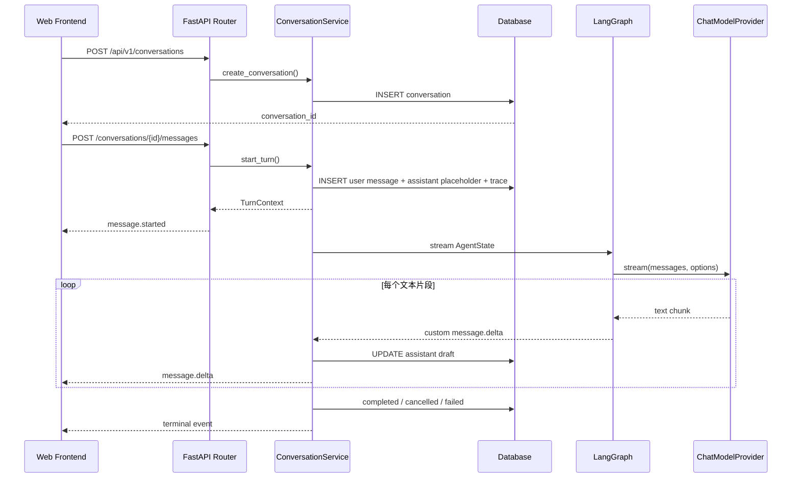
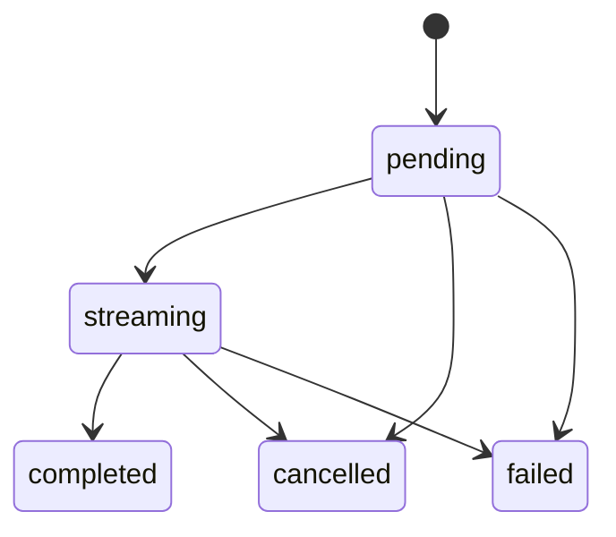

# 第一波文字聊天后端开发文档

## 1. 功能目标与范围

本模块把 Mio 从设计文档推进为可运行的文字聊天后端。它解决四个最基础的问题：

1. 前端可以创建和查询 Conversation。
2. 用户消息与澪的回复可以持久化。
3. 回复通过 SSE 流式返回，前端不必等待完整文本。
4. 每轮生成可以取消、失败可追踪、进程重启后状态能够收敛。

当前已经实现：

- 固定 Demo owner。
- 默认「澪」CompanionProfile。
- Conversation 和 Message 持久化。
- Mock LLM 与 OpenAI-compatible Chat Completions Provider。
- 轻量 LangGraph 工作流。
- SSE 事件流。
- 同一 Conversation 单活跃生成限制。
- 请求取消。
- SSE 客户端断开后立即把未完成助手消息收敛为 cancelled。
- AgentTrace 基础记录。
- PostgreSQL/Alembic 迁移。
- 测试环境 SQLite。
- 统一 JSON 错误结构。

当前没有实现：

- 注册、登录和多用户隔离。
- 长期记忆、RAG、Embedding、向量数据库。
- 情绪识别、意图分类、复杂 Safety 工作流。
- Tool Calling、Skill、MCP。
- Persona Builder。
- Live2D、ASR、TTS 和 WebRTC。

这些能力不能从当前代码中推断为已经存在。

## 2. 用户流程



用户消息会在调用模型前提交到数据库。因此即使 Provider 失败，用户输入仍然存在，前端可以展示失败状态并允许重试。

## 3. 模块架构与职责边界

```text
HTTP / SSE
  -> API Router
  -> ConversationService
  -> LangGraph
  -> ChatModelProvider

ConversationService
  -> SQLAlchemy AsyncSession
  -> ActiveRequestRegistry
  -> AgentTrace
```

### 3.1 API 层

位置：[routes.py](../../backend/src/mio/api/routes.py#L23)

职责：

- 解析路径、查询参数和 Pydantic 请求体。
- 调用 ConversationService。
- 把服务事件编码成 SSE。
- 不组装 Persona Prompt。
- 不直接访问 ORM Session。

### 3.2 ConversationService

位置：[conversations.py](../../backend/src/mio/services/conversations.py#L37)

职责：

- 校验 Conversation 属于 Demo owner。
- 管理消息和 Trace 事务。
- 加载最近上下文和 CompanionProfile。
- 驱动 LangGraph。
- 把流式草稿写入数据库。
- 处理完成、取消与失败。

它相当于 Spring Boot 项目中的 Application Service，但没有通过容器扫描自动注入，而是在应用工厂中显式构造。

### 3.3 Agent 层

位置：[graph.py](../../backend/src/mio/agent/graph.py#L13)

职责：

- 定义 AgentState。
- 定义 LangGraph 节点和边。
- 生成 `message.delta` 自定义事件。
- 不直接提交数据库事务。

当前图：


`load_context` 当前只标记状态。真正的数据库上下文加载在 ConversationService 中完成。这是第一波的刻意简化；后续加入 Memory/RAG 时，可以逐步把检索节点扩展进去。

### 3.4 Provider 层

接口位置：[base.py](../../backend/src/mio/llm/base.py#L19)

实现：

- [MockChatModelProvider](../../backend/src/mio/llm/mock.py#L8)
- [OpenAICompatibleChatModelProvider](../../backend/src/mio/llm/openai_compatible.py#L10)

Provider 只负责模型协议：

```text
stream(request_id, messages, options) -> AsyncIterator[str]
cancel(request_id)
```

ConversationService 不关心模型来自 OpenAI、DeepSeek、Ollama 还是本地兼容服务。

### 3.5 数据库层

位置：[models.py](../../backend/src/mio/db/models.py#L20)

职责：

- ORM 映射。
- 主外键、唯一约束和索引。
- 不包含 Agent 调用逻辑。

## 4. 目录与文件

```text
backend/
├── pyproject.toml
├── .env.example
├── alembic.ini
├── migrations/
│   ├── env.py
│   └── versions/20260609_0001_initial_chat.py
├── src/mio/
│   ├── main.py
│   ├── config.py
│   ├── agent/
│   │   ├── graph.py
│   │   └── prompt.py
│   ├── api/
│   │   ├── dependencies.py
│   │   ├── errors.py
│   │   ├── routes.py
│   │   └── schemas.py
│   ├── chat/registry.py
│   ├── db/
│   │   ├── base.py
│   │   ├── models.py
│   │   ├── seed.py
│   │   └── session.py
│   ├── llm/
│   │   ├── base.py
│   │   ├── factory.py
│   │   ├── mock.py
│   │   └── openai_compatible.py
│   └── services/
│       ├── conversations.py
│       └── recovery.py
└── tests/
```

根目录 [docker-compose.yml](../../docker-compose.yml) 只启动 PostgreSQL 16。后端默认在宿主机通过 uv 运行，便于热重载和调试。

云服务器已使用 Ubuntu 系统包部署 PostgreSQL 16.14，详细操作见 [云 PostgreSQL 部署文档](../deployment/postgresql-cloud.md)。

## 5. 核心类与数据结构

### 5.1 Settings

[Settings](../../backend/src/mio/config.py#L11) 使用 `pydantic-settings` 把环境变量转换为有类型的配置对象。

重要特点：

- 环境变量统一使用 `MIO_` 前缀。
- `.env` 固定从 `backend/.env` 读取，不依赖启动命令的当前工作目录。
- `Literal` 限制 environment 和 Provider 的合法值。
- `Field` 校验延迟和上下文条数。
- `get_settings()` 使用 `lru_cache`，避免重复解析 `.env`。

### 5.2 TurnContext

[TurnContext](../../backend/src/mio/services/conversations.py#L28) 是不可变 dataclass，保存一轮生成所需的 ID：

```text
conversation_id
request_id
user_message_id
assistant_message_id
trace_id
```

它不是数据库实体，只是服务内部的数据载体。

### 5.3 AgentState

[AgentState](../../backend/src/mio/agent/graph.py#L13) 是 `TypedDict`，描述节点之间共享的状态：

```text
request_id
profile
history
model
prompt_messages
display_text
status
```

后续加入 Memory/RAG 时，应新增明确字段，而不是把所有数据塞入一个任意 `metadata` 字典。

### 5.4 ActiveRequestRegistry

[registry.py](../../backend/src/mio/chat/registry.py) 使用进程内字典与 `asyncio.Lock`：

- Conversation ID 映射到当前 request。
- 第二个生成请求会得到 `409 conversation_busy`。
- cancel 会设置 `asyncio.Event`。
- terminal event 后释放注册项。
- 客户端中途关闭 SSE 时，即使无法再发送 terminal event，也会保存部分文本并标记 cancelled。

它只适用于单进程、单实例。多实例部署需要 Redis 或数据库锁。

## 6. API

统一业务前缀为 `/api/v1`，健康检查使用 `/api/health`。

### 6.1 健康检查

```http
GET /api/health/live
GET /api/health/ready
```

`live` 只表示进程能够处理请求。`ready` 会读取默认 CompanionProfile，从而验证数据库和种子数据可用。

### 6.2 默认 Companion

```http
GET /api/v1/companion/profile
```

示例响应：

```json
{
  "id": "uuid",
  "name": "澪",
  "relationship_type": "稳定陪伴者",
  "speaking_style": "清冷慢热、认真克制、害羞可爱、短句优先，不使用客服腔。",
  "boundaries": ["不冒充真人或已有动漫角色"]
}
```

### 6.3 Conversation

```http
POST /api/v1/conversations
GET  /api/v1/conversations
GET  /api/v1/conversations/{conversation_id}
```

创建请求：

```json
{
  "title": "新对话",
  "channel": "web"
}
```

两个字段都有默认值，因此 `{}` 也是合法请求。

### 6.4 消息历史

```http
GET /api/v1/conversations/{conversation_id}/messages?limit=50&cursor=...
```

- 默认 50 条，最大 100 条。
- 按 `created_at, id` 升序。
- `next_cursor` 是 URL-safe Base64，内部包含时间和 UUID。
- Cursor 是不透明协议，前端不能解析或修改。

### 6.5 流式消息

```http
POST /api/v1/conversations/{conversation_id}/messages
Content-Type: application/json
Accept: text/event-stream
```

请求：

```json
{
  "content": "今天写代码有点累。",
  "source": "text",
  "persist_history": true,
  "allow_memory_extraction": true
}
```

`allow_memory_extraction` 已存入 Message，但第一波没有 Memory 模块，不会执行记忆提取。

SSE 事件：

```text
message.started
message.delta
message.completed
message.cancelled
message.failed
```

示例：

```text
event: message.delta
data: {"request_id":"...","message_id":"...","trace_id":"...","delta":"嗯，先别"}

event: message.completed
data: {"request_id":"...","message_id":"...","trace_id":"...","display_text":"完整回复","speech_text":null}
```

SSE 编码位于 [routes.py 第 106 行](../../backend/src/mio/api/routes.py#L106)，业务事件生成位于 [conversations.py 第 288 行](../../backend/src/mio/services/conversations.py#L288)。

### 6.6 取消

```http
POST /api/v1/chat/requests/{request_id}/cancel
```

成功：

```json
{
  "request_id": "uuid",
  "cancelled": true
}
```

请求不存在或已经结束时返回 `404 request_not_active`。

## 7. 错误结构

所有普通 HTTP 错误统一为：

```json
{
  "code": "conversation_not_found",
  "message": "对话不存在。",
  "trace_id": "uuid",
  "details": {}
}
```

实现位于 [errors.py](../../backend/src/mio/api/errors.py)。

分类：

| HTTP | code | 场景 |
|---|---|---|
| 400 | `invalid_cursor` | Cursor 无法解析 |
| 404 | `conversation_not_found` | Conversation 不存在或不属于 Demo owner |
| 404 | `request_not_active` | 取消不存在的请求 |
| 409 | `conversation_busy` | 同一 Conversation 已有生成 |
| 422 | `validation_error` | Pydantic 请求校验失败 |
| 500 | `internal_error` | 非预期异常，响应不泄露内部信息 |

流开始之后不能再修改 HTTP 状态码，因此 Provider 错误通过 `message.failed` SSE 事件表达。

## 8. 数据库与迁移

迁移文件：[20260609_0001_initial_chat.py](../../backend/migrations/versions/20260609_0001_initial_chat.py)

### 8.1 users

| 字段 | 说明 |
|---|---|
| id | UUID 主键 |
| username | 唯一；当前固定为 `demo` |
| display_name | 展示名称 |
| created_at / updated_at | UTC 时间 |

### 8.2 companion_profiles

保存 Persona 数据。`(user_id, name)` 唯一，`user_id` 有索引。

### 8.3 conversations

字段：

- `user_id`
- `companion_id`
- `channel`
- `title`
- `status`

索引 `ix_conversations_user_updated(user_id, updated_at)` 用于按 owner 查询最近对话。

### 8.4 messages

关键字段：

- `role`
- `display_text`
- `speech_text`
- `status`
- `request_id`
- `source`
- `persist_history`
- `allow_memory_extraction`
- `error_code`
- `error_message`

索引：

- `ix_messages_conversation_created(conversation_id, created_at, id)`
- `ix_messages_active_generation(conversation_id, status)`
- `request_id` 唯一约束

状态：



用户消息直接以 `completed` 写入。

### 8.5 agent_traces

保存 Provider、模型、状态、耗时、错误阶段和节点摘要。它不是完整 Debug Console，只是后续可观测性的基础。

### 8.6 种子与恢复

[seed_demo_data](../../backend/src/mio/db/seed.py#L16) 先查询再插入，可重复执行。

[recover_incomplete_generations](../../backend/src/mio/services/recovery.py#L7) 在启动时把遗留 `pending/streaming` 消息改为 `failed`，错误码为 `generation_interrupted`。

开发和生产环境不会调用 `metadata.create_all()`。必须显式执行 Alembic：

```bash
uv run alembic upgrade head
```

只有测试环境会自动建 SQLite 表。

## 9. Prompt、Agent 与 Provider 边界

Persona Prompt 位于 [prompt.py](../../backend/src/mio/agent/prompt.py#L1)，内容来自数据库 CompanionProfile。

当前 Prompt 包含：

- 角色名与关系。
- 表达风格。
- 先理解感受再决定是否建议。
- 人设边界。
- 短句和非客服腔约束。

当前没有结构化的情绪识别输出，也没有 RAG Context。不能把 Mock Provider 的关键词判断当成真实情绪分类器。

LangGraph 负责节点顺序和流事件，Provider 负责外部模型协议，ConversationService 负责数据库和事务。这三个边界后续应保持。

## 10. 配置

参考 [`.env.example`](../../backend/.env.example)：

| 环境变量 | 默认值 | 说明 |
|---|---|---|
| `MIO_ENVIRONMENT` | `development` | development/test/production |
| `MIO_DATABASE_URL` | PostgreSQL 本地地址 | SQLAlchemy async URL |
| `MIO_LLM_PROVIDER` | `mock` | mock/openai_compatible |
| `MIO_LLM_BASE_URL` | 空 | 例如 `http://localhost:11434/v1` |
| `MIO_LLM_API_KEY` | 空 | 只存在服务端 |
| `MIO_LLM_MODEL` | `mock-mio` | 模型名 |
| `MIO_MOCK_CHUNK_DELAY_MS` | `0` | Mock 每片延迟 |
| `MIO_CORS_ORIGINS` | localhost:5173 | JSON 数组 |

本机当前的 `backend/.env` 已配置为通过 `127.0.0.1:15432` SSH
隧道连接云端 PostgreSQL。该文件权限为 `600` 且被 `.gitignore` 排除，
不得提交或复制其中的数据库密码。

## 11. 启动、测试与调试

### 11.1 安装

```bash
cd /Users/awei/Documents/mio-ai-companion/backend
uv sync
```

预期：uv 安装 Python 3.12、创建 `.venv` 并同步锁定依赖。

### 11.2 PostgreSQL

```bash
cd /Users/awei/Documents/mio-ai-companion
docker compose up -d postgres

cd backend
uv run alembic upgrade head
uv run alembic current
```

预期 migration revision：

```text
20260609_0001 (head)
```

### 11.3 启动 API

```bash
uv run uvicorn mio.main:app --reload
```

当前本机调试实例由 macOS `launchd` 以 `com.mio.backend` 名称托管，
监听 `127.0.0.1:8000`。云数据库 SSH 隧道必须同时监听
`127.0.0.1:15432`，否则应用启动阶段的数据库检查会失败。

查看托管状态：

```bash
launchctl print gui/$(id -u)/com.mio.backend
lsof -nP -iTCP:15432 -sTCP:LISTEN
```

访问：

- Swagger UI：<http://127.0.0.1:8000/docs>
- OpenAPI：<http://127.0.0.1:8000/openapi.json>
- Ready：<http://127.0.0.1:8000/api/health/ready>

### 11.4 测试

```bash
uv run pytest -q
uv run ruff check .
uv run mypy src
```

当前预期：

```text
21 passed
All checks passed!
Success: no issues found in 26 source files
```

真实 PostgreSQL 16.14 已通过 SSH 隧道完成 migration、应用启动、SSE 对话和消息持久化验证。

### 11.5 SSE 调试

先创建 Conversation：

```bash
curl -s -X POST http://127.0.0.1:8000/api/v1/conversations \
  -H 'Content-Type: application/json' \
  -d '{}'
```

取响应中的 `id`：

```bash
curl -N -X POST \
  http://127.0.0.1:8000/api/v1/conversations/<id>/messages \
  -H 'Content-Type: application/json' \
  -H 'Accept: text/event-stream' \
  -d '{"content":"今天写代码有点累。","source":"text"}'
```

`-N` 禁止 curl 缓冲，否则看起来像非流式返回。

## 12. Mock Provider

默认 Provider 是 Mock，不需要 API Key。

行为见 [mock.py 第 15 行](../../backend/src/mio/llm/mock.py#L15)：

- 包含“累”或“烦”时返回安抚文本。
- 包含“在吗”时返回在场回应。
- 其他内容返回稳定模板。
- 每 6 个字符产生一个 chunk。
- `MIO_MOCK_CHUNK_DELAY_MS` 可以模拟网络延迟。

Mock 的目的：

- 自动化测试稳定。
- 前端可以在没有模型账户时开发 SSE。
- 演示取消和失败状态。

Mock 不代表真实 LLM 能力。

## 13. 技术决策

### 使用 uv

相比 `pip + requirements.txt`，uv 同时管理 Python 版本、虚拟环境、依赖解析和 lock file，方便面试者复现。

### 测试使用 SQLite，运行使用 PostgreSQL

SQLite 让单元和 API 测试快速且无外部依赖；Alembic 仍以 PostgreSQL 方言生成迁移。数据库相关特性增加后，应补 PostgreSQL 集成测试。

### SSE 而非 WebSocket

第一波只有服务器向浏览器推送文本，SSE 足够。WebSocket 会增加连接状态和双向协议复杂度。

### 原生 StreamingResponse

SSE 格式简单，使用 Starlette 原生 StreamingResponse 可以减少依赖，并避免额外库在多事件循环测试中的全局状态问题。

### 轻量 LangGraph

当前流程本可由普通 Service 完成，但提前建立最小图可以让后续 Memory、RAG 和 Tool 节点有稳定位置。图中没有提前实现未来逻辑。

### 先保存用户消息

Provider 失败时，用户输入仍可追踪和重试。代价是数据库中可能存在 failed assistant message，这是前端需要正确展示的业务状态。

## 14. 已知限制与扩展点

1. ActiveRequestRegistry 在进程内，只支持单实例。
2. 流式草稿每个 chunk 提交一次数据库，真实高吞吐阶段需要节流或批量刷新。
3. `persist_history=false` 的消息仍作为操作记录保存在表中，但不会进入后续 Prompt 上下文。
4. `allow_memory_extraction` 只保存标志，Memory 尚未实现。
5. AgentTrace 没有公开查询 API。
6. 没有自动生成 Conversation 标题。
7. OpenAI-compatible Provider 当前只解析标准 `data:` Chat Completions 流。
8. 没有 Token 统计、重试、超时分级和限流。
9. 测试数据库是 SQLite，仍需要持续保留 PostgreSQL 集成验证。

下一阶段建议先增加情绪/意图的结构化输出和 Trace 查询，再进入长期记忆。

## 15. 重要代码索引

- 应用工厂与生命周期：[main.py](../../backend/src/mio/main.py#L24)
- 配置：[config.py](../../backend/src/mio/config.py#L8)
- API 与 SSE：[routes.py](../../backend/src/mio/api/routes.py#L23)
- ORM 模型：[models.py](../../backend/src/mio/db/models.py#L20)
- Conversation Service：[conversations.py](../../backend/src/mio/services/conversations.py#L37)
- LangGraph：[graph.py](../../backend/src/mio/agent/graph.py#L13)
- Persona Prompt：[prompt.py](../../backend/src/mio/agent/prompt.py#L1)
- Provider 接口：[base.py](../../backend/src/mio/llm/base.py#L19)
- Mock Provider：[mock.py](../../backend/src/mio/llm/mock.py#L8)
- OpenAI-compatible Provider：[openai_compatible.py](../../backend/src/mio/llm/openai_compatible.py#L10)
- API 行为测试：[test_conversations_api.py](../../backend/tests/test_conversations_api.py#L27)
