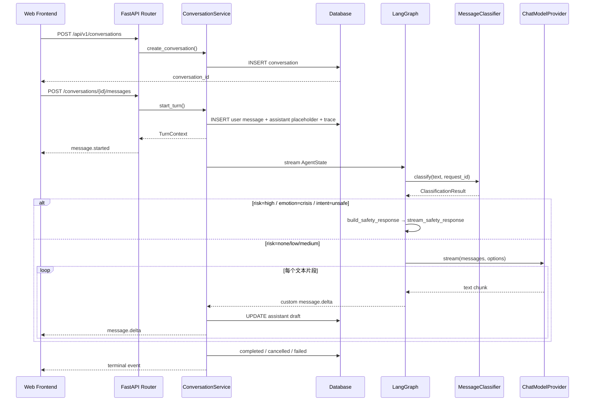
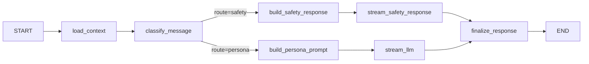
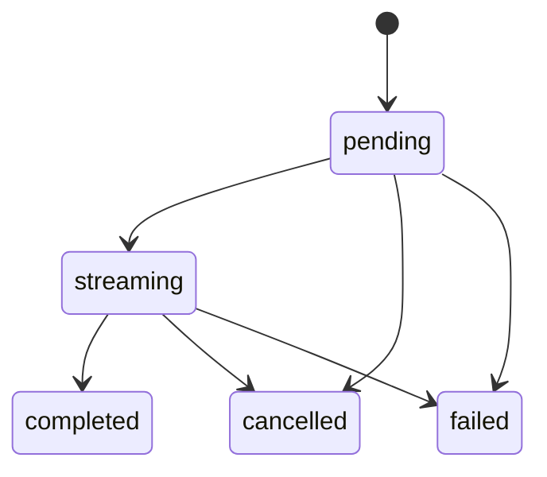
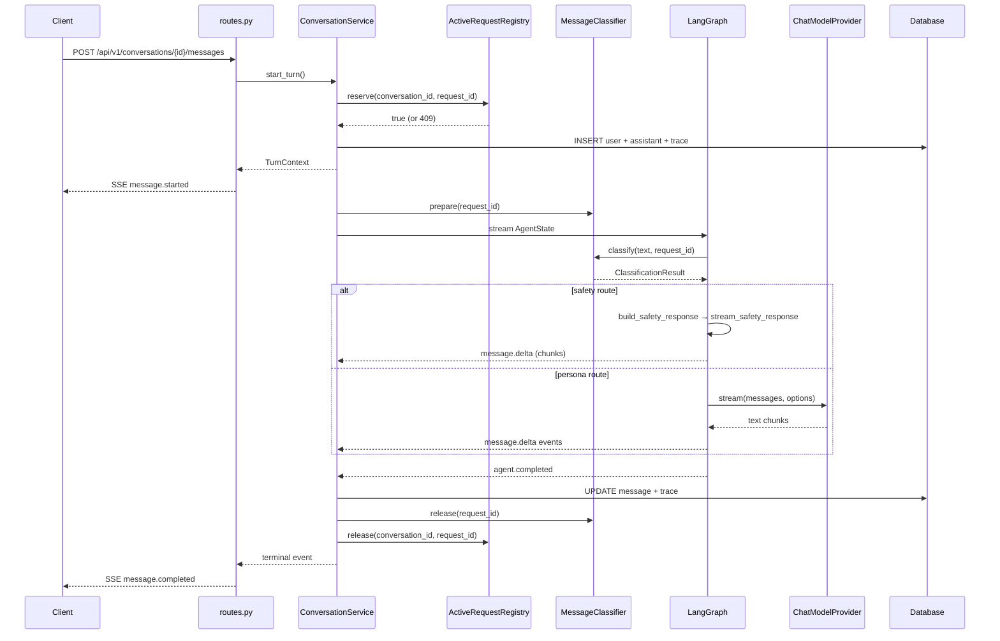

# Mio 文字聊天后端开发文档

> 本文档以当前代码实现为准。未实现的功能明确标注为「尚未实现」。

## 1. 功能目标与范围

本模块把 Mio 从设计文档推进为可运行的文字聊天后端。它解决五个基础问题：

1. 前端可以创建和查询 Conversation。
2. 用户消息与澪的回复可以持久化。
3. 回复通过 SSE 流式返回，前端不必等待完整文本。
4. 每轮生成可以取消、失败可追踪、进程重启后状态能够收敛。
5. 消息经过结构化分类后条件路由到 Safety 或 Persona 回复路径。

### 当前已实现

- 固定 Demo owner。
- 默认「澪」CompanionProfile。
- Conversation 和 Message 持久化。
- Mock LLM 与 OpenAI-compatible Chat Completions Provider。
- 消息分类模块（emotion / intent / risk）。
- Mock 分类器与 OpenAI-compatible 分类器。
- LangGraph 条件路由：分类 → Safety 或 Persona 分支。
- Safety 确定性回复模板。
- Persona Prompt 分类感知策略。
- SSE 事件流。
- 同一 Conversation 单活跃生成限制。
- 请求取消（含分类阶段取消）。
- SSE 客户端断开后立即把未完成助手消息收敛为 cancelled。
- AgentTrace 基础记录 + 分类字段。
- Trace 查询 API（列表 + 详情，游标分页，owner 隔离）。
- node_summary 白名单脱敏。
- PostgreSQL / Alembic 迁移（两个版本）。
- 测试环境 SQLite。
- 统一 JSON 错误结构。

### 当前未实现

- 注册、登录和多用户隔离。
- 长期记忆、RAG、Embedding、向量数据库。
- Tool Calling、Skill、MCP。
- Persona Builder。
- Live2D、ASR、TTS 和 WebRTC。
- Debug Console 前端页面。
- Reminder 执行能力。

这些能力不能从当前代码中推断为已经存在。

## 2. 用户流程



用户消息会在调用模型前提交到数据库。因此即使 Provider 失败，用户输入仍然存在，前端可以展示失败状态并允许重试。

## 3. 模块架构与职责边界

```text
HTTP / SSE
  -> API Router
  -> ConversationService
  -> LangGraph
       -> MessageClassifier
       -> ChatModelProvider (仅 Persona 路径)

ConversationService
  -> SQLAlchemy AsyncSession
  -> ActiveRequestRegistry
  -> AgentTrace

TraceService (独立查询服务)
  -> SQLAlchemy AsyncSession (只读)
```

### 3.1 API 层

位置：`backend/src/mio/api/routes.py`

职责：

- 解析路径、查询参数和 Pydantic 请求体。
- 调用 ConversationService 和 TraceService。
- 把服务事件编码成 SSE。
- 不组装 Persona Prompt。
- 不直接访问 ORM Session。

路由分组：

| Router | 前缀 | 用途 |
|---|---|---|
| `health_router` | `/api/health` | 存活和就绪检查 |
| `api_router` | `/api/v1` | 业务端点 |

### 3.2 ConversationService

位置：`backend/src/mio/services/conversations.py`

职责：

- 校验 Conversation 属于 Demo owner。
- 管理消息和 Trace 事务。
- 加载最近上下文和 CompanionProfile。
- 驱动 LangGraph。
- 把流式草稿写入数据库。
- 处理完成、取消与失败。
- 写入分类 trace 字段。

它相当于 Spring Boot 项目中的 Application Service，但没有通过容器扫描自动注入，而是在应用工厂中显式构造。

### 3.3 TraceService

位置：`backend/src/mio/services/traces.py`

职责：

- 查询 AgentTrace（只读，不写入）。
- Owner 隔离：通过 `AgentTrace → Conversation.user_id` JOIN。
- 游标编解码。
- node_summary 白名单脱敏。

它独立于 ConversationService，不共享状态。

### 3.4 Agent 层

位置：`backend/src/mio/agent/graph.py`

职责：

- 定义 AgentState。
- 定义 LangGraph 节点和边。
- 生成 `message.delta` 自定义事件。
- 不直接提交数据库事务。

### 3.5 Classification 层

位置：`backend/src/mio/classification/`

职责：

- 定义分类枚举和 Pydantic Schema。
- 提供 `MessageClassifier` ABC。
- 实现 Mock 和 OpenAI-compatible 分类器。
- 工厂函数根据配置创建分类器实例。

### 3.6 Provider 层

接口位置：`backend/src/mio/llm/base.py`

实现：

- `backend/src/mio/llm/mock.py`
- `backend/src/mio/llm/openai_compatible.py`

Provider 只负责模型协议：

```text
stream(request_id, messages, options) -> AsyncIterator[str]
cancel(request_id)
```

ConversationService 不关心模型来自 OpenAI、DeepSeek、Ollama 还是本地兼容服务。

### 3.7 数据库层

位置：`backend/src/mio/db/models.py`

职责：

- ORM 映射。
- 主外键、唯一约束和索引。
- 不包含 Agent 调用逻辑。

## 4. 目录与文件

```text
backend/
├── pyproject.toml
├── .env.example
├── alembic.ini
├── migrations/
│   ├── env.py
│   └── versions/
│       ├── 20260609_0001_initial_chat.py
│       └── 20260613_0002_m2_classification_trace.py
├── src/mio/
│   ├── main.py                  # 应用工厂、lifespan、服务挂载
│   ├── config.py                # Settings (pydantic-settings)
│   ├── py.typed                 # PEP 561 标记
│   ├── agent/
│   │   ├── graph.py             # LangGraph 工作流、AgentState、条件路由
│   │   ├── prompt.py            # Persona Prompt 构建（含分类策略）
│   │   └── safety.py            # Safety 回复模板与流式输出
│   ├── api/
│   │   ├── dependencies.py      # FastAPI Depends 辅助
│   │   ├── errors.py            # AppError + 统一错误处理
│   │   ├── routes.py            # HTTP 路由 + SSE 编码
│   │   └── schemas.py           # Pydantic 请求/响应模型
│   ├── chat/
│   │   └── registry.py          # ActiveRequestRegistry
│   ├── classification/
│   │   ├── __init__.py          # re-export 公开类型
│   │   ├── base.py              # MessageClassifier ABC
│   │   ├── exceptions.py        # 分类异常层次
│   │   ├── factory.py           # create_message_classifier()
│   │   ├── mock.py              # MockMessageClassifier
│   │   ├── models.py            # 枚举 + Schema + fallback
│   │   └── openai_compatible.py # OpenAICompatibleMessageClassifier
│   ├── db/
│   │   ├── base.py              # SQLAlchemy Base + mixin
│   │   ├── models.py            # ORM 模型
│   │   ├── seed.py              # 种子数据
│   │   └── session.py           # Engine 和 Session 工厂
│   ├── llm/
│   │   ├── base.py              # ChatModelProvider ABC
│   │   ├── factory.py           # create_chat_model_provider()
│   │   ├── mock.py              # MockChatModelProvider
│   │   └── openai_compatible.py # OpenAICompatibleChatModelProvider
│   └── services/
│       ├── conversations.py     # ConversationService
│       ├── recovery.py          # 启动时恢复未完成生成
│       └── traces.py            # TraceService + sanitize_node_summary
└── tests/
    ├── conftest.py
    ├── test_agent_and_providers.py
    ├── test_cancel_and_isolation.py
    ├── test_classification.py
    ├── test_classifier_factory.py
    ├── test_config.py
    ├── test_conversations_api.py
    ├── test_graph_routing.py
    ├── test_health_and_profile.py
    ├── test_openai_compatible_classifier.py
    ├── test_provider_failure.py
    ├── test_runtime_behaviors.py
    ├── test_trace_persistence.py
    └── test_traces_api.py
```

根目录 `docker-compose.yml` 只启动 PostgreSQL 16。后端默认在宿主机通过 uv 运行，便于热重载和调试。

## 5. 核心类与数据结构

### 5.1 Settings

`backend/src/mio/config.py` 中的 `Settings` 使用 `pydantic-settings` 把环境变量转换为有类型的配置对象。

重要特点：

- 环境变量统一使用 `MIO_` 前缀。
- `.env` 固定从 `backend/.env` 读取，不依赖启动命令的当前工作目录。
- `Literal` 限制 environment、LLM Provider 和 Classifier Provider 的合法值。
- `Field` 校验延迟和上下文条数。
- `get_settings()` 使用 `lru_cache`，避免重复解析 `.env`。

### 5.2 TurnContext

`backend/src/mio/services/conversations.py` 中的 `TurnContext` 是不可变 dataclass，保存一轮生成所需的 ID：

```text
conversation_id
request_id
user_message_id
assistant_message_id
trace_id
```

它不是数据库实体，只是服务内部的数据载体。

### 5.3 AgentState

`backend/src/mio/agent/graph.py` 中的 `AgentState` 是 `TypedDict`，描述节点之间共享的状态：

```python
class AgentState(TypedDict, total=False):
    request_id: UUID
    current_user_text: str
    profile: dict[str, Any]
    history: list[ChatMessage]
    model: str
    classification: ClassificationResult
    classification_status: str      # "success" | "fallback"
    classification_error_code: str  # provider_error | schema_invalid | classification_cancelled
    route: str                      # "safety" | "persona"
    prompt_messages: list[ChatMessage]
    safety_response: str
    display_text: str
    status: str
    node_summary: dict[str, Any]
```

后续加入 Memory/RAG 时，应新增明确字段，而不是把所有数据塞入一个任意 `metadata` 字典。

### 5.4 ActiveRequestRegistry

`backend/src/mio/chat/registry.py` 使用进程内字典与 `asyncio.Lock`：

- Conversation ID 映射到当前 request。
- 第二个生成请求会得到 `409 conversation_busy`。
- cancel 会设置 `asyncio.Event`。
- terminal event 后释放注册项。
- 客户端中途关闭 SSE 时，即使无法再发送 terminal event，也会保存部分文本并标记 cancelled。

它只适用于单进程、单实例。多实例部署需要 Redis 或数据库锁。

## 6. 分类枚举与 Schema

### 6.1 EmotionLabel（9 值）

```text
crisis, angry, anxious, sad, lonely, tired, happy, embarrassed, calm
```

检测优先级：crisis > angry > anxious > sad/lonely > tired > happy > embarrassed > calm

### 6.2 IntentLabel（5 值）

```text
unsafe, reminder, mixed, knowledge_qa, companion
```

检测优先级：unsafe > reminder > mixed > knowledge_qa > companion

### 6.3 RiskLevel（4 值）

```text
none, low, medium, high
```

支持 `<`/`<=`/`>`/`>=` 语义排序。

### 6.4 ClassificationResult

```python
ClassificationResult(
    emotion=EmotionResult(label=EmotionLabel, confidence=0.0~1.0),
    intent=IntentResult(label=IntentLabel, confidence=0.0~1.0),
    risk=RiskResult(level=RiskLevel, confidence=0.0~1.0),
)
```

**验证规则：**

- 所有 Schema 使用 `strict=True`：拒绝字符串隐式转枚举、字符串隐式转浮点数。
- 所有 Schema 使用 `extra="forbid"`：拒绝未知字段。
- `confidence` 范围：`0.0 <= x <= 1.0`。

**交叉约束（model_validator）：**

- `emotion=crisis` → `risk.level` 必须为 `high`
- `intent=unsafe` → `risk.level` 必须为 `high`

违反约束时抛出 `ValidationError`，错误信息包含触发条件和实际值。

### 6.5 Fallback 结果

```python
classification_fallback() → ClassificationResult(
    emotion=EmotionResult(label=calm, confidence=0.0),
    intent=IntentResult(label=companion, confidence=0.0),
    risk=RiskResult(level=medium, confidence=0.0),
)
```

## 7. MessageClassifier 接口与生命周期

### 7.1 接口

```python
class MessageClassifier(ABC):
    name: str

    async def prepare(self, request_id: UUID) -> None: ...
    async def classify(self, text: str, *, request_id: UUID) -> ClassificationResult: ...
    async def cancel(self, request_id: UUID) -> None: ...
    async def release(self, request_id: UUID) -> None: ...
    async def aclose(self) -> None: ...
```

### 7.2 生命周期（由 ConversationService.stream_turn 驱动）

```text
stream_turn 开始
  → classifier.prepare(request_id)     # 在 message.started 之前
  → yield message.started
  → 用户可能 cancel
  → Graph 运行 → classify(text, request_id)
  → terminal event (completed/cancelled/failed)
  → finally:
      classifier.release(request_id)   # 在 registry.release 之前
      registry.release(conversation_id, request_id)
```

### 7.3 竞态根因与解决方案

**问题**：如果 `cancel_event` 在 `classify()` 内部注册，存在以下窗口：

1. `stream_turn` yield `message.started`
2. 用户调用 `cancel()` → `classifier.cancel()` 是 no-op（event 尚未注册）
3. `classify()` 创建全新的、未取消的 Event
4. HTTP 请求正常发出

**解决方案**：`prepare()` 在 `message.started` 之前注册 Event。`cancel()` 只 `set()` 已存在的 Event。`classify()` 复用 `prepare()` 创建的 Event。

### 7.4 各方法职责

- **`prepare(request_id)`**：在 `_cancel_events` 中注册 `asyncio.Event`。幂等，不覆盖已 set 的 Event。
- **`classify(text, request_id)`**：复用 `prepare()` 的 Event。如果已 set，立即抛出 `ClassificationCancelledError`，不执行 I/O。
- **`cancel(request_id)`**：只对 `_cancel_events` 中已存在的 Event 调用 `set()`。非活跃 request_id 为 no-op。
- **`release(request_id)`**：删除 `_cancel_events` 和 `_active_tasks` 中的状态。多次调用安全。
- **`aclose()`**：set 所有 active cancel events → 等待所有 active classify tasks 退出 → 清理 → 关闭 HTTP client。

## 8. MockMessageClassifier

位置：`backend/src/mio/classification/mock.py`

基于关键词的确定性分类器，用于测试和开发。

### 8.1 Emotion 关键词（按优先级）

| 标签 | 关键词 |
|---|---|
| crisis | 不想活、自杀、想死、活不下去、结束生命、轻生 |
| angry | 气死、愤怒、烦死、生气、可恶、恼火 |
| anxious | 焦虑、紧张、害怕、恐惧、不安、慌 |
| sad | 难过、伤心、想哭、悲伤、心碎、痛苦 |
| lonely | 孤独、寂寞、没人陪、一个人、被抛弃 |
| tired | 累、疲惫、不想动、好困、筋疲力尽 |
| happy | 开心、高兴、太好了、快乐、幸福、棒 |
| embarrassed | 尴尬、害羞、不好意思、丢脸 |
| calm | 兜底 |

### 8.2 Intent 关键词（按优先级）

| 标签 | 关键词 |
|---|---|
| unsafe | 自残、自杀、不想活、结束生命、轻生、想死 |
| reminder | 提醒、记得、别忘了、定时、闹钟 |
| mixed | 情绪信号 + 知识信号同时出现 |
| knowledge_qa | 什么是、为什么、怎么、如何、解释、原理、GIL |
| companion | 兜底 |

**注意**：`unsafe` 关键词故意排除了单独的「伤害」——因为「他伤害了我」「我不想伤害别人」「不小心伤害了朋友」均不是自残意图。

### 8.3 Risk 映射

| 条件 | Risk |
|---|---|
| emotion=crisis 或 intent=unsafe | high |
| emotion=angry 或 emotion=anxious | medium |
| 其他 | none |

### 8.4 已知局限

- 关键词匹配，非语义理解。
- `knowledge_qa` 中的「怎么」可能误触发，但优先级低于 `unsafe`。
- 置信度固定为 0.9，不反映实际匹配强度。

## 9. OpenAICompatibleMessageClassifier

位置：`backend/src/mio/classification/openai_compatible.py`

### 9.1 请求协议

- 端点：`{base_url}/chat/completions`
- `stream=false`、`temperature=0`
- `response_format.type=json_schema`，使用 `ClassificationResult.model_json_schema()` 生成
- Authorization header 仅在 api_key 非空时发送
- System prompt 要求模型按 schema 返回 JSON

### 9.2 响应校验

- 直接使用 `ClassificationResult.model_validate_json(content)` 校验
- 禁止删除 Markdown fence、正则提取 JSON、修补枚举或模糊解析
- 空 choices → `ClassificationProviderError`
- 空 content → `ClassificationSchemaInvalidError`
- 非法 JSON → `ClassificationSchemaInvalidError`
- 非法枚举 → `ClassificationSchemaInvalidError`
- 额外字段 → `ClassificationSchemaInvalidError`
- confidence 越界 → `ClassificationSchemaInvalidError`
- 交叉约束失败 → `ClassificationSchemaInvalidError`
- HTTP 4xx/5xx → `ClassificationProviderError`

### 9.3 Task 管理

`_do_classify()` 创建两个子 task：

- `http_task`：HTTP POST 请求
- `cancel_task`：`cancel_event.wait()`

`asyncio.wait()` 竞争两者。`finally` 中对未完成的 task 执行 `cancel()` + `await asyncio.gather(return_exceptions=True)`。

`_active_tasks: dict[UUID, asyncio.Task]` 跟踪外层 classify task，使 `aclose()` 能真正停止活动分类。

### 9.4 异常层次

```text
ClassificationError (base)
├── ClassificationProviderError      — HTTP/连接错误
├── ClassificationSchemaInvalidError — 响应校验失败
└── ClassificationCancelledError     — 分类请求被取消（业务级取消，非 asyncio.CancelledError）
```

## 10. 工厂与配置

### 10.1 Settings 中的分类器字段

```python
classifier_provider: Literal["mock", "openai_compatible"] = "mock"
classifier_model: str = "mock-classifier"
classifier_base_url: str = ""
classifier_api_key: str = ""
```

### 10.2 工厂函数

位置：`backend/src/mio/classification/factory.py`

```python
create_message_classifier(settings) → MessageClassifier
```

- `mock` → `MockMessageClassifier()`
- `openai_compatible` → `OpenAICompatibleMessageClassifier(...)`
- 缺少 `classifier_base_url` 时抛出 `ValueError`

### 10.3 .env.example

```text
MIO_CLASSIFIER_PROVIDER=mock
MIO_CLASSIFIER_MODEL=mock-classifier
MIO_CLASSIFIER_BASE_URL=
MIO_CLASSIFIER_API_KEY=
```

## 11. LangGraph 条件路由

### 11.1 图结构

```text
START
→ load_context
→ classify_message
   → [safety] → build_safety_response → stream_safety_response → finalize_response → END
   → [persona] → build_persona_prompt → stream_llm → finalize_response → END
```



### 11.2 路由规则

| 条件 | 路由 |
|---|---|
| `risk=high` 或 `emotion=crisis` 或 `intent=unsafe` | safety |
| 其他 | persona |

### 11.3 节点执行追踪（node_summary）

每个节点写入状态字典：

```json
{
  "load_context": {"status": "completed", "error_code": null},
  "classify_message": {"status": "completed", "duration_ms": 18, "error_code": null},
  "build_persona_prompt": {"status": "completed", "error_code": null},
  "stream_llm": {"status": "completed", "error_code": null},
  "finalize_response": {"status": "completed", "error_code": null}
}
```

## 12. Safety 与 Persona Prompt 边界

### 12.1 Safety 路径

位置：`backend/src/mio/agent/safety.py`

- **不调用 ChatModelProvider**。
- 停止恋爱、暧昧和角色扮演表达。
- 不做医疗诊断。
- 不假设用户所在国家。
- 不硬编码某个国家的电话号码。
- 通过 `message.delta` + `message.completed` 流式输出。
- 按 20 字符固定切片，行为确定且可测试。

两种模板：

- **crisis/unsafe**：确认安全、建议联系紧急服务、鼓励联系信任的人。
- **其他 high risk**：确认安全、建议联系信任的人、建议紧急服务。

### 12.2 Persona Prompt 路径

位置：`backend/src/mio/agent/prompt.py`

分类结果转换为简短回复策略文本，不将完整 JSON 塞入 Prompt：

| 分类 | 策略 |
|---|---|
| sad/lonely | 先温柔回应感受，再询问是否想聊或需要建议 |
| anxious | 先帮助稳定情绪，再温和拆分问题 |
| tired | 避免立刻施压，优先承认疲惫 |
| angry | 先承认感受，避免激化 |
| mixed | 先简短回应情绪，再回答问题 |
| knowledge_qa | 保持人设，清晰回答 |
| reminder | 说明理解意图，不假装已创建提醒 |
| risk=medium | 加入谨慎、安全约束 |
| fallback | 加格外谨慎约束 |

## 13. Classification Provider/Schema 错误 Fallback

当分类失败时（Provider 错误、Schema 校验失败、或取消），使用 `classification_fallback()` 降级：

- `emotion=calm, confidence=0`
- `intent=companion, confidence=0`
- `risk=medium, confidence=0`
- `classification_status="fallback"`
- `classification_error_code` 为具体错误码

Fallback 后路由到 Persona（因为 risk=medium 不满足 safety 条件），Prompt 中会加入格外谨慎约束。

## 14. API

统一业务前缀为 `/api/v1`，健康检查使用 `/api/health`。

### 14.1 健康检查

```http
GET /api/health/live
GET /api/health/ready
```

`live` 只表示进程能够处理请求。`ready` 会读取默认 CompanionProfile，从而验证数据库和种子数据可用。

### 14.2 默认 Companion

```http
GET /api/v1/companion/profile
```

示例响应：

```json
{
  "id": "uuid",
  "name": "澪",
  "relationship_type": "稳定陪伴者",
  "speaking_style": "清冷慢热、认真克制、害羞可爱、短句优先，不使用客服腔。",
  "boundaries": ["不冒充真人或已有动漫角色"]
}
```

### 14.3 Conversation

```http
POST /api/v1/conversations
GET  /api/v1/conversations
GET  /api/v1/conversations/{conversation_id}
```

创建请求：

```json
{
  "title": "新对话",
  "channel": "web"
}
```

两个字段都有默认值，因此 `{}` 也是合法请求。

### 14.4 消息历史

```http
GET /api/v1/conversations/{conversation_id}/messages?limit=50&cursor=...
```

- 默认 50 条，最大 100 条。
- 按 `created_at, id` 升序。
- `next_cursor` 是 URL-safe Base64，内部包含时间和 UUID。
- Cursor 是不透明协议，前端不能解析或修改。

### 14.5 流式消息

```http
POST /api/v1/conversations/{conversation_id}/messages
Content-Type: application/json
Accept: text/event-stream
```

请求：

```json
{
  "content": "今天写代码有点累。",
  "source": "text",
  "persist_history": true,
  "allow_memory_extraction": true
}
```

`allow_memory_extraction` 已存入 Message，但当前没有 Memory 模块，不会执行记忆提取。

SSE 事件：

```text
message.started
message.delta
message.completed
message.cancelled
message.failed
```

示例：

```text
event: message.delta
data: {"request_id":"...","message_id":"...","trace_id":"...","delta":"嗯，先别"}

event: message.completed
data: {"request_id":"...","message_id":"...","trace_id":"...","display_text":"完整回复","speech_text":null}
```

内部 `agent.completed` 事件不暴露给前端。分类结果通过 Trace API 查询。

### 14.6 取消

```http
POST /api/v1/chat/requests/{request_id}/cancel
```

成功：

```json
{
  "request_id": "uuid",
  "cancelled": true
}
```

请求不存在或已经结束时返回 `404 request_not_active`。

### 14.7 Trace 查询 API

#### GET /api/v1/traces

列表查询，owner 隔离，游标分页。

请求参数：

| 参数 | 类型 | 默认值 | 说明 |
|---|---|---|---|
| `conversation_id` | UUID | None | 按对话 ID 过滤 |
| `status` | str | None | 按状态过滤（completed/cancelled/failed 等） |
| `limit` | int | 20 | 每页数量，范围 1~100 |
| `cursor` | str | None | 分页游标（不透明，Base64 编码） |

响应：

```json
{
  "items": [TraceResponse, ...],
  "next_cursor": "string | null"
}
```

#### GET /api/v1/traces/{trace_id}

单条详情，owner 隔离。

响应：`TraceResponse`

#### TraceResponse 字段

| 字段 | 类型 | 可空 | 说明 |
|---|---|---|---|
| `id` | UUID | 否 | Trace ID |
| `conversation_id` | UUID | 否 | 所属对话 ID |
| `request_id` | UUID | 否 | 请求 ID |
| `status` | str | 否 | pending/streaming/completed/cancelled/failed |
| `provider` | str | 否 | LLM Provider 名称 |
| `model` | str | 否 | 模型标识 |
| `duration_ms` | int | 是 | 耗时毫秒数 |
| `error_stage` | str | 是 | 错误阶段 |
| `error_code` | str | 是 | 错误码 |
| `emotion_label` | str | 是 | 情绪标签 |
| `emotion_confidence` | float | 是 | 情绪置信度 |
| `intent_label` | str | 是 | 意图标签 |
| `intent_confidence` | float | 是 | 意图置信度 |
| `risk_level` | str | 是 | 风险等级 |
| `risk_confidence` | float | 是 | 风险置信度 |
| `classification_status` | str | 是 | 分类状态 |
| `classification_error_code` | str | 是 | 分类错误码 |
| `route` | str | 是 | 路由（persona/safety） |
| `trace_schema_version` | int | 否 | Schema 版本，≥1（数据库 NULL→1） |
| `node_summary` | dict[str, dict] | 否 | 脱敏后的节点摘要 |
| `created_at` | datetime | 否 | 创建时间 |
| `updated_at` | datetime | 否 | 更新时间 |

#### Trace 错误码

| HTTP | code | 场景 |
|---|---|---|
| 400 | `invalid_cursor` | 非法游标格式 |
| 404 | `trace_not_found` | Trace 不存在或不属于当前 owner |
| 422 | `validation_error` | 参数校验失败（limit 越界等） |

## 15. AgentTrace M2 字段

### 15.1 10 个 M2 新增字段

| 字段 | 类型 | 说明 |
|---|---|---|
| `emotion_label` | VARCHAR(32) NULLABLE | 情绪标签 |
| `emotion_confidence` | FLOAT NULLABLE | 情绪置信度 |
| `intent_label` | VARCHAR(32) NULLABLE | 意图标签 |
| `intent_confidence` | FLOAT NULLABLE | 意图置信度 |
| `risk_level` | VARCHAR(32) NULLABLE | 风险等级 |
| `risk_confidence` | FLOAT NULLABLE | 风险置信度 |
| `classification_status` | VARCHAR(32) NULLABLE | success / fallback |
| `classification_error_code` | VARCHAR(100) NULLABLE | 错误码或 NULL |
| `route` | VARCHAR(32) NULLABLE | persona / safety |
| `trace_schema_version` | INTEGER NULLABLE | 2（新）/ NULL（历史 v1） |

所有分类字段 nullable，保证历史 Trace 可读取。枚举字段保存字符串，不使用 PostgreSQL ENUM。

### 15.2 trace_schema_version 契约

- **DB NULL**：表示历史 v1 Trace（Phase 1/2 写入，无分类字段）。
- **DB 2**：表示 M2 新 Trace（Phase 3+ 写入）。
- **API 响应**：始终为 `int`（≥1），数据库 NULL 映射为 1。
- **Pydantic 字段定义**：`trace_schema_version: int = Field(ge=1)`。

### 15.3 Trace 写入流程

```text
stream_turn 开始
  → classifier.prepare(request_id)
  → yield message.started
  → Graph 运行 → classify_message 节点
      → 正常分类: classification_status="success", classification_error_code=None
      → fallback:  classification_status="fallback", classification_error_code=错误码
      → 取消:     classification_status="fallback", classification_error_code="classification_cancelled"
  → agent.completed 事件 → 捕获 classification, classification_status, classification_error_code, route
  → _finish() 写入 AgentTrace:
      → classification dict 解析为 emotion/intent/risk 子字段
      → classification_status, classification_error_code 直接写入
      → route 写入
      → trace_schema_version=2
  → 完成/取消/失败
```

## 16. Trace Cursor 分页

### 16.1 排序

按 `created_at DESC, id DESC` 排序（最新在前）。

### 16.2 编码格式

Cursor 同时编码 `created_at` 和 `id`，使用 `|` 分隔后 Base64 URL-safe 编码：

```python
raw = f"{created_at.isoformat()}|{trace_id}"
cursor = base64.urlsafe_b64encode(raw.encode()).decode()
```

### 16.3 前端约束

- Cursor 是不透明字符串，前端不要解析或修改。
- 非法 Cursor 统一返回 400 `invalid_cursor`。
- 最后一页 `next_cursor` 为 `null`。

## 17. Owner 隔离

### 17.1 实现方式

通过 `AgentTrace → Conversation.user_id` JOIN 校验归属：

```python
def _owner_filter(self) -> ColumnElement[bool]:
    return Conversation.user_id == self._demo_user_id
```

### 17.2 前端表现

- 只返回 demo user 所属 Conversation 的 Trace。
- 其他 owner 的 Trace 返回 404（非 403），避免信息泄露。
- 前端看到的是统一的 `trace_not_found` 错误。

## 18. node_summary 脱敏

### 18.1 对外格式

统一为 `dict[str, dict[str, object]]`，每个节点只包含白名单字段：

- `status`
- `duration_ms`
- `error_code`

### 18.2 节点名过滤

只保留匹配 `^[a-z][a-z0-9_]{0,63}$` 的节点名。其他节点名被静默丢弃。

### 18.3 值校验

- `status`：必须是已知状态字符串之一（pending/streaming/completed/failed/cancelled/fallback/skipped），否则丢弃。
- `duration_ms`：必须是非负 `int`（`bool` 不算），否则丢弃。
- `error_code`：仅当输入中存在该键时才处理。`None` → `None`；`str` → 截断至 100 字符；其他类型丢弃。

### 18.4 非字典值处理

- 已知状态字符串 → 转换为 `{"status": <值>}`。
- 未知字符串、list、tuple、数字、bool、嵌套对象 → 返回 `{}`。

### 18.5 安全约束

不返回：Prompt、聊天正文、API Key、Authorization、堆栈、数据库连接串。

## 19. 错误结构

所有普通 HTTP 错误统一为：

```json
{
  "code": "conversation_not_found",
  "message": "对话不存在。",
  "trace_id": "uuid",
  "details": {}
}
```

实现位于 `backend/src/mio/api/errors.py`。

分类：

| HTTP | code | 场景 |
|---|---|---|
| 400 | `invalid_cursor` | Cursor 无法解析 |
| 404 | `conversation_not_found` | Conversation 不存在或不属于 Demo owner |
| 404 | `request_not_active` | 取消不存在的请求 |
| 404 | `trace_not_found` | Trace 不存在或不属于当前 owner |
| 409 | `conversation_busy` | 同一 Conversation 已有生成 |
| 422 | `validation_error` | Pydantic 请求校验失败 |
| 500 | `internal_error` | 非预期异常，响应不泄露内部信息 |

流开始之后不能再修改 HTTP 状态码，因此 Provider 错误通过 `message.failed` SSE 事件表达。

## 20. 数据库与迁移

### 20.1 迁移文件

| Revision | 文件 | 说明 |
|---|---|---|
| `20260609_0001` | `20260609_0001_initial_chat.py` | 初始表：users, companion_profiles, conversations, messages, agent_traces |
| `20260613_0002` | `20260613_0002_m2_classification_trace.py` | 为 agent_traces 添加 10 个分类字段 |

Revision 链：`base → 20260609_0001 → 20260613_0002 (head)`

**云端尚未执行 20260613_0002 迁移。**

### 20.2 users

| 字段 | 说明 |
|---|---|
| id | UUID 主键 |
| username | 唯一；当前固定为 `demo` |
| display_name | 展示名称 |
| created_at / updated_at | UTC 时间 |

### 20.3 companion_profiles

保存 Persona 数据。`(user_id, name)` 唯一，`user_id` 有索引。

### 20.4 conversations

字段：

- `user_id`
- `companion_id`
- `channel`
- `title`
- `status`

索引 `ix_conversations_user_updated(user_id, updated_at)` 用于按 owner 查询最近对话。

### 20.5 messages

关键字段：

- `role`
- `display_text`
- `speech_text`
- `status`
- `request_id`
- `source`
- `persist_history`
- `allow_memory_extraction`
- `error_code`
- `error_message`

索引：

- `ix_messages_conversation_created(conversation_id, created_at, id)`
- `ix_messages_active_generation(conversation_id, status)`
- `request_id` 唯一约束

状态：



用户消息直接以 `completed` 写入。

### 20.6 agent_traces

基础字段 + M2 分类字段（详见第 15 节）。

索引：`conversation_id` 索引，`request_id` 唯一约束。

### 20.7 种子与恢复

`backend/src/mio/db/seed.py` 的 `seed_demo_data` 先查询再插入，可重复执行。

`backend/src/mio/services/recovery.py` 的 `recover_incomplete_generations` 在启动时把遗留 `pending/streaming` 消息改为 `failed`，错误码为 `generation_interrupted`。

开发和生产环境不会调用 `metadata.create_all()`。必须显式执行 Alembic：

```bash
uv run alembic upgrade head
```

只有测试环境会自动建 SQLite 表。

## 21. 请求调用链



## 22. 配置

参考 `backend/.env.example`：

| 环境变量 | 默认值 | 说明 |
|---|---|---|
| `MIO_ENVIRONMENT` | `development` | development/test/production |
| `MIO_DATABASE_URL` | PostgreSQL 本地地址 | SQLAlchemy async URL |
| `MIO_LLM_PROVIDER` | `mock` | mock/openai_compatible |
| `MIO_LLM_BASE_URL` | 空 | 例如 `http://localhost:11434/v1` |
| `MIO_LLM_API_KEY` | 空 | 只存在服务端 |
| `MIO_LLM_MODEL` | `mock-mio` | 模型名 |
| `MIO_MOCK_CHUNK_DELAY_MS` | `0` | Mock 每片延迟 |
| `MIO_CONTEXT_MESSAGE_LIMIT` | `20` | 发送给 LLM 的最大历史消息数 |
| `MIO_CORS_ORIGINS` | `["http://localhost:5173"]` | JSON 数组 |
| `MIO_CLASSIFIER_PROVIDER` | `mock` | mock/openai_compatible |
| `MIO_CLASSIFIER_MODEL` | `mock-classifier` | 分类器模型名 |
| `MIO_CLASSIFIER_BASE_URL` | 空 | 分类器端点 |
| `MIO_CLASSIFIER_API_KEY` | 空 | 分类器 API Key |

本机 `backend/.env` 不得提交或复制其中的数据库密码。

## 23. 启动、测试与调试

### 23.1 安装

```bash
cd backend
uv sync
```

### 23.2 PostgreSQL

```bash
cd ..
docker compose up -d postgres

cd backend
uv run alembic upgrade head
uv run alembic current
```

预期 migration revision：

```text
20260613_0002 (head)
```

### 23.3 启动 API

```bash
uv run uvicorn mio.main:app --reload
```

访问：

- Swagger UI：<http://127.0.0.1:8000/docs>
- OpenAPI：<http://127.0.0.1:8000/openapi.json>
- Ready：<http://127.0.0.1:8000/api/health/ready>

### 23.4 测试

```bash
uv run pytest -q
uv run ruff check .
uv run mypy src
```

当前预期：

```text
199 passed, 855 warnings in 16.48s
All checks passed
Success: no issues found in 35 source files
```

### 23.5 SSE 调试

先创建 Conversation：

```bash
curl -s -X POST http://127.0.0.1:8000/api/v1/conversations \
  -H 'Content-Type: application/json' \
  -d '{}'
```

取响应中的 `id`：

```bash
curl -N -X POST \
  http://127.0.0.1:8000/api/v1/conversations/<id>/messages \
  -H 'Content-Type: application/json' \
  -H 'Accept: text/event-stream' \
  -d '{"content":"今天写代码有点累。","source":"text"}'
```

`-N` 禁止 curl 缓冲，否则看起来像非流式返回。

### 23.6 Trace 调试

```bash
# 列表
curl -s http://127.0.0.1:8000/api/v1/traces

# 详情
curl -s http://127.0.0.1:8000/api/v1/traces/<trace_id>

# 按 conversation 过滤
curl -s "http://127.0.0.1:8000/api/v1/traces?conversation_id=<id>"
```

### 23.7 Warnings 说明

当前 LangGraph 测试中的 `DeprecationWarning` 来自 Python 3.14 中 `asyncio.iscoroutinefunction` 的弃用警告，由 LangGraph 内部代码触发。这不影响功能，等待 LangGraph 上游修复即可。

## 24. Mock Provider

### 24.1 LLM Mock

默认 Provider 是 Mock，不需要 API Key。

行为见 `backend/src/mio/llm/mock.py`：

- 包含"累"或"烦"时返回安抚文本。
- 包含"在吗"时返回在场回应。
- 其他内容返回稳定模板。
- 每 6 个字符产生一个 chunk。
- `MIO_MOCK_CHUNK_DELAY_MS` 可以模拟网络延迟。

### 24.2 Classifier Mock

默认分类器是 Mock，不需要 API Key。

基于关键词匹配，详见第 8 节。

Mock 的目的：

- 自动化测试稳定。
- 前端可以在没有模型账户时开发 SSE。
- 演示取消和失败状态。

Mock 不代表真实 LLM 能力。

## 25. SSE 兼容性

公开事件名不变：

```text
message.started
message.delta
message.completed
message.cancelled
message.failed
```

已验证：

- 正常 Persona 回复事件顺序不变。
- Safety 回复产生 delta + completed。
- 分类 fallback 不产生 message.failed。
- Provider 失败仍产生 message.failed code=provider_error。
- 显式取消保留已生成文本。
- 分类阶段取消允许空的部分文本。
- SSE 断连收敛为 cancelled。
- 同一 Conversation 并发返回 409 conversation_busy。
- 取消后下一轮可发送。
- 内部节点事件不暴露给前端。

## 26. 技术决策

### 使用 uv

相比 `pip + requirements.txt`，uv 同时管理 Python 版本、虚拟环境、依赖解析和 lock file，方便面试者复现。

### 测试使用 SQLite，运行使用 PostgreSQL

SQLite 让单元和 API 测试快速且无外部依赖；Alembic 仍以 PostgreSQL 方言生成迁移。

### SSE 而非 WebSocket

第一波只有服务器向浏览器推送文本，SSE 足够。WebSocket 会增加连接状态和双向协议复杂度。

### 原生 StreamingResponse

SSE 格式简单，使用 Starlette 原生 StreamingResponse 可以减少依赖。

### 轻量 LangGraph

当前流程本可由普通 Service 完成，但提前建立最小图可以让后续 Memory、RAG 和 Tool 节点有稳定位置。图中没有提前实现未来逻辑。

### 先保存用户消息

Provider 失败时，用户输入仍可追踪和重试。

### 分类器独立模块

Classification 与 LLM Provider 分离，允许使用不同端点/模型做分类。工厂模式通过配置切换。

### node_summary 白名单脱敏

防止内部调试信息泄露给前端，同时保留足够可观测性。

## 27. 已知限制与扩展点

1. ActiveRequestRegistry 在进程内，只支持单实例。
2. 流式草稿每个 chunk 提交一次数据库，真实高吞吐阶段需要节流或批量刷新。
3. `persist_history=false` 的消息仍作为操作记录保存在表中，但不会进入后续 Prompt 上下文。
4. `allow_memory_extraction` 只保存标志，Memory 尚未实现。
5. 没有自动生成 Conversation 标题。
6. OpenAI-compatible Provider 当前只解析标准 `data:` Chat Completions 流。
7. 没有 Token 统计、重试、超时分级和限流。
8. 测试数据库是 SQLite，仍需要持续保留 PostgreSQL 集成验证。
9. Mock 分类器基于关键词，非语义理解。
10. Safety 模板是确定性的——当前不使用 LLM 生成安全回复。
11. `knowledge_qa`、`mixed`、`reminder` 意图只影响 Prompt/Trace 状态，不接入 RAG 或 Tool。

## 28. 重要代码索引

- 应用工厂与生命周期：`backend/src/mio/main.py`
- 配置：`backend/src/mio/config.py`
- API 与 SSE：`backend/src/mio/api/routes.py`
- Pydantic Schema：`backend/src/mio/api/schemas.py`
- 统一错误：`backend/src/mio/api/errors.py`
- ORM 模型：`backend/src/mio/db/models.py`
- Conversation Service：`backend/src/mio/services/conversations.py`
- Trace Service：`backend/src/mio/services/traces.py`
- LangGraph：`backend/src/mio/agent/graph.py`
- Persona Prompt：`backend/src/mio/agent/prompt.py`
- Safety 模板：`backend/src/mio/agent/safety.py`
- 分类 Schema：`backend/src/mio/classification/models.py`
- 分类 ABC：`backend/src/mio/classification/base.py`
- Mock 分类器：`backend/src/mio/classification/mock.py`
- OpenAI 分类器：`backend/src/mio/classification/openai_compatible.py`
- 分类工厂：`backend/src/mio/classification/factory.py`
- Provider 接口：`backend/src/mio/llm/base.py`
- Mock Provider：`backend/src/mio/llm/mock.py`
- OpenAI Provider：`backend/src/mio/llm/openai_compatible.py`
- 迁移 1（初始）：`backend/migrations/versions/20260609_0001_initial_chat.py`
- 迁移 2（分类字段）：`backend/migrations/versions/20260613_0002_m2_classification_trace.py`
- API 行为测试：`backend/tests/test_conversations_api.py`
- Trace API 测试：`backend/tests/test_traces_api.py`
- Trace 持久化测试：`backend/tests/test_trace_persistence.py`
