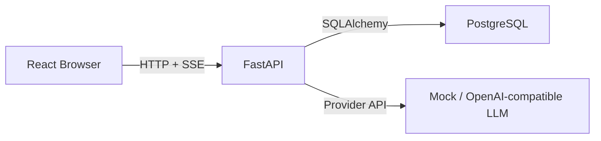
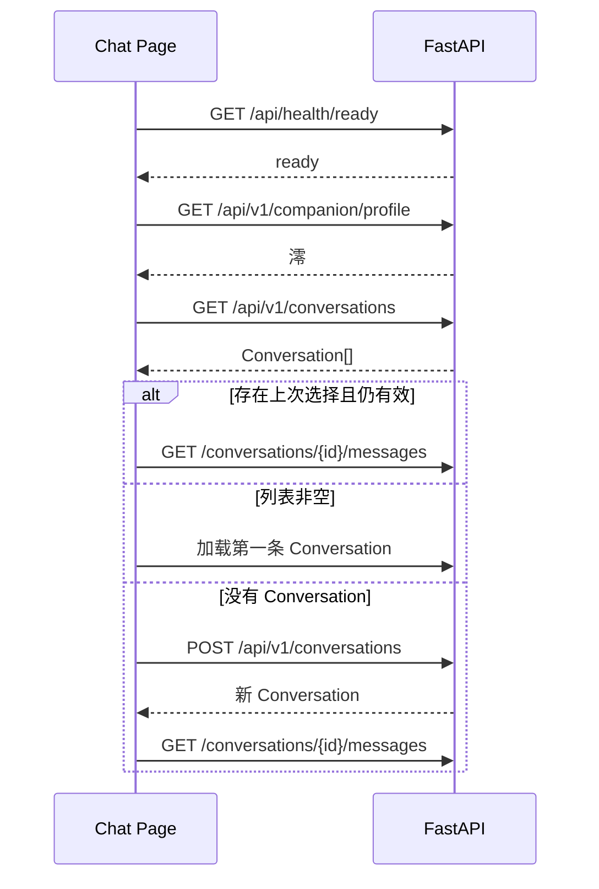

# 前端接入后端说明

> 本文档给 Mio 前端开发者使用，描述当前已实现的后端能力、接口契约和推荐接入顺序。前端只阅读此文档即可完成接入。

## 1. 当前能接入什么

前端可以完成一个真实的文字聊天闭环：

```text
检查后端
  -> 获取默认澪
  -> 查询或创建 Conversation
  -> 加载历史消息
  -> 发送文本
  -> 接收 SSE 流式回复
  -> 取消回复
  -> 查询 Agent Trace
  -> 处理失败并重新加载历史
```

不要假装已经实现：

- 登录注册。
- 长期记忆管理。
- RAG、知识库和项目检索。
- Persona 编辑。
- Agent Trace 前端 Debug Console 页面。
- Live2D 后端事件。
- ASR、TTS、语音状态。
- 表情包、附件和 Tool Result。
- Reminder 执行。

导航中的记忆、知识库、项目、调试和设置可以先保留视觉入口，但应标记为"开发中"，不要请求不存在的 API。

## 2. Base URL

```env
VITE_API_BASE_URL=http://127.0.0.1:8000
```

统一读取：

```ts
export const API_BASE_URL =
  import.meta.env.VITE_API_BASE_URL ?? "http://127.0.0.1:8000";
```

本地前端默认运行在 `http://localhost:5173`，后端已允许该 Origin。

## 3. 网络结构



禁止：

- 在前端保存数据库 URL。
- 从浏览器连接 PostgreSQL。
- 在 `VITE_*` 环境变量中保存数据库密码或模型 API Key。

## 4. 统一成功与错误结构

### 成功响应

各端点返回各自 Schema，详见后续章节。

### 错误响应

所有普通 HTTP 错误统一为：

```json
{
  "code": "conversation_not_found",
  "message": "对话不存在。",
  "trace_id": "uuid",
  "details": {}
}
```

`trace_id` 可以显示在"展开详情"中，便于后端排查。

### 错误码一览

| HTTP | code | 场景 |
|---|---|---|
| 400 | `invalid_cursor` | Cursor 无法解析 |
| 404 | `conversation_not_found` | Conversation 不存在或不属于当前 owner |
| 404 | `request_not_active` | 取消不存在的请求 |
| 404 | `trace_not_found` | Trace 不存在或不属于当前 owner |
| 409 | `conversation_busy` | 同一 Conversation 已有生成 |
| 422 | `validation_error` | Pydantic 请求校验失败 |
| 500 | `internal_error` | 非预期异常 |

生产环境不要直接展示后端堆栈、API Key、数据库 URL 或 `details` 中的内部字段。

## 5. TypeScript 类型

所有字段使用 `snake_case`，与 API JSON 一致。

```ts
export type UUID = string;

// ── Companion ──────────────────────────────────────────────────────

export interface CompanionProfile {
  id: UUID;
  name: string;
  relationship_type: string;
  speaking_style: string;
  boundaries: string[];
}

// ── Conversation ───────────────────────────────────────────────────

export type ConversationStatus = "active" | "archived";

export interface Conversation {
  id: UUID;
  channel: string;
  title: string;
  status: ConversationStatus;
  created_at: string;
  updated_at: string;
}

export interface ConversationListResponse {
  items: Conversation[];
}

// ── Message ────────────────────────────────────────────────────────

export type MessageRole = "user" | "assistant" | "system";
export type MessageStatus =
  | "completed"
  | "pending"
  | "streaming"
  | "cancelled"
  | "failed";

export interface Message {
  id: UUID;
  conversation_id: UUID;
  role: MessageRole;
  display_text: string;
  speech_text: string | null;
  status: MessageStatus;
  request_id: UUID | null;
  source: string;
  created_at: string;
  updated_at: string;
}

export interface MessageListResponse {
  items: Message[];
  next_cursor: string | null;
}

// ── SSE Events ─────────────────────────────────────────────────────

export type ChatStreamEvent =
  | {
      type: "message.started";
      request_id: UUID;
      message_id: UUID;
      trace_id: UUID;
    }
  | {
      type: "message.delta";
      request_id: UUID;
      message_id: UUID;
      trace_id: UUID;
      delta: string;
    }
  | {
      type: "message.completed";
      request_id: UUID;
      message_id: UUID;
      trace_id: UUID;
      display_text: string;
      speech_text: string | null;
    }
  | {
      type: "message.cancelled";
      request_id: UUID;
      message_id: UUID;
      trace_id: UUID;
      display_text: string;
      speech_text: string | null;
    }
  | {
      type: "message.failed";
      request_id: UUID;
      message_id: UUID;
      trace_id: UUID;
      display_text: string;
      speech_text: string | null;
      code: string;
      message: string;
      details: Record<string, unknown>;
    };

// ── Cancel ─────────────────────────────────────────────────────────

export interface CancelResponse {
  request_id: UUID;
  cancelled: boolean;
}

// ── Trace ──────────────────────────────────────────────────────────

export interface TraceNodeSummary {
  status?:
    | "pending"
    | "streaming"
    | "completed"
    | "failed"
    | "cancelled"
    | "fallback"
    | "skipped";
  duration_ms?: number;
  error_code?: string | null;
}

export interface TraceResponse {
  id: UUID;
  conversation_id: UUID;
  request_id: UUID;
  status: string;
  provider: string;
  model: string;
  duration_ms: number | null;
  error_stage: string | null;
  error_code: string | null;
  emotion_label: string | null;
  emotion_confidence: number | null;
  intent_label: string | null;
  intent_confidence: number | null;
  risk_level: string | null;
  risk_confidence: number | null;
  classification_status: string | null;
  classification_error_code: string | null;
  route: string | null;
  trace_schema_version: number; // always ≥1, never null
  node_summary: Record<string, TraceNodeSummary>;
  created_at: string;
  updated_at: string;
}

export interface TraceListResponse {
  items: TraceResponse[];
  next_cursor: string | null;
}

// ── Unified Error ──────────────────────────────────────────────────

export interface ApiError {
  code: string;
  message: string;
  trace_id: UUID;
  details: Record<string, unknown>;
}
```

说明：

- 时间字段是 ISO 8601 字符串，前端展示时再格式化。
- UUID 在 TypeScript 中仍然是 `string`。
- `speech_text` 当前通常为 `null`。
- `trace_schema_version` 必须是 `number`，不允许 `null`。
- `node_summary` 的值是 `Record<string, TraceNodeSummary>`，只包含白名单字段。
- 不要把 `source` 写死成只允许 `text`，后端还预留了其他来源。

## 6. Conversation API

### 创建 Conversation

```http
POST /api/v1/conversations
Content-Type: application/json
```

请求（两个字段都有默认值，`{}` 也合法）：

```json
{
  "title": "新对话",
  "channel": "web"
}
```

响应 `201 Created`：`Conversation`

### 查询 Conversation 列表

```http
GET /api/v1/conversations
```

响应：

```json
{
  "items": [Conversation, ...]
}
```

### 查询单个 Conversation

```http
GET /api/v1/conversations/{conversation_id}
```

响应：`Conversation`

当前没有删除、归档或重命名接口。前端不要显示已可用的这些操作。

## 7. Message 历史分页

```http
GET /api/v1/conversations/{conversation_id}/messages?limit=50&cursor=...
```

| 参数 | 类型 | 默认值 | 说明 |
|---|---|---|---|
| `limit` | int | 50 | 范围 1~100 |
| `cursor` | str | null | 分页游标（不透明） |

响应：

```json
{
  "items": [Message, ...],
  "next_cursor": "string | null"
}
```

- 返回顺序是旧消息到新消息。
- 有下一页时，把 `next_cursor` 原样传回。
- Cursor 是不透明字符串，前端不要解析。
- 最后一页 `next_cursor` 为 `null`。

## 8. SSE 发送消息

### 为什么必须使用 fetch

浏览器原生 `EventSource` 只支持 GET，不能携带 JSON POST body，因此必须使用 `fetch() + response.body.getReader()`。

### 请求

```http
POST /api/v1/conversations/{conversation_id}/messages
Content-Type: application/json
Accept: text/event-stream
```

```json
{
  "content": "今天写代码有点累。",
  "source": "text",
  "persist_history": true,
  "allow_memory_extraction": true
}
```

第一波固定：`source: "text"`, `persist_history: true`, `allow_memory_extraction: true`。

### SSE 事件

每次正常请求的事件顺序：

```text
message.started
  -> 0..N message.delta
  -> message.completed
```

异常或取消：

```text
message.started
  -> 0..N message.delta
  -> message.cancelled / message.failed
```

内部 `agent.completed` 事件不暴露给前端。分类结果通过 Trace API 查询。

### SSE 解析器

网络 chunk 不等于 SSE event。一次 `reader.read()` 可能得到半个事件，也可能得到多个事件，必须使用字符串缓冲区。

```ts
interface RawSseEvent {
  event: string;
  data: string;
}

function readSseBlock(block: string): RawSseEvent | null {
  let event = "";
  const dataLines: string[] = [];

  for (const line of block.split(/\r?\n/)) {
    if (line.startsWith("event:")) {
      event = line.slice("event:".length).trim();
    } else if (line.startsWith("data:")) {
      dataLines.push(line.slice("data:".length).trimStart());
    }
  }

  if (!event || dataLines.length === 0) {
    return null;
  }

  return {
    event,
    data: dataLines.join("\n"),
  };
}

export async function streamChat(
  baseUrl: string,
  conversationId: UUID,
  content: string,
  onEvent: (event: ChatStreamEvent) => void,
  signal?: AbortSignal,
): Promise<void> {
  const response = await fetch(
    `${baseUrl}/api/v1/conversations/${conversationId}/messages`,
    {
      method: "POST",
      headers: {
        "Content-Type": "application/json",
        Accept: "text/event-stream",
      },
      body: JSON.stringify({
        content,
        source: "text",
        persist_history: true,
        allow_memory_extraction: true,
      }),
      signal,
    },
  );

  if (!response.ok) {
    const error = (await response.json()) as ApiError;
    throw new ApiClientError(response.status, error);
  }

  if (!response.body) {
    throw new Error("浏览器没有返回可读取的响应流");
  }

  const reader = response.body.getReader();
  const decoder = new TextDecoder("utf-8");
  let buffer = "";

  while (true) {
    const { value, done } = await reader.read();
    buffer += decoder.decode(value, { stream: !done });
    buffer = buffer.replace(/\r\n/g, "\n");

    let boundary = buffer.indexOf("\n\n");
    while (boundary >= 0) {
      const block = buffer.slice(0, boundary);
      buffer = buffer.slice(boundary + 2);

      const rawEvent = readSseBlock(block);
      if (rawEvent) {
        onEvent({
          type: rawEvent.event,
          ...JSON.parse(rawEvent.data),
        } as ChatStreamEvent);
      }

      boundary = buffer.indexOf("\n\n");
    }

    if (done) {
      break;
    }
  }
}
```

不要简单执行 `JSON.parse(await response.text())`，这会等待整个回复结束，失去流式效果。

## 9. Cancel API

```http
POST /api/v1/chat/requests/{request_id}/cancel
```

成功响应：`CancelResponse`

请求不存在或已经结束时返回 `404 request_not_active`。

## 10. Trace API

### Trace 列表

```http
GET /api/v1/traces?conversation_id=...&status=...&limit=20&cursor=...
```

| 参数 | 类型 | 默认值 | 说明 |
|---|---|---|---|
| `conversation_id` | UUID | null | 按对话 ID 过滤 |
| `status` | string | null | 按状态过滤 |
| `limit` | int | 20 | 范围 1~100 |
| `cursor` | string | null | 分页游标（不透明） |

响应：`TraceListResponse`

### Trace 详情

```http
GET /api/v1/traces/{trace_id}
```

响应：`TraceResponse`

### node_summary 格式

```ts
node_summary: Record<string, {
  status?: "pending" | "streaming" | "completed" |
           "failed" | "cancelled" | "fallback" | "skipped";
  duration_ms?: number;
  error_code?: string | null;
}>
```

每个节点只包含白名单字段。节点名只允许小写字母开头、小写字母/数字/下划线、最长 64 字符。

### trace_schema_version

- 必须是 `number`，不允许 `null`。
- 历史 Trace（数据库 NULL）在 API 中返回 `1`。
- 新 Trace 返回 `2`。

## 11. AbortController 与服务端 Cancel 的区别

### AbortController（客户端断开）

```ts
const controller = new AbortController();
// 在 fetch 中传入 signal: controller.signal
```

调用 `controller.abort()` 后：

- 浏览器断开 HTTP 连接。
- 后端检测到流关闭后，把未完成助手消息标记为 `cancelled`。
- 下次加载历史即可获得收敛后的状态。
- 使用场景：页面卸载、用户切换 Conversation、网络长时间无响应。

### 服务端 Cancel（显式取消）

```ts
await fetch(`${API_BASE_URL}/api/v1/chat/requests/${requestId}/cancel`, {
  method: "POST",
});
```

调用后：

- 后端设置 cancel event。
- 继续读取 SSE 直到收到 `message.cancelled`。
- 能得到服务端保存的最终部分文本。
- 使用场景：用户点击"停止生成"。

### 推荐组合

1. 用户点击"停止生成" → 调用服务端 cancel API → 继续读 SSE → 收到 `message.cancelled`。
2. 页面卸载 / 切换 Conversation → 调用 `controller.abort()`。
3. 不要在收到 `message.completed` 后继续调用取消接口（会返回 `404 request_not_active`）。

## 12. 请求参数、响应字段与错误码汇总

### 请求参数

| 端点 | 参数 | 类型 | 说明 |
|---|---|---|---|
| POST /conversations | `title` | string | 默认 "新对话" |
| POST /conversations | `channel` | string | 默认 "web" |
| GET /conversations/{id}/messages | `limit` | int | 1~100，默认 50 |
| GET /conversations/{id}/messages | `cursor` | string | 不透明游标 |
| POST /conversations/{id}/messages | `content` | string | 消息内容 |
| POST /conversations/{id}/messages | `source` | string | 默认 "text" |
| POST /conversations/{id}/messages | `persist_history` | bool | 默认 true |
| POST /conversations/{id}/messages | `allow_memory_extraction` | bool | 默认 true |
| GET /traces | `conversation_id` | UUID | 可选过滤 |
| GET /traces | `status` | string | 可选过滤 |
| GET /traces | `limit` | int | 1~100，默认 20 |
| GET /traces | `cursor` | string | 不透明游标 |

### SSE 事件字段

| 事件 | 字段 |
|---|---|
| `message.started` | `request_id`, `message_id`, `trace_id` |
| `message.delta` | `request_id`, `message_id`, `trace_id`, `delta` |
| `message.completed` | `request_id`, `message_id`, `trace_id`, `display_text`, `speech_text` |
| `message.cancelled` | `request_id`, `message_id`, `trace_id`, `display_text`, `speech_text` |
| `message.failed` | `request_id`, `message_id`, `trace_id`, `display_text`, `speech_text`, `code`, `message`, `details` |

### 错误码

| HTTP | code | 前端行为 |
|---|---|---|
| 400 | `invalid_cursor` | 放弃当前 cursor，从第一页重载 |
| 404 | `conversation_not_found` | 清除本地当前 ID，刷新列表或创建新会话 |
| 404 | `request_not_active` | 清除本地 requestId，重新加载历史 |
| 404 | `trace_not_found` | Trace 不存在或不属于当前 owner，清除选中 |
| 409 | `conversation_busy` | 保持当前流，提示"澪还在回复" |
| 422 | `validation_error` | 优先检查前端输入 |
| 500 | `internal_error` | 显示通用错误和 trace_id |
| fetch 网络失败 | — | 显示服务未连接，提供重试 |
| `message.failed` (SSE) | 各种 | 在对应助手消息附近显示事件中的 message |

## 13. Cursor 规则

- Cursor 是不透明字符串，前端不要解析或修改。
- 有下一页时，把 `next_cursor` 原样传回。
- 非法 Cursor（不可解析）统一返回 400 `invalid_cursor`。
- 前端遇到 `invalid_cursor` 时应放弃当前 cursor，从第一页重载。
- 最后一页 `next_cursor` 为 `null`。

## 14. Owner 隔离对前端的表现

- 后端通过 `AgentTrace → Conversation.user_id` JOIN 校验 Trace 归属。
- 当前固定为 demo user。
- 如果前端请求了不属于当前 owner 的 Trace，后端返回 `404 trace_not_found`（不是 403）。
- 前端看到的统一表现是 404，不区分"不存在"和"无权限"。

## 15. 推荐联调顺序

### 第 1 步：API 基础

- `API_BASE_URL`
- `ApiClientError`
- health / profile / conversation / messages 普通 API
- TypeScript 类型

完成标准：可以在浏览器控制台查询 profile 和创建 Conversation。

### 第 2 步：历史聊天

- Conversation 列表。
- 当前 Conversation。
- 消息历史。
- 无 Conversation 时自动创建。

完成标准：刷新页面后聊天历史仍存在。

### 第 3 步：SSE

- POST fetch。
- 流缓冲与事件解析。
- 助手消息增量更新。
- terminal event 校正。

完成标准：能够看到澪逐段出现，而不是一次性显示。

### 第 4 步：取消和失败

- 保存 request_id。
- 停止生成。
- 页面卸载 abort。
- 409、404、message.failed。

完成标准：取消后部分文本保留，下一轮仍可发送。

### 第 5 步：Trace 查询

- Trace 列表展示。
- Trace 详情查看。
- 分类信息展示。

完成标准：能在页面查看每轮对话的分类结果和路由。

### 第 6 步：接入既有 UI

- 在线状态。
- Conversation Sidebar。
- MessageList。
- MessageComposer。
- 响应式与键盘操作。

## 16. 前端状态机

### 消息状态管理

推荐维护两类消息：

- 服务端 Message：来自历史接口。
- 临时 UI Message：刚发送但尚未重新取得服务端 ID 的用户消息。

当前 `message.started` 只返回助手消息 ID，不返回用户消息 ID。因此发送时建议：

1. 生成 `local-user-${crypto.randomUUID()}`。
2. 立即把用户消息插入 UI，状态为 `sending`。
3. 收到 `message.started` 后创建澪的空占位消息。
4. 收到 delta 时累加助手文本。
5. 收到 terminal event 后更新助手状态。
6. terminal event 后重新请求消息历史，用服务端数据替换临时消息。

### 事件映射

| 后端事件 | 前端操作 |
|---|---|
| 请求刚发出 | 插入本地用户消息，输入框清空 |
| `message.started` | 创建澪的空占位消息，页面进入 thinking |
| 首个 `message.delta` | thinking → streaming |
| 后续 `message.delta` | 在同一助手消息后追加 delta |
| `message.completed` | 使用 display_text 校正完整正文，状态 completed |
| `message.cancelled` | 保留部分正文，状态 cancelled |
| `message.failed` | 保留部分正文，在消息附近显示错误与重试 |

### ChatBootState

```ts
type ChatBootState =
  | "loading"
  | "ready"
  | "backend_unavailable"
  | "failed";
```

### ChatUiMessage

```ts
export interface ChatUiMessage {
  key: string;
  serverId?: UUID;
  role: MessageRole;
  text: string;
  state:
    | "sending"
    | "thinking"
    | "streaming"
    | "completed"
    | "cancelled"
    | "failed";
  requestId?: UUID;
  traceId?: UUID;
  errorMessage?: string;
}
```

## 17. 页面启动流程



前端可以在 `localStorage` 保存最后选择的 `conversation_id`，但它只是 UI 偏好，最终必须以服务端查询结果为准。

## 18. Conversation 切换

切换前建议：

1. 如果当前有生成，调用 cancel。
2. 中止当前 fetch。
3. 清空当前页面的临时 UI 消息。
4. 加载目标 Conversation 历史。
5. 滚动到最新消息。

要避免的竞态：

```text
Conversation A 的 delta
  -> 用户切换到 Conversation B
  -> A 的 delta 被错误追加到 B
```

每个流回调必须携带启动时的 `conversationId`。处理事件前检查它是否仍等于对应 store 中的流 ID。

## 19. 重试策略

当前没有后端"重新生成同一条消息"接口。

推荐前端重试：

1. 读取失败消息之前最近一条用户消息。
2. 用户确认后重新发送相同文本。
3. 它会生成新的 user message 和 assistant message。

不要：

- 修改数据库中的 failed 消息。
- 假装旧消息状态已经变成 completed。
- 在用户不知情时自动无限重试模型请求。

## 20. 本地联调命令

后端：

```bash
cd backend
uv sync
uv run alembic upgrade head
uv run uvicorn mio.main:app --reload
```

检查：

```bash
curl -s http://127.0.0.1:8000/api/health/ready
```

预期：

```json
{"status":"ready","database":"reachable"}
```

Swagger：`http://127.0.0.1:8000/docs`

前端：

```bash
cd frontend
npm install
npm run dev
```

## 21. 后端代码依据

- 请求与响应 Schema：`backend/src/mio/api/schemas.py`
- HTTP 路由与 SSE 编码：`backend/src/mio/api/routes.py`
- 统一错误：`backend/src/mio/api/errors.py`
- 事件与持久化：`backend/src/mio/services/conversations.py`
- Trace 查询：`backend/src/mio/services/traces.py`
- API 行为测试：`backend/tests/test_conversations_api.py`
- Trace API 测试：`backend/tests/test_traces_api.py`
- CORS 配置：`backend/src/mio/config.py`

前端发现文档与 OpenAPI 不一致时，应以当前运行实例的 `GET /openapi.json` 以及 SSE 行为测试为准，并同步修正文档。

## 22. 当前后端仍需要前端反馈的契约缺口

实现过程中若明显影响体验，请反馈后端追加：

1. 创建消息后返回 user message ID，减少 terminal 后全量刷新。
2. Conversation 重命名、归档和删除接口。
3. Conversation 列表的最后消息摘要和未读状态。
4. 结构化情绪、意图和 PresentationPlan。
5. 自动生成 Conversation 标题。

这些是下一步候选，不属于当前已完成接口。前端不得自行假设字段已经存在。
