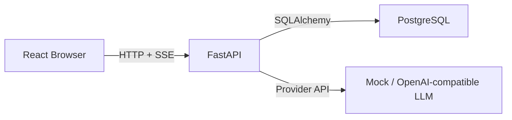
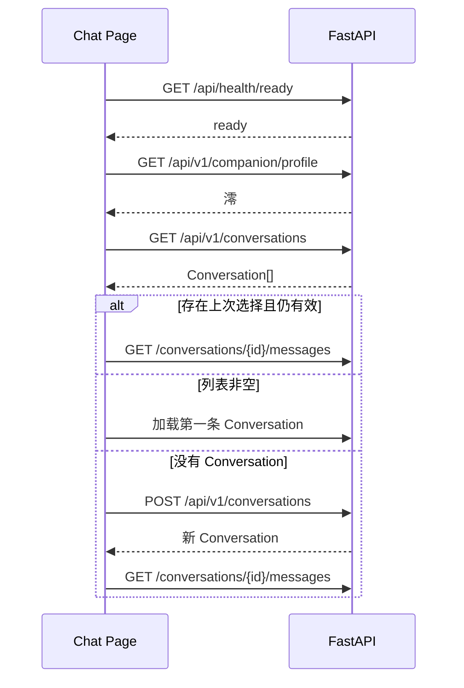
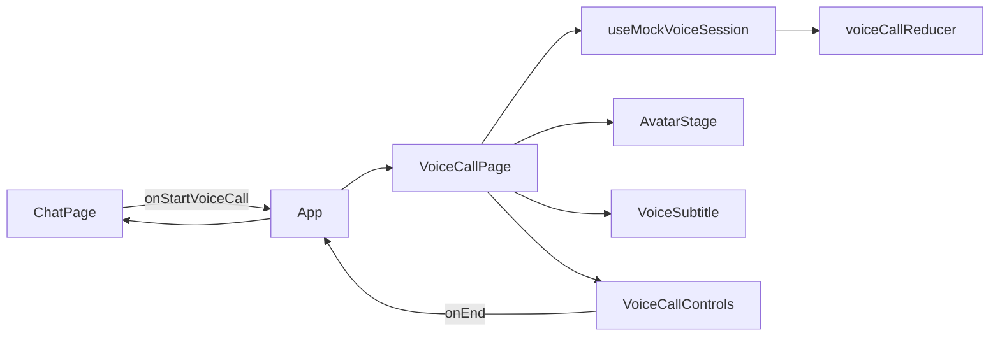

# 第一波前端接入后端说明

## 1. 文档目的

本文档给 Mio 前端开发者使用，描述当前已经实现的后端能力、接口契约、页面状态映射和推荐接入顺序。

当前前端可以完成一个真实的文字聊天闭环：

```text
检查后端
  -> 获取默认澪
  -> 查询或创建 Conversation
  -> 加载历史消息
  -> 发送文本
  -> 接收 SSE 流式回复
  -> 取消回复
  -> 处理失败并重新加载历史
```

当前后端实现详情见：

- [文字聊天后端开发文档](chat-backend.md)
- [聊天页面规格](../../design/screens/chat.md)
- [UI Brief](../../design/UI-BRIEF.md)

## 2. 当前能接入什么

第一波前端应实现：

- 后端在线状态。
- 默认「澪」资料读取。
- Conversation 创建、列表和切换。
- 历史消息加载。
- 文字消息发送。
- 澪回复的逐段流式展示。
- 停止当前生成。
- 失败、取消和并发冲突提示。
- 页面刷新后恢复数据库中的历史消息。

第一波不要假装已经实现：

- 登录注册。
- 长期记忆管理。
- RAG、知识库和项目检索。
- Persona 编辑。
- Agent Trace 查询页面。
- Live2D 后端事件。
- ASR、TTS、语音状态。
- 表情包、附件和 Tool Result。

导航中的记忆、知识库、项目、调试和设置可以先保留视觉入口，但应标记为“开发中”，不要请求不存在的 API。

## 3. 网络结构

浏览器只能访问 FastAPI，不能访问 PostgreSQL：



禁止：

- 在前端保存数据库 URL。
- 从浏览器连接 PostgreSQL。
- 在 `VITE_*` 环境变量中保存数据库密码或模型 API Key。
- 把 `/etc/mio/postgresql.env` 的内容复制到前端。

## 4. 前端环境变量

建议增加：

```env
VITE_API_BASE_URL=http://127.0.0.1:8000
```

统一读取：

```ts
export const API_BASE_URL =
  import.meta.env.VITE_API_BASE_URL ?? "http://127.0.0.1:8000";
```

本地前端默认运行在：

```text
http://localhost:5173
```

后端当前允许该 Origin。若前端使用其他端口，需要同步修改后端：

```env
MIO_CORS_ORIGINS=["http://localhost:5173","http://localhost:3000"]
```

目前云服务器只部署了 PostgreSQL，尚未常驻部署 FastAPI。因此现阶段前端应连接本机 FastAPI，而不是直接请求 `62.234.37.168`。

## 5. 推荐目录

前端可以采用：

```text
src/
├── api/
│   ├── client.ts
│   ├── chat-api.ts
│   ├── sse.ts
│   └── types.ts
├── features/chat/
│   ├── ChatPage.tsx
│   ├── MessageList.tsx
│   ├── MessageComposer.tsx
│   ├── ConversationSidebar.tsx
│   ├── chat-store.ts
│   └── use-chat-stream.ts
└── components/avatar/
    └── AvatarStage.tsx
```

职责：

- `api`：只处理 HTTP、SSE 和类型。
- `features/chat`：管理聊天业务状态。
- `AvatarStage`：当前使用静态资源或占位实现，不依赖聊天 API 返回 Live2D 参数。
- 页面组件不要直接散落 `fetch()`。

## 6. TypeScript 类型

以下类型与当前后端 Schema 对应：

```ts
export type UUID = string;

export type ConversationStatus = "active" | "archived";
export type MessageRole = "user" | "assistant" | "system";
export type MessageStatus =
  | "completed"
  | "pending"
  | "streaming"
  | "cancelled"
  | "failed";

export interface CompanionProfile {
  id: UUID;
  name: string;
  relationship_type: string;
  speaking_style: string;
  boundaries: string[];
}

export interface Conversation {
  id: UUID;
  channel: string;
  title: string;
  status: ConversationStatus;
  created_at: string;
  updated_at: string;
}

export interface Message {
  id: UUID;
  conversation_id: UUID;
  role: MessageRole;
  display_text: string;
  speech_text: string | null;
  status: MessageStatus;
  request_id: UUID | null;
  source: string;
  created_at: string;
  updated_at: string;
}

export interface ApiError {
  code: string;
  message: string;
  trace_id: UUID;
  details: Record<string, unknown>;
}

export interface ConversationListResponse {
  items: Conversation[];
}

export interface MessageListResponse {
  items: Message[];
  next_cursor: string | null;
}
```

说明：

- 时间字段是 ISO 8601 字符串，前端展示时再格式化。
- UUID 在 TypeScript 中仍然是 `string`。
- `speech_text` 第一波通常为 `null`。
- 不要把 `source` 写死成只允许 `text`，后端还预留了其他来源；当前发送时使用 `text`。

## 7. 页面启动流程

推荐顺序：



前端可以在 `localStorage` 保存最后选择的 `conversation_id`，但它只是 UI 偏好，最终必须以服务端查询结果为准。

推荐初始化状态：

```ts
type ChatBootState =
  | "loading"
  | "ready"
  | "backend_unavailable"
  | "failed";
```

## 8. API 契约

### 8.1 健康检查

```http
GET /api/health/live
```

响应：

```json
{
  "status": "alive"
}
```

```http
GET /api/health/ready
```

响应：

```json
{
  "status": "ready",
  "database": "reachable"
}
```

顶栏的“在线”建议以 `ready` 为准。请求失败时显示“服务未连接”，但不要删除当前已加载的聊天内容。

### 8.2 获取澪

```http
GET /api/v1/companion/profile
```

响应示例：

```json
{
  "id": "8359448e-2ae0-47f3-9779-e2e7a0f6c41b",
  "name": "澪",
  "relationship_type": "稳定陪伴者",
  "speaking_style": "清冷慢热、认真克制、害羞可爱、短句优先，不使用客服腔。",
  "boundaries": [
    "不冒充真人或已有动漫角色",
    "不诱导现实依赖",
    "危机风险时停止暧昧表达并进入安全支持"
  ]
}
```

当前主要用于：

- 顶栏名称和头像入口。
- 空状态文案。
- 消息发送者名称。

不要直接把 `boundaries` 全量展示在聊天页。

### 8.3 创建 Conversation

```http
POST /api/v1/conversations
Content-Type: application/json
```

请求：

```json
{
  "title": "新对话",
  "channel": "web"
}
```

也可以发送空对象：

```json
{}
```

响应状态为 `201 Created`。

### 8.4 查询 Conversation

```http
GET /api/v1/conversations
GET /api/v1/conversations/{conversation_id}
```

列表响应：

```json
{
  "items": [
    {
      "id": "uuid",
      "channel": "web",
      "title": "新对话",
      "status": "active",
      "created_at": "2026-06-09T12:00:00Z",
      "updated_at": "2026-06-09T12:00:00Z"
    }
  ]
}
```

当前没有：

- 删除接口。
- 归档接口。
- 重命名接口。
- 自动生成标题。

前端不要显示已经可用的删除、归档或重命名操作。

### 8.5 查询消息

```http
GET /api/v1/conversations/{conversation_id}/messages?limit=50
```

响应：

```json
{
  "items": [
    {
      "id": "uuid",
      "conversation_id": "uuid",
      "role": "user",
      "display_text": "今天写代码有点累。",
      "speech_text": null,
      "status": "completed",
      "request_id": null,
      "source": "text",
      "created_at": "2026-06-09T12:00:00Z",
      "updated_at": "2026-06-09T12:00:00Z"
    }
  ],
  "next_cursor": null
}
```

分页规则：

- 默认 `limit=50`。
- 最小 1，最大 100。
- 返回顺序是旧消息到新消息。
- 有下一页时，把 `next_cursor` 原样传回：

```http
GET /api/v1/conversations/{id}/messages?limit=50&cursor=<next_cursor>
```

Cursor 是不透明字符串，前端不要解析。

第一版聊天页可以先请求 `limit=100`。当历史超过 100 条后，再实现“加载更多”。

## 9. 发送消息与 SSE

### 9.1 为什么必须使用 fetch

发送接口是：

```http
POST /api/v1/conversations/{conversation_id}/messages
```

浏览器原生 `EventSource` 只支持 GET，不能携带 JSON POST body，因此这里必须使用：

```ts
fetch() + response.body.getReader()
```

### 9.2 请求

```json
{
  "content": "今天写代码有点累。",
  "source": "text",
  "persist_history": true,
  "allow_memory_extraction": true
}
```

第一波固定：

```ts
source: "text";
persist_history: true;
allow_memory_extraction: true;
```

`allow_memory_extraction` 当前只被保存，后端尚未执行长期记忆抽取。

### 9.3 事件类型

```ts
export type ChatStreamEvent =
  | {
      type: "message.started";
      request_id: UUID;
      message_id: UUID;
      trace_id: UUID;
    }
  | {
      type: "message.delta";
      request_id: UUID;
      message_id: UUID;
      trace_id: UUID;
      delta: string;
    }
  | {
      type: "message.completed";
      request_id: UUID;
      message_id: UUID;
      trace_id: UUID;
      display_text: string;
      speech_text: string | null;
    }
  | {
      type: "message.cancelled";
      request_id: UUID;
      message_id: UUID;
      trace_id: UUID;
      display_text: string;
      speech_text: string | null;
    }
  | {
      type: "message.failed";
      request_id: UUID;
      message_id: UUID;
      trace_id: UUID;
      display_text: string;
      speech_text: string | null;
      code: string;
      message: string;
      details: Record<string, unknown>;
    };
```

每次正常请求的事件顺序：

```text
message.started
  -> 0..N message.delta
  -> message.completed
```

异常或取消：

```text
message.started
  -> 0..N message.delta
  -> message.cancelled / message.failed
```

### 9.4 SSE 解析器

网络 chunk 不等于 SSE event。一次 `reader.read()` 可能得到半个事件，也可能得到多个事件，必须使用字符串缓冲区。

```ts
interface RawSseEvent {
  event: string;
  data: string;
}

function readSseBlock(block: string): RawSseEvent | null {
  let event = "";
  const dataLines: string[] = [];

  for (const line of block.split(/\r?\n/)) {
    if (line.startsWith("event:")) {
      event = line.slice("event:".length).trim();
    } else if (line.startsWith("data:")) {
      dataLines.push(line.slice("data:".length).trimStart());
    }
  }

  if (!event || dataLines.length === 0) {
    return null;
  }

  return {
    event,
    data: dataLines.join("\n"),
  };
}

export async function streamChat(
  baseUrl: string,
  conversationId: UUID,
  content: string,
  onEvent: (event: ChatStreamEvent) => void,
  signal?: AbortSignal,
): Promise<void> {
  const response = await fetch(
    `${baseUrl}/api/v1/conversations/${conversationId}/messages`,
    {
      method: "POST",
      headers: {
        "Content-Type": "application/json",
        Accept: "text/event-stream",
      },
      body: JSON.stringify({
        content,
        source: "text",
        persist_history: true,
        allow_memory_extraction: true,
      }),
      signal,
    },
  );

  if (!response.ok) {
    const error = (await response.json()) as ApiError;
    throw new ApiClientError(response.status, error);
  }

  if (!response.body) {
    throw new Error("浏览器没有返回可读取的响应流");
  }

  const reader = response.body.getReader();
  const decoder = new TextDecoder("utf-8");
  let buffer = "";

  while (true) {
    const { value, done } = await reader.read();
    buffer += decoder.decode(value, { stream: !done });
    buffer = buffer.replace(/\r\n/g, "\n");

    let boundary = buffer.indexOf("\n\n");
    while (boundary >= 0) {
      const block = buffer.slice(0, boundary);
      buffer = buffer.slice(boundary + 2);

      const rawEvent = readSseBlock(block);
      if (rawEvent) {
        onEvent({
          type: rawEvent.event,
          ...JSON.parse(rawEvent.data),
        } as ChatStreamEvent);
      }

      boundary = buffer.indexOf("\n\n");
    }

    if (done) {
      break;
    }
  }
}
```

不要简单执行：

```ts
JSON.parse(await response.text());
```

这会等待整个回复结束，失去流式效果。

## 10. 前端消息状态管理

推荐维护两类消息：

- 服务端 Message：来自历史接口。
- 临时 UI Message：刚发送但尚未重新取得服务端 ID 的用户消息。

当前 `message.started` 只返回助手消息 ID，不返回用户消息 ID。因此发送时建议：

1. 生成 `local-user-${crypto.randomUUID()}`。
2. 立即把用户消息插入 UI，状态为 `sending`。
3. 收到 `message.started` 后创建助手占位消息。
4. 收到 delta 时累加助手文本。
5. 收到 terminal event 后更新助手状态。
6. terminal event 后重新请求消息历史，用服务端数据替换临时消息。

建议 UI 类型：

```ts
export interface ChatUiMessage {
  key: string;
  serverId?: UUID;
  role: MessageRole;
  text: string;
  state:
    | "sending"
    | "thinking"
    | "streaming"
    | "completed"
    | "cancelled"
    | "failed";
  requestId?: UUID;
  traceId?: UUID;
  errorMessage?: string;
}
```

### 事件映射

| 后端事件 | 前端操作 |
|---|---|
| 请求刚发出 | 插入本地用户消息，输入框清空 |
| `message.started` | 创建澪的空占位消息，页面进入 thinking |
| 首个 `message.delta` | thinking -> streaming |
| 后续 `message.delta` | 在同一助手消息后追加 delta |
| `message.completed` | 使用 display_text 校正完整正文，状态 completed |
| `message.cancelled` | 保留部分正文，状态 cancelled |
| `message.failed` | 保留部分正文，在消息附近显示错误与重试 |

第一波是文字聊天，不应把文本 streaming 状态命名为语音 `speaking`。语音状态以后再接。

## 11. 取消与 AbortController

发送请求时创建：

```ts
const controller = new AbortController();
```

收到 `message.started` 后保存 `request_id`。

用户点击“停止生成”时，推荐：

```ts
await fetch(`${API_BASE_URL}/api/v1/chat/requests/${requestId}/cancel`, {
  method: "POST",
});
```

然后继续读取 SSE，直到收到：

```text
message.cancelled
```

这样能得到服务端保存的最终部分文本。

如果：

- 页面卸载；
- 用户切换 Conversation；
- 网络长时间无响应；

可以调用：

```ts
controller.abort();
```

后端检测到流关闭后，会把未完成助手消息标记为 `cancelled`。下次加载历史即可获得收敛后的状态。

不要在收到 `message.completed` 后继续调用取消接口，此时会返回：

```text
404 request_not_active
```

## 12. 同一 Conversation 并发限制

当前同一 Conversation 同时只能有一条生成请求。

第二次发送会返回：

```http
409 Conflict
```

```json
{
  "code": "conversation_busy",
  "message": "该对话已有回复正在生成，请等待完成或先取消。",
  "trace_id": "uuid",
  "details": {}
}
```

推荐前端行为：

- 生成期间发送按钮变为停止按钮。
- 不允许同一 Conversation 重复提交。
- 用户切换到其他 Conversation 时，可以保留当前请求或主动取消；第一版推荐主动取消，逻辑更清晰。
- 即使 UI 已禁用发送，也必须处理后端 `409`，因为可能存在多标签页。

## 13. 错误处理

普通 HTTP 错误：

```ts
export class ApiClientError extends Error {
  constructor(
    public readonly status: number,
    public readonly payload: ApiError,
  ) {
    super(payload.message);
  }
}
```

错误结构：

```json
{
  "code": "conversation_not_found",
  "message": "对话不存在。",
  "trace_id": "uuid",
  "details": {}
}
```

处理建议：

| code / 情况 | 前端行为 |
|---|---|
| `conversation_not_found` | 清除本地当前 ID，刷新列表或创建新会话 |
| `conversation_busy` | 保持当前流，提示“澪还在回复” |
| `request_not_active` | 清除本地 requestId，重新加载历史 |
| `invalid_cursor` | 放弃当前 cursor，从第一页重载 |
| `validation_error` | 优先检查前端输入；开发环境可展开 details |
| `internal_error` | 显示通用错误和 trace_id |
| fetch 网络失败 | 显示服务未连接，提供重试 |
| `message.failed` | 在对应助手消息附近显示事件中的 message |

不要把异常只显示成全局 toast。聊天生成错误应出现在对应消息附近，符合既有 UI 规格。

生产环境不要直接展示：

- 后端堆栈。
- API Key。
- 数据库 URL。
- `details` 中潜在的内部字段。

`trace_id` 可以显示在“展开详情”中，便于后端排查。

## 14. UI 状态与现有设计的对应

### 顶栏在线状态

- `/ready` 成功：在线。
- `/ready` 失败：服务未连接。

当前在线只表示 FastAPI 和数据库可用，不表示真实 LLM Provider 一定可用。

### 输入框

- idle：允许输入和发送。
- thinking/streaming：发送按钮切换为“停止生成”。
- failed：恢复发送，保留上一条输入的重试入口。

### 消息

- user：右侧。
- assistant：左侧。
- pending/streaming：显示轻量生成指示，不使用整块骨架屏替代已经生成的文字。
- cancelled：保留部分回复，显示“已停止”。
- failed：保留部分回复，显示原因和重试。

### AvatarStage

当前后端没有 AvatarProfile 或 PresentationPlan API。

第一波：

- 语音入口由前端本地状态控制。
- 使用静态透明立绘、占位 SVG 或隐藏人物。
- 使用 `localStorage` 保存显示偏好。
- 可以把 thinking/streaming 映射为前端自带的简单 CSS 状态。
- 不要从自然语言回复中解析 `[happy]` 等情绪标签。
- 不要声称已支持真实 Live2D 情绪驱动。

### 语音按钮

当前没有 ASR/TTS API。按钮可以：

- 暂时禁用并显示“开发中”；或
- 在开发环境隐藏。

不要请求浏览器麦克风权限，也不要伪造 listening/transcribing 状态。

## 15. Conversation 切换

切换前建议：

1. 如果当前有生成，调用 cancel。
2. 中止当前 fetch。
3. 清空当前页面的临时 UI 消息。
4. 加载目标 Conversation 历史。
5. 滚动到最新消息。

要避免的竞态：

```text
Conversation A 的 delta
  -> 用户切换到 Conversation B
  -> A 的 delta 被错误追加到 B
```

每个流回调必须携带启动时的 `conversationId`。处理事件前检查它是否仍等于对应 store 中的流 ID。

## 16. 重试策略

第一波没有后端“重新生成同一条消息”接口。

推荐前端重试：

1. 读取失败消息之前最近一条用户消息。
2. 用户确认后重新发送相同文本。
3. 它会生成新的 user message 和 assistant message。

不要：

- 修改数据库中的 failed 消息。
- 假装旧消息状态已经变成 completed。
- 在用户不知情时自动无限重试模型请求。

## 17. 建议实现顺序

### 第 1 步：API 基础

- `API_BASE_URL`
- `ApiClientError`
- health/profile/conversation/messages 普通 API
- TypeScript 类型

完成标准：可以在浏览器控制台查询 profile 和创建 Conversation。

### 第 2 步：历史聊天

- Conversation 列表。
- 当前 Conversation。
- 消息历史。
- 无 Conversation 时自动创建。

完成标准：刷新页面后聊天历史仍存在。

### 第 3 步：SSE

- POST fetch。
- 流缓冲与事件解析。
- 助手消息增量更新。
- terminal event 校正。

完成标准：能够看到澪逐段出现，而不是一次性显示。

### 第 4 步：取消和失败

- 保存 request_id。
- 停止生成。
- 页面卸载 abort。
- 409、404、message.failed。

完成标准：取消后部分文本保留，下一轮仍可发送。

### 第 5 步：接入既有 UI

- 在线状态。
- Conversation Sidebar。
- MessageList。
- MessageComposer。
- AvatarStage 静态占位和显示偏好。
- 响应式与键盘操作。

## 18. 前端验收用例

### 用例 1：首次打开

1. 后端已运行。
2. 打开聊天页。
3. 显示在线。
4. 顶栏语音入口。
5. 没有 Conversation 时自动创建。
6. 页面显示空聊天状态。

### 用例 2：正常聊天

1. 输入“今天写代码有点累。”
2. 用户气泡立即出现。
3. 澪进入 thinking。
4. 回复逐段显示。
5. 最终状态 completed。
6. 刷新后两条消息仍存在。

### 用例 3：停止生成

1. 配置 Mock 延迟：

```env
MIO_MOCK_CHUNK_DELAY_MS=200
```

2. 发送消息。
3. 收到首个 delta 后点击停止。
4. 收到 `message.cancelled`。
5. 部分回复保留并标记“已停止”。
6. 可以继续发送下一条。

### 用例 4：后端未启动

1. 关闭 FastAPI。
2. 打开页面。
3. 显示“服务未连接”。
4. 页面布局不崩溃。
5. 提供重试。

### 用例 5：多标签页冲突

1. 两个标签页打开同一个 Conversation。
2. A 开始生成。
3. B 发送消息。
4. B 收到 `409 conversation_busy`。
5. A 的流不受影响。

### 用例 6：切换 Conversation

1. A 正在生成。
2. 切换到 B。
3. A 被取消。
4. A 的后续 delta 不进入 B。
5. B 历史正确显示。

## 19. 本地联调命令

后端：

```bash
cd /Users/awei/Documents/mio-ai-companion/backend
uv run alembic upgrade head
uv run uvicorn mio.main:app --reload
```

如果使用云 PostgreSQL，先按 [云 PostgreSQL 文档](../deployment/postgresql-cloud.md) 建立 SSH 隧道和 `MIO_DATABASE_URL`。

检查：

```bash
curl -s http://127.0.0.1:8000/api/health/ready
```

预期：

```json
{"status":"ready","database":"reachable"}
```

Swagger：

```text
http://127.0.0.1:8000/docs
```

前端：

```bash
npm run dev
```

当前前端使用 React + Vite + TypeScript，详见 `frontend/package.json`。

## 20. 后端代码依据

- 请求与响应 Schema：[schemas.py](../../backend/src/mio/api/schemas.py)
- HTTP 路由与 SSE 编码：[routes.py](../../backend/src/mio/api/routes.py)
- 统一错误：[errors.py](../../backend/src/mio/api/errors.py)
- 事件与持久化：[conversations.py](../../backend/src/mio/services/conversations.py)
- API 行为测试：[test_conversations_api.py](../../backend/tests/test_conversations_api.py)
- CORS 配置：[config.py](../../backend/src/mio/config.py)

前端发现文档与 OpenAPI 不一致时，应以当前运行实例的：

```text
GET /openapi.json
```

以及 SSE 行为测试为准，并同步修正文档。

## 21. 当前后端仍需要前端反馈的契约缺口

实现过程中若明显影响体验，请反馈后端追加：

1. 创建消息后返回 user message ID，减少 terminal 后全量刷新。
2. Conversation 重命名、归档和删除接口。
3. Conversation 列表的最后消息摘要和未读状态。
4. 公开 AgentTrace 查询接口。
5. 结构化情绪、意图和 PresentationPlan。
6. 自动生成 Conversation 标题。

这些是下一步候选，不属于当前已完成接口。前端不得自行假设字段已经存在。


## 普通聊天与人物边界

普通聊天页不渲染人物，也不保存人物显示偏好。`AvatarStage` 只由全屏语音通话页使用，因此人物资源失败不会改变消息区布局。

## Mock Voice Session

当前前端提供可演示的全屏 Mock Voice Session，用于验证页面切换、语音状态、字幕、人物降级和控制交互。它不会调用 `getUserMedia`，不会上传音频，也不代表 ASR/TTS/WebRTC 已实现。

### 前端调用链



### 测试和调试命令

```bash
cd /Users/awei/Documents/mio-ai-companion/frontend
npm test
npm run lint
npm run build
npm run dev
```

开发环境下，VoiceCallPage 右上角有一个"下一状态"按钮，用于手动切换语音状态。该按钮在生产构建中不会出现（由 `import.meta.env.DEV` 控制）。

### 视觉验收

- 桌面端 1440×960 已测试：聊天页无人物，语音入口可用
- 移动端 390×844 已测试：无水平溢出，控制按钮至少 44px
- 语音状态全部可检查：permission、listening、transcribing、thinking、speaking、failed
- 已知限制：Mock session 无真实音频

### 视觉验收记录

- **桌面端** (1440×960)：聊天页无人物、无"显示澪"开关、消息区居中、语音入口可见
- **移动端** (390×844)：单列布局、无水平溢出、控制按钮至少 44px、安全区域已处理
- **语音状态**：permission、listening、transcribing、thinking、speaking、failed 全部可检查
- **Reduced Motion**：`prefers-reduced-motion: reduce` 下停止持续动画
- **已知限制**：Mock session 无真实音频，不调用 `getUserMedia`
