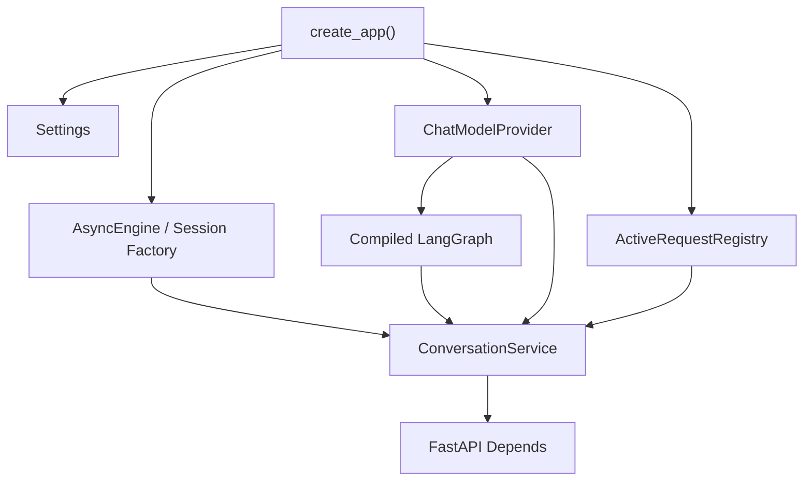

# 01 从 Spring Boot 到 FastAPI：实现 Mio 的流式聊天后端

## 1. 本章学习目标

完成本章后，你应该能够独立解释并复现：

1. Python package、module 和 import 如何组织。
2. Python 类型标注、dataclass、TypedDict 和 Pydantic 各自适合什么场景。
3. `async/await`、异步生成器和异步 context manager 如何协作。
4. FastAPI Router、Depends、请求模型和异常处理如何工作。
5. SQLAlchemy 2.x Async 与 JPA/Hibernate 的主要差异。
6. Alembic 如何承担类似 Flyway/Liquibase 的数据库迁移职责。
7. SSE 为什么适合 LLM 文本流式响应。
8. LLM Provider 抽象和 Mock Provider 为什么重要。
9. LangGraph 的 State、Node、Edge 与自定义流事件。
10. pytest 如何覆盖 API、异步代码、失败和取消。

本章对应当前真实代码，不假设 Memory、RAG 或 Tool 已经实现。

## 2. 先建立整体认知

如果用 Spring Boot 的语言描述，本轮大致是：

```text
Controller
  -> Application Service
  -> Agent Workflow
  -> LLM Client
  -> Repository / Database
```

Mio 的实际结构是：

```text
FastAPI Router
  -> ConversationService
  -> LangGraph
  -> ChatModelProvider
  -> SQLAlchemy AsyncSession
```

两者结构相似，但 Python 版本没有 Spring IoC 容器自动扫描 Bean。对象是在 [create_app](../../backend/src/mio/main.py#L24) 中显式创建并放入 `app.state`。



## 3. Python package、module 与 import

### 3.1 基本术语

- **module**：一个 `.py` 文件，例如 `config.py`。
- **package**：可包含多个 module 的目录，通常含 `__init__.py`。
- **import**：加载并引用其他 module 中的名字。

项目采用 `src layout`：

```text
backend/
└── src/
    └── mio/
        ├── __init__.py
        ├── main.py
        ├── api/
        └── db/
```

`pyproject.toml` 告诉 Hatchling 把 `src/mio` 构建为包。执行 `uv sync` 后，虚拟环境可以直接：

```python
from mio.config import Settings
```

### 3.2 与 Java 对照

Java：

```java
import com.example.mio.config.Settings;
```

Python：

```python
from mio.config import Settings
```

相似点是都通过命名空间定位类型。差异在于 Python module 本身是运行时对象，import 会执行 module 顶层代码。因此不要在 module 顶层执行昂贵操作或读取不必要的外部资源。

## 4. 类型标注：Python 不是“没有类型”

查看 [Settings](../../backend/src/mio/config.py#L8)：

```python
environment: Literal["development", "test", "production"] = "development"
database_url: str = "postgresql+asyncpg://..."
mock_chunk_delay_ms: int = Field(default=0, ge=0)
```

`name: Type` 是类型标注。Python 运行时通常不会自动强制普通函数的标注，但：

- IDE 可以补全。
- Mypy 可以静态检查。
- Pydantic 会在模型实例化时校验。
- FastAPI 会根据标注生成 OpenAPI。

本项目运行：

```bash
uv run mypy src
```

并启用 strict 模式。

### Java 对照

Java 类型是编译器和 JVM 语义的一部分：

```java
String databaseUrl;
```

Python 类型标注默认更像“可由工具检查的契约”：

```python
database_url: str
```

不能因为两者写法相似，就认为 Python 获得了 Java 完全相同的编译期保证。

## 5. dataclass、TypedDict 与 Pydantic

本轮同时使用三种数据表达方式。

### 5.1 dataclass：内部简单数据载体

[TurnContext](../../backend/src/mio/services/conversations.py#L28)：

```python
@dataclass(frozen=True)
class TurnContext:
    conversation_id: UUID
    request_id: UUID
    user_message_id: UUID
    assistant_message_id: UUID
    trace_id: UUID
```

`@dataclass` 自动生成构造方法、比较方法和 repr。`frozen=True` 表示创建后不能重新赋值。

适合：

- 服务内部数据。
- 不需要 JSON 校验。
- 不直接作为 HTTP Schema。

它有点像 Java `record`，但不是完全等同：Python frozen dataclass 的运行时、继承和可变成员语义与 Java record 不同。

### 5.2 TypedDict：描述字典结构

[AgentState](../../backend/src/mio/agent/graph.py#L13)：

```python
class AgentState(TypedDict, total=False):
    request_id: UUID
    history: list[ChatMessage]
    display_text: str
    status: str
```

运行时它仍然是普通 `dict`。TypedDict 主要帮助 Mypy 理解有哪些 key。

为什么 LangGraph 使用它？

- Graph 节点天然通过“状态字典”交换数据。
- 节点只返回自己修改的字段。
- 图框架负责合并状态。

### 5.3 Pydantic：外部输入输出

`MessageCreate` 位于 `api/schemas.py`，负责：

- JSON 反序列化。
- 字段类型校验。
- 长度和枚举校验。
- OpenAPI Schema。

请求：

```json
{
  "content": "今天有点累",
  "source": "text"
}
```

如果 `content` 为空，FastAPI 返回统一的 `422 validation_error`。

### 与 DTO / Bean Validation 对照

Pydantic Model 可以类比 DTO + 一部分 Bean Validation：

```java
record MessageRequest(
    @NotBlank
    @Size(max = 20000)
    String content
) {}
```

但差异是：

- Pydantic 参与 Python 运行时解析和类型转换。
- Java DTO 的类型先由编译器确定，Bean Validation 是额外校验阶段。
- Pydantic 默认可能执行类型转换，需要理解 strict 配置，而不是把它当作 Java record。

### 5.4 配置文件路径不能依赖当前工作目录

[config.py](../../backend/src/mio/config.py#L8) 使用 `__file__` 定位 Python
模块自身，再向上找到 `backend` 目录：

```python
BACKEND_DIR = Path(__file__).resolve().parents[2]
env_file = BACKEND_DIR / ".env"
```

`Path` 是 Python 标准库的路径对象。`__file__` 是当前模块文件路径。
这样从项目目录、`/tmp` 或 macOS `launchd` 启动时，读取的始终是
`backend/.env`。

这类似 Spring Boot 明确指定外部配置位置，但 Python 进程的当前工作目录
更容易因 IDE、Shell、systemd 或 launchd 而变化。测试
[test_config.py](../../backend/tests/test_config.py#L6) 会切换工作目录，确认配置
路径不随之改变。

## 6. async/await：不要机械套用 CompletableFuture

### 6.1 async def

[ConversationService.start_turn](../../backend/src/mio/services/conversations.py#L150) 是：

```python
async def start_turn(...) -> TurnContext:
    ...
    await session.commit()
```

调用 async 函数不会立即得到 TurnContext，而会得到 coroutine。必须通过 `await` 驱动它。

### 6.2 异步生成器

LLM 返回多个文本片段，所以 Provider 使用：

```python
async def stream(...) -> AsyncIterator[str]:
    yield "第一段"
    yield "第二段"
```

消费方式：

```python
async for chunk in provider.stream(...):
    ...
```

它同时具备：

- `await` 非阻塞等待网络。
- `yield` 分批产生结果。

这正适合 LLM token/chunk 流。

### 6.3 与 CompletableFuture 对照

`CompletableFuture<T>` 通常表示未来得到一个 T。`AsyncIterator[str]` 表示未来不断得到多个字符串。

Java 更接近的概念是：

- Reactor `Flux<String>`。
- Java Flow Publisher。
- Kotlin Flow。

Python async 也不等于 Java 虚拟线程：

- `asyncio` 依赖协作式调度，阻塞调用会卡住事件循环。
- 虚拟线程允许用同步写法表达并发，由 JVM 调度大量轻量线程。
- 在 FastAPI async 路由中，应使用 asyncpg/httpx async 等非阻塞库。

## 7. context manager：资源必须成对释放

查看 [main.py 生命周期](../../backend/src/mio/main.py#L33)：

```python
@asynccontextmanager
async def lifespan(app):
    # 启动阶段
    yield
    # 关闭阶段
```

`yield` 前执行启动逻辑，`yield` 后释放 Provider 和数据库 Engine。

数据库 Session：

```python
async with self._session_factory() as session:
    ...
```

离开代码块时 Session 自动关闭。这和 Java `try-with-resources` 的目标相似：

```java
try (var resource = open()) {
    ...
}
```

差异是 Python context manager 由 `__enter__/__exit__` 或 `__aenter__/__aexit__` 协议实现。

## 8. 装饰器

Python 装饰器接收一个函数或类，返回包装后的对象。

FastAPI 路由：

```python
@api_router.post("/conversations")
async def create_conversation(...):
    ...
```

装饰器把函数注册为 HTTP handler。

测试中的 `@pytest.fixture` 也是装饰器。`@dataclass` 则是类装饰器。

与 Spring `@PostMapping` 相似之处是都声明路由元数据；差异是 Python 装饰器是普通可调用对象，运行时会真实执行并替换/注册函数。

## 9. FastAPI Router 与 Depends

### 9.1 Router

[routes.py](../../backend/src/mio/api/routes.py#L23) 定义两个 Router：

```python
health_router = APIRouter(prefix="/api/health")
api_router = APIRouter(prefix="/api/v1")
```

可类比 Spring 的 Controller 路径分组，但 Router 本身不是 Controller 类。

### 9.2 Depends

代码使用：

```python
ConversationServiceDep = Annotated[
    ConversationService,
    Depends(get_conversation_service),
]
```

FastAPI 在每次请求时调用 dependency function，从 `request.app.state` 取出 Service。

与 Spring DI 的区别：

- Spring 容器通常在启动时扫描并管理 Bean 生命周期。
- FastAPI Depends 更接近“请求处理时解析依赖函数图”。
- FastAPI 不会自动把任意类变成 singleton。
- 当前 singleton 是我们在 `create_app()` 中显式创建的。

## 10. SQLAlchemy 2.x 与 JPA/Hibernate

### 10.1 ORM 映射

[Message](../../backend/src/mio/db/models.py#L89)：

```python
class Message(..., Base):
    __tablename__ = "messages"

    display_text: Mapped[str] = mapped_column(Text, default="", nullable=False)
```

可类比：

```java
@Entity
@Table(name = "messages")
class Message {
    @Column(nullable = false)
    String displayText;
}
```

### 10.2 Session 不是 Repository

SQLAlchemy 使用：

```python
await session.scalar(select(Conversation).where(...))
```

当前项目没有 Spring Data JPA 那样的 Repository interface 自动实现。`AsyncSession` 同时承担：

- Unit of Work。
- Identity Map。
- 查询和持久化入口。

### 10.3 commit 和 flush

- `flush()`：把 SQL 发给数据库，但事务还没提交。
- `commit()`：提交事务。
- `refresh()`：重新从数据库读取字段。

[seed_demo_data](../../backend/src/mio/db/seed.py#L16) 在创建 User 后先 flush，因为后续 CompanionProfile 需要 `user.id`。

### 10.4 Lazy Loading 风险

异步 SQLAlchemy 不适合在 Session 已关闭后触发隐式 lazy load。接口返回 ORM 对象时，应确保响应需要的字段已加载。当前响应只使用实体自身列，不读取未加载关系。

### 10.5 Alembic 与 Flyway

Alembic 类似 Flyway/Liquibase，但通常迁移由 Python 脚本表达：

```bash
uv run alembic upgrade head
```

应用启动时只检查数据库，不自动 `create_all()`。这和生产 Spring Boot 项目中关闭 Hibernate 自动建表、使用 Flyway 管迁移的思路一致。

## 11. LLM 在本模块中的职责

LLM 当前只负责一件事：根据 System Prompt 和最近 Conversation Context 生成澪的回复。

它不负责：

- 数据库事务。
- 用户身份。
- Conversation 分页。
- 记忆写入。
- Tool 权限。
- HTTP/SSE 编码。

这种边界非常重要。LLM 是不稳定的外部计算组件，不应该成为整个应用的“万能 Service”。

## 12. Prompt 如何组织

[build_persona_prompt](../../backend/src/mio/agent/prompt.py#L1) 从 CompanionProfile 接收：

- name
- relationship_type
- speaking_style
- boundaries

生成 system message，然后把最近历史拼到后面：

```text
System Persona Prompt
User/Assistant History
Current User Message
```

为什么不把人设写在 Router？

- Router 只处理 HTTP。
- Persona 后续可能从数据库编辑。
- 微信、语音等渠道必须复用同一人设。
- Prompt 需要独立测试和版本管理。

## 13. Token、上下文窗口与流式响应

### 13.1 Token

Token 是模型处理文本的基本单位，不严格等于字符或单词。不同 tokenizer 对中文、英文、代码的拆分不同。

当前代码没有真实 Token 计数，而是最多取最近 20 条已完成且允许进入历史的消息：

[上下文加载](../../backend/src/mio/services/conversations.py#L206)

这是第一波的简单限制，不是完整 Context Window 管理。后续需要：

- Token 估算。
- Conversation 摘要。
- Memory 与 RAG Context 预算。
- 超长输入拒绝或截断策略。

### 13.2 为什么流式

完整回复可能需要几秒。SSE 允许模型每产生一段就发送：

```text
message.started
message.delta
message.delta
message.completed
```

用户感知的是“开始回复的速度”，而不只是总耗时。

### 13.3 SSE 与 WebSocket

SSE：

- 单向：服务器到浏览器。
- 基于 HTTP。
- 文本事件格式简单。

WebSocket：

- 双向。
- 需要长期连接和自定义消息协议。
- 更适合实时音频、状态同步和多人协作。

第一波文字聊天选择 SSE，未来 WebRTC 语音不会复用 SSE 传音频。

## 14. 为什么需要结构化输出

本轮 LLM 只输出自然语言字符串，因此没有模型结构化输出。

但 HTTP 请求、Message 状态、SSE 事件和错误已经结构化。这为下一波情绪/意图节点做准备：

```json
{
  "emotion": "tired",
  "intent": "mixed",
  "risk_level": "none"
}
```

为什么未来不能依赖文本标签：

```text
[happy] 我在。
```

因为字符串容易缺失、拼错或混入正文。正确做法是让模型输出受 Pydantic Schema 校验的对象，并对解析失败设置降级。

## 15. LangGraph：State、Node 和 Edge

### 15.1 State

State 是节点共享的数据，见 [AgentState](../../backend/src/mio/agent/graph.py#L13)。

### 15.2 Node

节点是接收 State、返回部分 State 的函数：

```python
async def finalize_response(state):
    return {"status": "completed"}
```

### 15.3 Edge

Edge 决定执行顺序：

```python
graph.add_edge("stream_llm", "finalize_response")
```

当前是固定线性图。后续意图分类后可以增加条件边：

```text
companion -> no RAG
knowledge_qa -> knowledge retriever
mixed -> emotion first + retriever
unsafe -> safety response
```

### 15.4 自定义流事件

[stream_llm](../../backend/src/mio/agent/graph.py#L46) 使用 `get_stream_writer()`：

```python
writer({"event": "message.delta", "text": chunk})
```

ConversationService 消费这些事件并写数据库，再交给 Router 编码为 SSE。

### 15.5 持久化说明

当前没有使用 LangGraph Checkpointer。Conversation 和 Message 由业务数据库持久化，AgentState 只存在于一次请求内。

这与 LangGraph 持久化不是一回事：

- 业务持久化：用户对话、消息、Trace。
- Graph checkpoint：节点级执行状态和恢复。

第一波不需要 checkpoint，避免引入第二套状态来源。

## 16. Memory、Knowledge 与 Conversation Context

当前只实现 Conversation Context。

| 概念 | 含义 | 当前状态 |
|---|---|---|
| Conversation Context | 最近几轮消息 | 已实现 |
| Memory | 跨会话的稳定用户事实和偏好 | 未实现 |
| Knowledge | 上传资料形成的可检索事实 | 未实现 |
| Project Context | 项目文档、代码和日志 | 未实现 |

不要把“历史消息在 Prompt 中”称为长期记忆。长期记忆需要抽取、审核、存储、检索和删除等独立生命周期。

## 17. RAG、Embedding 和重排

本轮尚未实现，先建立概念关系：

```text
Document
  -> Chunk
  -> Embedding Vector
  -> Vector Search
  -> Candidate Chunks
  -> Optional Rerank
  -> Prompt Context
```

- **RAG**：生成前检索外部知识并注入 Prompt。
- **Embedding**：把文本映射为向量。
- **向量检索**：按向量相似度寻找候选。
- **重排 Rerank**：用更精确但更慢的模型重新排序候选。

它们不应该被塞进 ChatModelProvider。未来会成为独立 Retriever 节点。

## 18. Tool Calling、Skill 与 MCP

当前均未实现。

- **Tool Calling**：模型选择并调用一个具有 Schema 的函数。
- **Skill**：项目内部封装的完整业务能力，可以包含多个步骤和工具。
- **MCP**：连接外部系统的标准协议与适配层。

关系可以理解为：

```text
Agent
  -> Built-in Tool
  -> Skill Registry
  -> MCP Tool Adapter
  -> External System
```

它们不是同义词，也不应该在第一波聊天闭环中提前搭框架。

## 19. 关键调用链逐步执行

以“今天写代码有点累”为例：

1. FastAPI 根据 Pydantic MessageCreate 校验 JSON。
2. Router 调用 `ConversationService.start_turn()`。
3. Registry 为 Conversation 预留 request_id。
4. Service 在一个事务中插入：
   - completed user message；
   - pending assistant message；
   - pending AgentTrace。
5. Router 返回 StreamingResponse。
6. Service 查询 CompanionProfile 和最近 completed 消息。
7. LangGraph `build_persona_prompt` 生成 system message。
8. `stream_llm` 调用 Mock 或 OpenAI-compatible Provider。
9. 每个 chunk 通过 LangGraph custom event 返回。
10. Service 把 assistant 草稿更新为 streaming。
11. Router 编码为 `event: message.delta`。
12. Provider 结束后，Graph 执行 finalize。
13. Service 把 Message 和 Trace 更新为 completed。
14. 前端收到 `message.completed`。
15. finally 释放 Registry 中的活跃请求。

对应实现：

- [start_turn](../../backend/src/mio/services/conversations.py#L150)
- [load AgentState](../../backend/src/mio/services/conversations.py#L206)
- [stream_turn](../../backend/src/mio/services/conversations.py#L288)

## 20. 异常与取消

### 20.1 普通 HTTP 异常

`AppError` 携带：

```text
status_code
code
message
details
```

异常处理器统一加上 trace_id。

### 20.2 流开始后的异常

HTTP headers 一旦发送，就不能把状态从 200 改成 500。因此 Provider 失败必须发送：

```text
event: message.failed
data: {"code":"provider_error", ...}
```

### 20.3 取消

取消不是杀死 Python 线程。当前流程是协作式取消：

1. Cancel API 设置 Event。
2. Provider 收到 request_id cancellation。
3. 流循环检查取消状态。
4. Message 保存已生成的部分文本。
5. terminal event 为 `message.cancelled`。

这与 Java 中常见的 `future.cancel(true)` 也不完全相同；底层库是否真的停止网络工作取决于 Provider 实现是否配合。

浏览器直接关闭 SSE 时，服务端无法再发送 `message.cancelled`，但异步生成器的 `finally` 仍会执行。当前实现会取消 Provider、保存已生成文本、把 Message 标记为 `cancelled`，并释放 Conversation 的活跃请求锁。对应回归测试位于 [test_conversations_api.py 第 165 行](../../backend/tests/test_conversations_api.py#L165)。

## 21. pytest 与 JUnit

### 21.1 Fixture

`tests/conftest.py` 提供 Settings、App 和 AsyncClient fixture。每个测试获得独立 SQLite 文件和应用生命周期。

可以类比 JUnit 的 setup 与 Spring Test Context，但 pytest fixture：

- 通过函数参数声明依赖。
- 可以组合其他 fixture。
- scope 可配置。
- yield 前后可以做 setup/teardown。

### 21.2 异步测试

项目配置 `asyncio_mode = "auto"`，所以可以直接：

```python
async def test_stream_message(...):
    response = await client.post(...)
```

### 21.3 MockTransport

[OpenAI-compatible 测试](../../backend/tests/test_agent_and_providers.py#L63) 使用 `httpx.MockTransport`，验证真实 HTTP 解析代码，但不访问网络。

这比直接 mock Provider 的 `stream()` 更有价值，因为它覆盖：

- URL。
- 请求 payload。
- SSE 行解析。
- `[DONE]` 终止。

### 21.4 与 JUnit 对照

| pytest | JUnit/Spring |
|---|---|
| fixture 参数 | `@BeforeEach` / TestContext 注入 |
| plain `assert` | AssertJ / JUnit assertions |
| `pytest -q` | Maven/Gradle test |
| monkeypatch/mock | Mockito |
| conftest.py | 共享测试配置 |

pytest 使用 Python 原生 `assert`，失败时通过 assertion rewriting 展示详细差异。

## 22. 常见错误与排查顺序

### 22.1 `ModuleNotFoundError: No module named mio`

排查：

1. 是否在 `backend` 目录。
2. 是否执行 `uv sync`。
3. 是否通过 `uv run ...` 启动。
4. `pyproject.toml` 是否仍包含 `packages = ["src/mio"]`。

### 22.2 PostgreSQL 连接失败

```bash
docker compose ps
docker compose logs postgres
```

检查 `MIO_DATABASE_URL` 是否使用 `postgresql+asyncpg://`。

使用云数据库时还要检查 SSH 隧道：

```bash
lsof -nP -iTCP:15432 -sTCP:LISTEN
curl http://127.0.0.1:8000/api/health/ready
```

前者确认本机隧道存在，后者确认 FastAPI 使用应用凭据完成了真实数据库查询。

### 22.3 表不存在

开发环境不会自动建表：

```bash
uv run alembic upgrade head
uv run alembic current
```

### 22.4 SSE 看起来一次性返回

curl 需要 `-N`。反向代理还需要关闭 buffering，本接口已经返回 `X-Accel-Buffering: no`。

### 22.5 409 conversation_busy

同一 Conversation 已有活跃生成。等待 terminal event，或调用 cancel API。

### 22.6 消息卡在 streaming

正常启动会执行 recovery。若仍存在：

1. 检查应用是否经过 lifespan 启动。
2. 查询 Message 的 request_id。
3. 查询对应 AgentTrace。
4. 检查启动日志和数据库事务。

### 22.7 Provider 失败

排查顺序：

1. `MIO_LLM_PROVIDER`。
2. `MIO_LLM_BASE_URL` 是否已经包含 `/v1`。
3. API Key 是否只在服务端配置。
4. 模型名是否存在。
5. 直接用 Mock Provider 验证应用链路。
6. 查看 `message.failed` 的 trace_id。

## 23. 为什么采用当前方案

### 普通 Service vs LangGraph

普通 Service 更简单，但第二波加入 Memory/RAG 时主链路会重构。当前用四节点最小图，付出少量复杂度换取稳定扩展位置。

### 每个 chunk 写数据库 vs 只在结束写

当前每个 chunk 写草稿，优点是进程异常时可保留部分文本。缺点是写入频繁。流量上升后应改为按时间或字符数节流。

### SQLite 测试 vs PostgreSQL Testcontainers

SQLite 测试启动快、适合第一波。缺点是无法覆盖 PostgreSQL 方言和锁行为。数据库能力增强后应增加 PostgreSQL 集成测试，而不是永久只依赖 SQLite。

### 显式对象装配 vs DI 框架

Python 项目可以使用依赖注入框架，但第一波显式构造更容易理解和调试。FastAPI Depends 负责请求侧依赖，不需要复制 Spring 容器。

## 24. 建议亲手完成的小练习

### 练习 1：增加 Mock 场景

在用户文本包含“晚安”时返回澪的晚安回复，并先写失败测试。

目标文件：

- `tests/test_agent_and_providers.py`
- `src/mio/llm/mock.py`

### 练习 2：增加归档接口

实现：

```http
POST /api/v1/conversations/{id}/archive
```

要求：

- 只修改当前 Demo owner 的 Conversation。
- archived Conversation 不能再发送消息。
- 先写 API 测试。

### 练习 3：给 Trace 增加查询接口

实现按 request_id 查询 Trace，但不要返回完整 Prompt 或 API Key。

### 练习 4：给草稿更新增加节流

每累计 30 个字符或 200ms 才写一次数据库，同时保证最终文本完整。

## 25. 自测题

1. 为什么 MessageCreate 使用 Pydantic，而 TurnContext 使用 dataclass？
2. `async def` 调用后为什么需要 await？
3. AsyncIterator 与 CompletableFuture 的核心区别是什么？
4. FastAPI Depends 和 Spring Bean 注入为什么不是完全等同？
5. 为什么应用启动时不自动 `create_all()`？
6. Provider 失败后为什么用户消息仍然存在？
7. SSE 开始后为什么不能返回普通 HTTP 500？
8. Conversation Context 与长期 Memory 有什么区别？
9. 当前 LangGraph 为什么不使用 Checkpointer？
10. ActiveRequestRegistry 为什么不能支持多实例？

## 26. 参考答案

1. Pydantic 面向不可信 HTTP 输入，需要运行时解析和校验；TurnContext 是内部已验证数据，只需轻量不可变载体。
2. async 函数返回 coroutine，await 才把控制权交给事件循环并等待结果。
3. CompletableFuture 通常产生一个最终值，AsyncIterator 可以异步产生多个值，更接近 Flux。
4. Depends 在请求时执行依赖函数；Spring 容器通常在启动时管理 Bean 生命周期和自动装配。
5. Schema 变化必须由可审计、可回滚的 Alembic 迁移管理，避免生产数据库被 ORM 隐式修改。
6. start_turn 在调用 LLM 前提交用户消息、助手占位和 Trace，失败只改变助手消息状态。
7. HTTP headers 已发送，状态码不能重写；必须用流内 terminal event 表达错误。
8. Conversation Context 是最近消息；Memory 是跨 Conversation 的稳定事实和偏好，有独立抽取与管理生命周期。
9. 当前业务数据库已保存消息和 Trace，图只执行一次线性流程；引入 Checkpointer 会增加第二套状态来源。
10. Registry 存在单个 Python 进程内，其他实例看不到该字典和取消 Event。

## 27. 本章总结与下一章

本章完成了一个真正可运行的 Python AI 应用最小闭环：

```text
HTTP 输入
  -> Pydantic 校验
  -> SQLAlchemy 事务
  -> Persona Prompt
  -> LangGraph
  -> LLM Provider
  -> SSE
  -> Message / Trace 持久化
```

最重要的不是“调用了一次模型”，而是把不稳定的模型调用放进可测试、可取消、可恢复、可观测的应用边界中。

下一章适合学习结构化情绪和意图识别：让 LangGraph 出现第一条条件边，同时理解 LLM 结构化输出、Pydantic Schema 校验、失败降级和 Trace 扩展。
