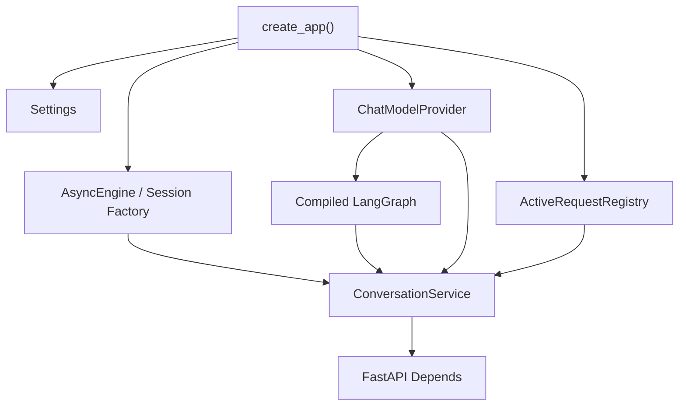
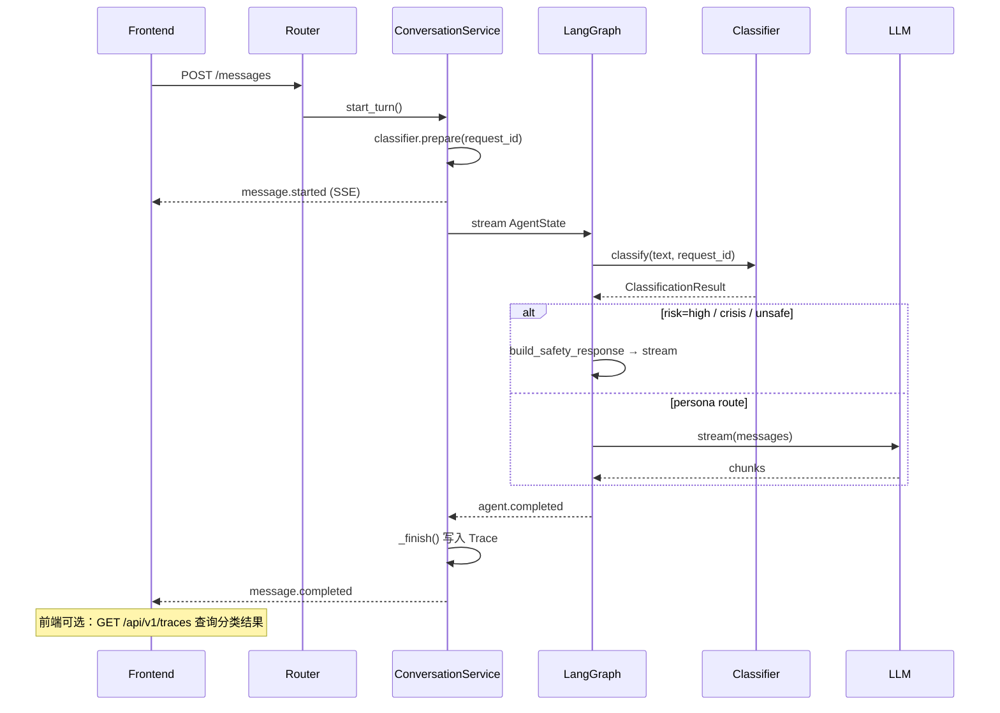
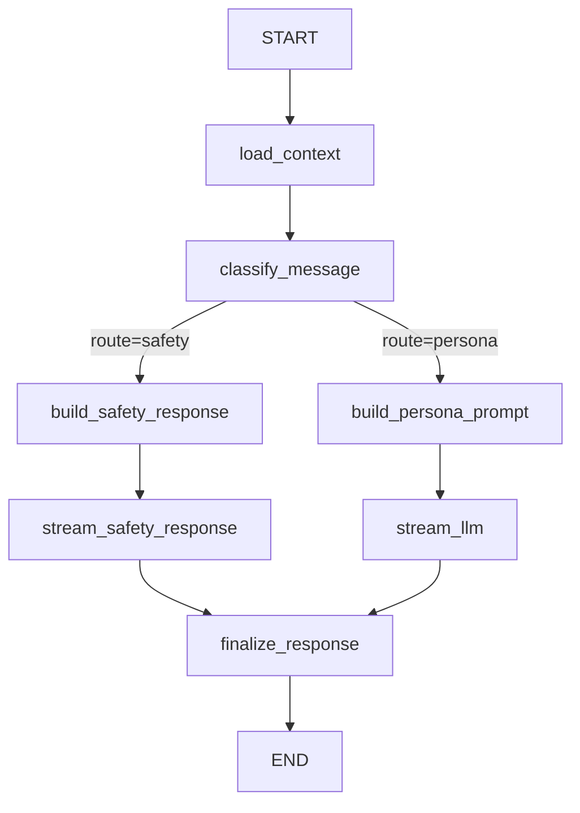
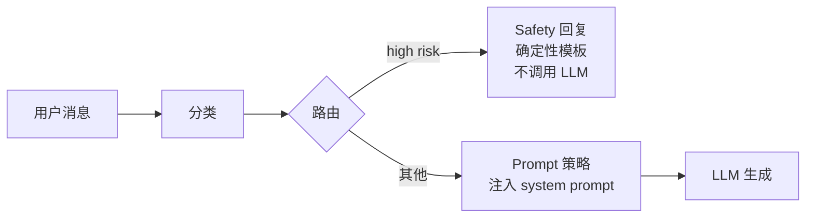
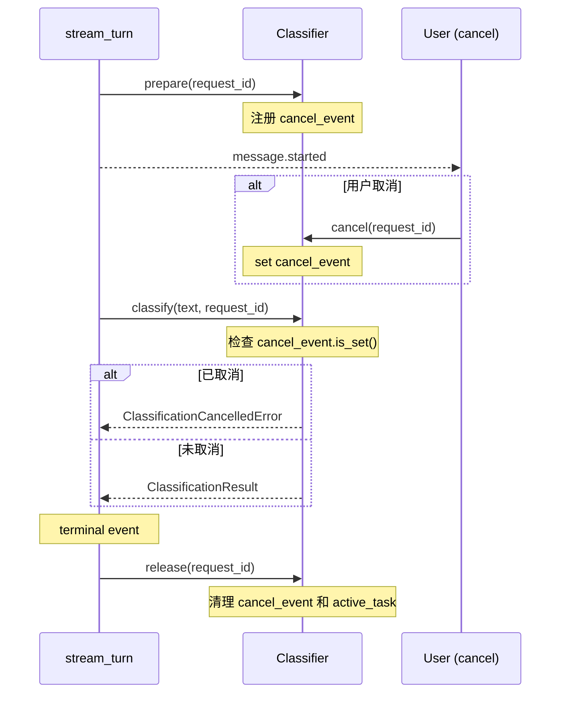

# 01 从 Spring Boot 到 FastAPI：实现 Mio 的流式聊天后端

## 1. 本章学习目标

完成本章后，你应该能够独立解释并复现：

1. Python package、module 和 import 如何组织。
2. Python 类型标注、dataclass、TypedDict 和 Pydantic 各自适合什么场景。
3. StrEnum、TypedDict `total=False` 和抽象基类 ABC 的用途。
4. Pydantic `strict`、`extra="forbid"`、`Field`、`model_validator` 和 `model_validate_json`。
5. `async/await`、异步生成器、AsyncIterator 和异步 context manager 如何协作。
6. FastAPI Router、Depends、Query、response_model 和统一异常处理。
7. SQLAlchemy 2.x AsyncSession 与 JPA/Hibernate 的主要差异。
8. Alembic revision、upgrade、downgrade 和 Flyway 的对照。
9. SSE 事件格式与 StreamingResponse。
10. LLM Provider 和 Classifier 的 ABC + 工厂模式。
11. OpenAI-compatible `/chat/completions` 协议和 JSON Schema 结构化输出。
12. LangGraph 的 State、Node、条件边、stream writer。
13. 分类、Persona Prompt 和 Safety 的职责边界。
14. prepare → classify → cancel → release 取消生命周期。
15. asyncio.Event、Task、wait 和 gather。
16. AgentTrace 字段、Schema v1/v2 兼容和 Trace API。
17. node_summary 白名单脱敏和 owner 隔离。
18. Cursor 分页原理。
19. pytest fixture、AsyncClient 和 MockTransport。
20. 如何测试分类 Schema、Graph 路由、取消、Task 泄漏、Trace 持久化和 owner 越权。

本章对应当前真实代码，不假设 Memory、RAG 或 Tool 已经实现。

## 2. 先建立整体认知

如果用 Spring Boot 的语言描述，本轮大致是：

```text
Controller
  -> Application Service
  -> Agent Workflow
  -> LLM Client
  -> Repository / Database
```

Mio 的实际结构是：

```text
FastAPI Router
  -> ConversationService
  -> LangGraph
  -> ChatModelProvider
  -> SQLAlchemy AsyncSession
```

两者结构相似，但 Python 版本没有 Spring IoC 容器自动扫描 Bean。对象是在 [create_app](../../backend/src/mio/main.py#L24) 中显式创建并放入 `app.state`。



## 3. Python package、module 与 import

### 3.1 基本术语

- **module**：一个 `.py` 文件，例如 `config.py`。
- **package**：可包含多个 module 的目录，通常含 `__init__.py`。
- **import**：加载并引用其他 module 中的名字。

项目采用 `src layout`：

```text
backend/
└── src/
    └── mio/
        ├── __init__.py
        ├── main.py
        ├── api/
        └── db/
```

`pyproject.toml` 告诉 Hatchling 把 `src/mio` 构建为包。执行 `uv sync` 后，虚拟环境可以直接：

```python
from mio.config import Settings
```

### 3.2 与 Java 对照

Java：

```java
import com.example.mio.config.Settings;
```

Python：

```python
from mio.config import Settings
```

相似点是都通过命名空间定位类型。差异在于 Python module 本身是运行时对象，import 会执行 module 顶层代码。因此不要在 module 顶层执行昂贵操作或读取不必要的外部资源。

## 4. 类型标注：Python 不是"没有类型"

查看 [Settings](../../backend/src/mio/config.py#L8)：

```python
environment: Literal["development", "test", "production"] = "development"
database_url: str = "postgresql+asyncpg://..."
mock_chunk_delay_ms: int = Field(default=0, ge=0)
```

`name: Type` 是类型标注。Python 运行时通常不会自动强制普通函数的标注，但：

- IDE 可以补全。
- Mypy 可以静态检查。
- Pydantic 会在模型实例化时校验。
- FastAPI 会根据标注生成 OpenAPI。

本项目运行：

```bash
uv run mypy src
```

并启用 strict 模式。

### Java 对照

Java 类型是编译器和 JVM 语义的一部分：

```java
String databaseUrl;
```

Python 类型标注默认更像"可由工具检查的契约"：

```python
database_url: str
```

不能因为两者写法相似，就认为 Python 获得了 Java 完全相同的编译期保证。

## 5. dataclass、TypedDict 与 Pydantic

本轮同时使用三种数据表达方式。

### 5.1 dataclass：内部简单数据载体

[TurnContext](../../backend/src/mio/services/conversations.py#L28)：

```python
@dataclass(frozen=True)
class TurnContext:
    conversation_id: UUID
    request_id: UUID
    user_message_id: UUID
    assistant_message_id: UUID
    trace_id: UUID
```

`@dataclass` 自动生成构造方法、比较方法和 repr。`frozen=True` 表示创建后不能重新赋值。

适合：

- 服务内部数据。
- 不需要 JSON 校验。
- 不直接作为 HTTP Schema。

它有点像 Java `record`，但不是完全等同：Python frozen dataclass 的运行时、继承和可变成员语义与 Java record 不同。

### 5.2 TypedDict：描述字典结构

[AgentState](../../backend/src/mio/agent/graph.py#L13)：

```python
class AgentState(TypedDict, total=False):
    request_id: UUID
    history: list[ChatMessage]
    display_text: str
    status: str
```

运行时它仍然是普通 `dict`。TypedDict 主要帮助 Mypy 理解有哪些 key。

为什么 LangGraph 使用它？

- Graph 节点天然通过"状态字典"交换数据。
- 节点只返回自己修改的字段。
- 图框架负责合并状态。

### 5.3 Pydantic：外部输入输出

`MessageCreate` 位于 `api/schemas.py`，负责：

- JSON 反序列化。
- 字段类型校验。
- 长度和枚举校验。
- OpenAPI Schema。

请求：

```json
{
  "content": "今天有点累",
  "source": "text"
}
```

如果 `content` 为空，FastAPI 返回统一的 `422 validation_error`。

### 与 DTO / Bean Validation 对照

Pydantic Model 可以类比 DTO + 一部分 Bean Validation：

```java
record MessageRequest(
    @NotBlank
    @Size(max = 20000)
    String content
) {}
```

但差异是：

- Pydantic 参与 Python 运行时解析和类型转换。
- Java DTO 的类型先由编译器确定，Bean Validation 是额外校验阶段。
- Pydantic 默认可能执行类型转换，需要理解 strict 配置，而不是把它当作 Java record。

### 5.4 配置文件路径不能依赖当前工作目录

[config.py](../../backend/src/mio/config.py#L8) 使用 `__file__` 定位 Python
模块自身，再向上找到 `backend` 目录：

```python
BACKEND_DIR = Path(__file__).resolve().parents[2]
env_file = BACKEND_DIR / ".env"
```

`Path` 是 Python 标准库的路径对象。`__file__` 是当前模块文件路径。
这样从项目目录、`/tmp` 或 macOS `launchd` 启动时，读取的始终是
`backend/.env`。

这类似 Spring Boot 明确指定外部配置位置，但 Python 进程的当前工作目录
更容易因 IDE、Shell、systemd 或 launchd 而变化。测试
[test_config.py](../../backend/tests/test_config.py#L6) 会切换工作目录，确认配置
路径不随之改变。

## 6. async/await：不要机械套用 CompletableFuture

### 6.1 async def

[ConversationService.start_turn](../../backend/src/mio/services/conversations.py#L150) 是：

```python
async def start_turn(...) -> TurnContext:
    ...
    await session.commit()
```

调用 async 函数不会立即得到 TurnContext，而会得到 coroutine。必须通过 `await` 驱动它。

### 6.2 异步生成器

LLM 返回多个文本片段，所以 Provider 使用：

```python
async def stream(...) -> AsyncIterator[str]:
    yield "第一段"
    yield "第二段"
```

消费方式：

```python
async for chunk in provider.stream(...):
    ...
```

它同时具备：

- `await` 非阻塞等待网络。
- `yield` 分批产生结果。

这正适合 LLM token/chunk 流。

### 6.3 与 CompletableFuture 对照

`CompletableFuture<T>` 通常表示未来得到一个 T。`AsyncIterator[str]` 表示未来不断得到多个字符串。

Java 更接近的概念是：

- Reactor `Flux<String>`。
- Java Flow Publisher。
- Kotlin Flow。

Python async 也不等于 Java 虚拟线程：

- `asyncio` 依赖协作式调度，阻塞调用会卡住事件循环。
- 虚拟线程允许用同步写法表达并发，由 JVM 调度大量轻量线程。
- 在 FastAPI async 路由中，应使用 asyncpg/httpx async 等非阻塞库。

## 7. context manager：资源必须成对释放

查看 [main.py 生命周期](../../backend/src/mio/main.py#L33)：

```python
@asynccontextmanager
async def lifespan(app):
    # 启动阶段
    yield
    # 关闭阶段
```

`yield` 前执行启动逻辑，`yield` 后释放 Provider 和数据库 Engine。

数据库 Session：

```python
async with self._session_factory() as session:
    ...
```

离开代码块时 Session 自动关闭。这和 Java `try-with-resources` 的目标相似：

```java
try (var resource = open()) {
    ...
}
```

差异是 Python context manager 由 `__enter__/__exit__` 或 `__aenter__/__aexit__` 协议实现。

## 8. 装饰器

Python 装饰器接收一个函数或类，返回包装后的对象。

FastAPI 路由：

```python
@api_router.post("/conversations")
async def create_conversation(...):
    ...
```

装饰器把函数注册为 HTTP handler。

测试中的 `@pytest.fixture` 也是装饰器。`@dataclass` 则是类装饰器。

与 Spring `@PostMapping` 相似之处是都声明路由元数据；差异是 Python 装饰器是普通可调用对象，运行时会真实执行并替换/注册函数。

## 9. FastAPI Router 与 Depends

### 9.1 Router

[routes.py](../../backend/src/mio/api/routes.py#L26) 定义两个 Router：

```python
health_router = APIRouter(prefix="/api/health")
api_router = APIRouter(prefix="/api/v1")
```

可类比 Spring 的 Controller 路径分组，但 Router 本身不是 Controller 类。

### 9.2 Depends

代码使用：

```python
ConversationServiceDep = Annotated[
    ConversationService,
    Depends(get_conversation_service),
]
```

FastAPI 在每次请求时调用 dependency function，从 `request.app.state` 取出 Service。

与 Spring DI 的区别：

- Spring 容器通常在启动时扫描并管理 Bean 生命周期。
- FastAPI Depends 更接近"请求处理时解析依赖函数图"。
- FastAPI 不会自动把任意类变成 singleton。
- 当前 singleton 是我们在 `create_app()` 中显式创建的。

## 10. SQLAlchemy 2.x 与 JPA/Hibernate

### 10.1 ORM 映射

[Message](../../backend/src/mio/db/models.py#L89)：

```python
class Message(..., Base):
    __tablename__ = "messages"

    display_text: Mapped[str] = mapped_column(Text, default="", nullable=False)
```

可类比：

```java
@Entity
@Table(name = "messages")
class Message {
    @Column(nullable = false)
    String displayText;
}
```

### 10.2 Session 不是 Repository

SQLAlchemy 使用：

```python
await session.scalar(select(Conversation).where(...))
```

当前项目没有 Spring Data JPA 那样的 Repository interface 自动实现。`AsyncSession` 同时承担：

- Unit of Work。
- Identity Map。
- 查询和持久化入口。

### 10.3 commit 和 flush

- `flush()`：把 SQL 发给数据库，但事务还没提交。
- `commit()`：提交事务。
- `refresh()`：重新从数据库读取字段。

[seed_demo_data](../../backend/src/mio/db/seed.py#L16) 在创建 User 后先 flush，因为后续 CompanionProfile 需要 `user.id`。

### 10.4 Lazy Loading 风险

异步 SQLAlchemy 不适合在 Session 已关闭后触发隐式 lazy load。接口返回 ORM 对象时，应确保响应需要的字段已加载。当前响应只使用实体自身列，不读取未加载关系。

### 10.5 Alembic 与 Flyway

Alembic 类似 Flyway/Liquibase，但通常迁移由 Python 脚本表达：

```bash
uv run alembic upgrade head     # 应用所有迁移
uv run alembic downgrade -1     # 回退一个版本
uv run alembic current          # 查看当前版本
uv run alembic heads            # 查看最新版本（当前：20260613_0002）
uv run alembic history          # 查看完整历史
```

应用启动时只检查数据库，不自动 `create_all()`。这和生产 Spring Boot 项目中关闭 Hibernate 自动建表、使用 Flyway 管迁移的思路一致。

## 11. LLM 在本模块中的职责

LLM 当前只负责一件事：根据 System Prompt 和最近 Conversation Context 生成澪的回复。

它不负责：

- 数据库事务。
- 用户身份。
- Conversation 分页。
- 记忆写入。
- Tool 权限。
- HTTP/SSE 编码。

这种边界非常重要。LLM 是不稳定的外部计算组件，不应该成为整个应用的"万能 Service"。

## 12. Prompt 如何组织

[build_persona_prompt](../../backend/src/mio/agent/prompt.py#L1) 从 CompanionProfile 接收：

- name
- relationship_type
- speaking_style
- boundaries

生成 system message，然后把最近历史拼到后面：

```text
System Persona Prompt
User/Assistant History
Current User Message
```

为什么不把人设写在 Router？

- Router 只处理 HTTP。
- Persona 后续可能从数据库编辑。
- 微信、语音等渠道必须复用同一人设。
- Prompt 需要独立测试和版本管理。

## 13. Token、上下文窗口与流式响应

### 13.1 Token

Token 是模型处理文本的基本单位，不严格等于字符或单词。不同 tokenizer 对中文、英文、代码的拆分不同。

当前代码没有真实 Token 计数，而是最多取最近 20 条已完成且允许进入历史的消息：

[上下文加载](../../backend/src/mio/services/conversations.py#L206)

这是第一波的简单限制，不是完整 Context Window 管理。后续需要：

- Token 估算。
- Conversation 摘要。
- Memory 与 RAG Context 预算。
- 超长输入拒绝或截断策略。

### 13.2 为什么流式

完整回复可能需要几秒。SSE 允许模型每产生一段就发送：

```text
message.started
message.delta
message.delta
message.completed
```

用户感知的是"开始回复的速度"，而不只是总耗时。

### 13.3 SSE 与 WebSocket

SSE：

- 单向：服务器到浏览器。
- 基于 HTTP。
- 文本事件格式简单。

WebSocket：

- 双向。
- 需要长期连接和自定义消息协议。
- 更适合实时音频、状态同步和多人协作。

第一波文字聊天选择 SSE，未来 WebRTC 语音不会复用 SSE 传音频。

## 14. 为什么需要结构化输出

本轮 LLM 只输出自然语言字符串，因此没有模型结构化输出。

但 HTTP 请求、Message 状态、SSE 事件和错误已经结构化。这为下一波情绪/意图节点做准备：

```json
{
  "emotion": "tired",
  "intent": "mixed",
  "risk_level": "none"
}
```

为什么未来不能依赖文本标签：

```text
[happy] 我在。
```

因为字符串容易缺失、拼错或混入正文。正确做法是让模型输出受 Pydantic Schema 校验的对象，并对解析失败设置降级。

## 14A. StrEnum、TypedDict 与抽象基类

### 14A.1 StrEnum

M2 大量使用 Python 3.11+ 的 `StrEnum`。它同时是 `str` 和 `Enum`：

```python
class EmotionLabel(StrEnum):
    crisis = "crisis"
    angry = "angry"
    calm = "calm"
```

[EmotionLabel](../../backend/src/mio/classification/models.py#L8) 的每个成员既是枚举值，也是字符串。可以直接和 `str` 比较：

```python
label = EmotionLabel.crisis
assert label == "crisis"           # True
assert isinstance(label, str)      # True
```

数据库存的是字符串列（`VARCHAR(32)`），读出来后可以直接比较枚举成员：

```python
if trace.emotion_label == EmotionLabel.crisis.value:
    ...
```

[MessageStatus](../../backend/src/mio/db/models.py#L31) 同样是 StrEnum，数据库 status 列存字符串，ORM 字段类型是 `Mapped[MessageStatus]`。

与 Java `enum` 的差异：

- Java enum 是编译期类型，不能直接当 `String` 用。
- Python StrEnum 成员本身就是 `str`，可以直接序列化、比较和存入数据库。
- Java enum 的 `name()` 和 `ordinal()` 没有直接对应；StrEnum 的 `.value` 就是字符串本身。

### 14A.2 TypedDict

[AgentState](../../backend/src/mio/agent/graph.py#L28)：

```python
class AgentState(TypedDict, total=False):
    request_id: UUID
    current_user_text: str
    classification: ClassificationResult
    route: str
    node_summary: dict[str, Any]
    # ...
```

`total=False` 表示所有字段都是可选的——节点只返回自己修改的字段，图框架负责合并。

TypedDict 和 Python `dict` 在运行时完全相同。它只给 Mypy 提供类型信息。为什么要用它而不是 dataclass？

- LangGraph 节点必须返回字典，不能返回 dataclass 实例。
- 图框架按 key 合并状态，TypedDict 让 Mypy 理解每个 key 的类型。
- `total=False` 让节点不需要返回所有字段。

### 14A.3 抽象基类 ABC

[MessageClassifier](../../backend/src/mio/classification/base.py#L9)：

```python
class MessageClassifier(ABC):
    name: str

    async def prepare(self, request_id: UUID) -> None: ...

    @abstractmethod
    async def classify(self, text: str, *, request_id: UUID) -> ClassificationResult:
        raise NotImplementedError

    @abstractmethod
    async def cancel(self, request_id: UUID) -> None:
        raise NotImplementedError

    async def release(self, request_id: UUID) -> None: ...
    async def aclose(self) -> None: ...
```

与 Java `interface` 的对比：

| Python ABC | Java interface |
|---|---|
| `@abstractmethod` | 方法声明（无 `default`） |
| 有默认实现的方法 | `default` 方法 |
| `ABC` 基类 | `interface` 关键字 |
| 运行时不能实例化抽象类 | 编译期检查 |
| 可以有实例属性 `name: str` | 可以有常量 |

差异：Java interface 可以多继承；Python ABC 也可以多继承，但更常用 mixin 模式。Java 的 `default` 方法和 Python ABC 的非抽象方法用途相似，但 Python 没有接口常量的概念。

`prepare()` 和 `release()` 有默认空实现，子类可以不覆盖。`classify()` 和 `cancel()` 是抽象的，子类必须实现。这比 Java `default` 方法更明确——空实现用 `pass` 或 `...` 而不是抛异常。

## 14B. Pydantic 深入：strict、forbid 和 model_validator

### 14B.1 BaseModel 回顾

`MessageCreate` 是典型的输入 Schema：

```python
class MessageCreate(BaseModel):
    content: str = Field(min_length=1, max_length=20_000)
    source: Literal["text", "voice", "active_care", "system"] = "text"
    persist_history: bool = True
```

Pydantic 在实例化时执行运行时校验。`Field(min_length=1, max_length=20_000)` 确保 content 非空且不超过 20000 字符。

### 14B.2 strict=True

[EmotionResult](../../backend/src/mio/classification/models.py#L62)：

```python
class EmotionResult(BaseModel):
    model_config = ConfigDict(extra="forbid", strict=True)
    label: EmotionLabel
    confidence: float = Field(ge=0.0, le=1.0)
```

`strict=True` 禁止 Pydantic 的隐式类型转换。没有 strict 时：

```python
# Pydantic 默认行为
EmotionResult(label="crisis", confidence="0.9")  # "0.9" 被转为 float 0.9
```

有 strict 时：

```python
# strict=True
EmotionResult(label="crisis", confidence="0.9")  # ValidationError!
```

为什么分类 Schema 要用 strict？

- LLM 返回的 JSON 可能是 `0.9`（数字）或 `"0.9"`（字符串）。
- 如果允许隐式转换，可能掩盖 LLM 输出格式错误。
- strict 模式下，类型不匹配直接报错，方便定位问题。

Java 对照：Java 编译器天然 strict——你不能把 `String` 赋给 `float`。Python Pydantic 的 strict 是运行时选择，不是语言默认行为。

### 14B.3 extra="forbid"

```python
model_config = ConfigDict(extra="forbid", strict=True)
```

`extra="forbid"` 拒绝 Schema 中未定义的字段。没有这个配置时，Pydantic 默认忽略多余字段。

为什么分类 Schema 要 forbid？

- LLM 可能在 JSON 中返回额外字段（例如 `"reasoning": "..."`）。
- 允许额外字段会隐藏 LLM 输出和 Schema 之间的不一致。
- forbid 模式强制 Schema 和 LLM 输出完全匹配。

Java 对照：Jackson 默认忽略未知字段（`@JsonIgnoreProperties(ignoreUnknown = true)`）。`extra="forbid"` 更严格，类似 Jackson 的 `FAIL_ON_UNKNOWN_PROPERTIES`。

### 14B.4 Field 校验

```python
confidence: float = Field(ge=0.0, le=1.0)
```

`ge`（>=）和 `le`（<=）是约束。Pydantic 在实例化时检查。其他常用约束：

- `gt`（>）、`lt`（<）
- `min_length`、`max_length`（字符串）
- `pattern`（正则）

Java 对照：`@Min(0) @Max(1)` Bean Validation 注解。

### 14B.5 model_validator：交叉约束

[ClassificationResult](../../backend/src/mio/classification/models.py#L89)：

```python
class ClassificationResult(BaseModel):
    model_config = ConfigDict(extra="forbid", strict=True)
    emotion: EmotionResult
    intent: IntentResult
    risk: RiskResult

    @model_validator(mode="after")
    def _check_cross_field_constraints(self) -> "ClassificationResult":
        if self.emotion.label is EmotionLabel.crisis and self.risk.level is not RiskLevel.high:
            raise ValueError(
                "emotion=crisis requires risk.level=high, "
                f"got risk.level={self.risk.level}"
            )
        if self.intent.label is IntentLabel.unsafe and self.risk.level is not RiskLevel.high:
            raise ValueError(
                "intent=unsafe requires risk.level=high, "
                f"got risk.level={self.risk.level}"
            )
        return self
```

`mode="after"` 在所有字段各自校验通过后执行。交叉约束不能用单字段 `Field` 表达，因为约束涉及多个字段。

Java 对照：`@ScriptAssert` 或自定义 `Validator`。差异是 Java Bean Validation 的交叉约束通常在类级别定义，Pydantic 的 `model_validator` 更灵活。

### 14B.6 model_validate_json

[OpenAI-compatible 分类器](../../backend/src/mio/classification/openai_compatible.py#L177)：

```python
result = ClassificationResult.model_validate_json(content)
```

`model_validate_json` 直接从 JSON 字符串解析并校验。一步完成：

1. JSON 字符串 → Python dict。
2. dict → Pydantic model（strict 校验 + 交叉约束）。

如果任何一步失败，抛出 `ValidationError`。分类器捕获这个异常，包装为 `ClassificationSchemaInvalidError`。

为什么不用 `json.loads()` + `ClassificationResult.model_validate()`？

- `model_validate_json` 内部做了相同的事，但可能更高效（Pydantic 内部优化）。
- 语义更清晰：一行代码表达"从 JSON 校验"。

## 14C. JSON Schema 结构化输出与为什么不能用正则

### 14C.1 JSON Schema 输出

OpenAI-compatible 分类器请求：

```python
"response_format": {
    "type": "json_schema",
    "json_schema": {
        "name": "classification_result",
        "strict": True,
        "schema": ClassificationResult.model_json_schema(),
    },
}
```

`model_json_schema()` 自动生成 JSON Schema，描述 ClassificationResult 的结构、类型、约束和交叉验证规则。LLM 被要求按这个 Schema 返回 JSON。

Java 对照：类似用 Jackson `ObjectMapper` 生成 Schema，但 Pydantic 的 Schema 生成是声明式的，不需要手写。

### 14C.2 为什么不能用正则或 Markdown fence 清理解析 LLM

有些开发者用正则从 LLM 输出中提取 JSON：

```python
# ❌ 不要这样做
match = re.search(r"```json\s*(.*?)\s*```", content, re.DOTALL)
data = json.loads(match.group(1))
```

问题：

1. **LLM 不保证输出 Markdown fence**——有时是纯 JSON，有时是 JSON 嵌在自然语言中。
2. **正则匹配可能截断**——嵌套大括号、字符串中的 `\`\`\`` 都会导致错误匹配。
3. **修补和模糊解析掩盖错误**——如果 LLM 输出格式错误，应该报错并修复 Prompt 或 Schema，而不是用正则"猜"。
4. **安全风险**——模糊解析可能被注入利用。

正确做法：

```python
# ✅ 直接校验
result = ClassificationResult.model_validate_json(content)
```

如果 LLM 输出不符合 Schema，直接报 `ClassificationSchemaInvalidError`，Graph 使用 fallback 分类，不影响用户。

## 15. LangGraph：State、Node 和 Edge

### 15.1 State

State 是节点共享的数据，见 [AgentState](../../backend/src/mio/agent/graph.py#L28)。M2 版本新增了 `classification`、`route`、`safety_response` 等字段，详见 [27G 节](#27g-langgraph-m2条件路由与-stream-writer)。

### 15.2 Node

节点是接收 State、返回部分 State 的函数：

```python
async def finalize_response(state):
    return {"status": "completed"}
```

M2 有 7 个节点：`load_context`、`classify_message`、`build_safety_response`、`stream_safety_response`、`build_persona_prompt`、`stream_llm`、`finalize_response`。

### 15.3 Edge

Edge 决定执行顺序。M1 是线性图，M2 增加了条件边：

```python
graph.add_conditional_edges(
    "classify_message",
    route_after_classify,  # 根据 state["route"] 返回 "safety" 或 "persona"
    {"build_safety_response": ..., "build_persona_prompt": ...},
)
```

### 15.4 自定义流事件

[stream_llm](../../backend/src/mio/agent/graph.py#L209) 使用 `get_stream_writer()`：

```python
writer({"event": "message.delta", "text": chunk})
```

ConversationService 消费这些事件并写数据库，再交给 Router 编码为 SSE。

### 15.5 持久化说明

当前没有使用 LangGraph Checkpointer。Conversation 和 Message 由业务数据库持久化，AgentState 只存在于一次请求内。

这与 LangGraph 持久化不是一回事：

- 业务持久化：用户对话、消息、Trace。
- Graph checkpoint：节点级执行状态和恢复。

第一波不需要 checkpoint，避免引入第二套状态来源。

## 16. Memory、Knowledge 与 Conversation Context

当前只实现 Conversation Context。

| 概念 | 含义 | 当前状态 |
|---|---|---|
| Conversation Context | 最近几轮消息 | 已实现 |
| Memory | 跨会话的稳定用户事实和偏好 | 未实现 |
| Knowledge | 上传资料形成的可检索事实 | 未实现 |
| Project Context | 项目文档、代码和日志 | 未实现 |

不要把"历史消息在 Prompt 中"称为长期记忆。长期记忆需要抽取、审核、存储、检索和删除等独立生命周期。

## 17. RAG、Embedding 和重排

本轮尚未实现，先建立概念关系：

```text
Document
  -> Chunk
  -> Embedding Vector
  -> Vector Search
  -> Candidate Chunks
  -> Optional Rerank
  -> Prompt Context
```

- **RAG**：生成前检索外部知识并注入 Prompt。
- **Embedding**：把文本映射为向量。
- **向量检索**：按向量相似度寻找候选。
- **重排 Rerank**：用更精确但更慢的模型重新排序候选。

它们不应该被塞进 ChatModelProvider。未来会成为独立 Retriever 节点。

## 18. Tool Calling、Skill 与 MCP

当前均未实现。

- **Tool Calling**：模型选择并调用一个具有 Schema 的函数。
- **Skill**：项目内部封装的完整业务能力，可以包含多个步骤和工具。
- **MCP**：连接外部系统的标准协议与适配层。

关系可以理解为：

```text
Agent
  -> Built-in Tool
  -> Skill Registry
  -> MCP Tool Adapter
  -> External System
```

它们不是同义词，也不应该在第一波聊天闭环中提前搭框架。

## 19. 关键调用链逐步执行

以"今天写代码有点累"为例：

1. FastAPI 根据 Pydantic MessageCreate 校验 JSON。
2. Router 调用 `ConversationService.start_turn()`。
3. Registry 为 Conversation 预留 request_id。
4. Service 在一个事务中插入：
   - completed user message；
   - pending assistant message；
   - pending AgentTrace。
5. Router 返回 StreamingResponse。
6. Service 查询 CompanionProfile 和最近 completed 消息。
7. LangGraph `build_persona_prompt` 生成 system message。
8. `stream_llm` 调用 Mock 或 OpenAI-compatible Provider。
9. 每个 chunk 通过 LangGraph custom event 返回。
10. Service 把 assistant 草稿更新为 streaming。
11. Router 编码为 `event: message.delta`。
12. Provider 结束后，Graph 执行 finalize。
13. Service 把 Message 和 Trace 更新为 completed。
14. 前端收到 `message.completed`。
15. finally 释放 Registry 中的活跃请求。

对应实现：

- [start_turn](../../backend/src/mio/services/conversations.py#L150)
- [load AgentState](../../backend/src/mio/services/conversations.py#L206)
- [stream_turn](../../backend/src/mio/services/conversations.py#L288)

## 20. 异常与取消

### 20.1 普通 HTTP 异常

`AppError` 携带：

```text
status_code
code
message
details
```

异常处理器统一加上 trace_id。

### 20.2 流开始后的异常

HTTP headers 一旦发送，就不能把状态从 200 改成 500。因此 Provider 失败必须发送：

```text
event: message.failed
data: {"code":"provider_error", ...}
```

### 20.3 取消

取消不是杀死 Python 线程。当前流程是协作式取消：

1. Cancel API 设置 Event。
2. Provider 收到 request_id cancellation。
3. 流循环检查取消状态。
4. Message 保存已生成的部分文本。
5. terminal event 为 `message.cancelled`。

这与 Java 中常见的 `future.cancel(true)` 也不完全相同；底层库是否真的停止网络工作取决于 Provider 实现是否配合。

浏览器直接关闭 SSE 时，服务端无法再发送 `message.cancelled`，但异步生成器的 `finally` 仍会执行。当前实现会取消 Provider、保存已生成文本、把 Message 标记为 `cancelled`，并释放 Conversation 的活跃请求锁。对应回归测试位于 [test_conversations_api.py 第 165 行](../../backend/tests/test_conversations_api.py#L165)。

## 21. pytest 与 JUnit

### 21.1 Fixture

`tests/conftest.py` 提供 Settings、App 和 AsyncClient fixture。每个测试获得独立 SQLite 文件和应用生命周期。

可以类比 JUnit 的 setup 与 Spring Test Context，但 pytest fixture：

- 通过函数参数声明依赖。
- 可以组合其他 fixture。
- scope 可配置。
- yield 前后可以做 setup/teardown。

### 21.2 异步测试

项目配置 `asyncio_mode = "auto"`，所以可以直接：

```python
async def test_stream_message(...):
    response = await client.post(...)
```

### 21.3 MockTransport

[OpenAI-compatible 测试](../../backend/tests/test_agent_and_providers.py#L63) 使用 `httpx.MockTransport`，验证真实 HTTP 解析代码，但不访问网络。

这比直接 mock Provider 的 `stream()` 更有价值，因为它覆盖：

- URL。
- 请求 payload。
- SSE 行解析。
- `[DONE]` 终止。

### 21.4 与 JUnit 对照

| pytest | JUnit/Spring |
|---|---|
| fixture 参数 | `@BeforeEach` / TestContext 注入 |
| plain `assert` | AssertJ / JUnit assertions |
| `pytest -q` | Maven/Gradle test |
| monkeypatch/mock | Mockito |
| conftest.py | 共享测试配置 |

pytest 使用 Python 原生 `assert`，失败时通过 assertion rewriting 展示详细差异。

## 22. 常见错误与排查顺序

### 22.1 `ModuleNotFoundError: No module named mio`

排查：

1. 是否在 `backend` 目录。
2. 是否执行 `uv sync`。
3. 是否通过 `uv run ...` 启动。
4. `pyproject.toml` 是否仍包含 `packages = ["src/mio"]`。

### 22.2 PostgreSQL 连接失败

```bash
docker compose ps
docker compose logs postgres
```

检查 `MIO_DATABASE_URL` 是否使用 `postgresql+asyncpg://`。

使用云数据库时还要检查 SSH 隧道：

```bash
lsof -nP -iTCP:15432 -sTCP:LISTEN
curl http://127.0.0.1:8000/api/health/ready
```

前者确认本机隧道存在，后者确认 FastAPI 使用应用凭据完成了真实数据库查询。

### 22.3 表不存在

开发环境不会自动建表：

```bash
uv run alembic upgrade head
uv run alembic current
```

### 22.4 SSE 看起来一次性返回

curl 需要 `-N`。反向代理还需要关闭 buffering，本接口已经返回 `X-Accel-Buffering: no`。

### 22.5 409 conversation_busy

同一 Conversation 已有活跃生成。等待 terminal event，或调用 cancel API。

### 22.6 消息卡在 streaming

正常启动会执行 recovery。若仍存在：

1. 检查应用是否经过 lifespan 启动。
2. 查询 Message 的 request_id。
3. 查询对应 AgentTrace。
4. 检查启动日志和数据库事务。

### 22.7 Provider 失败

排查顺序：

1. `MIO_LLM_PROVIDER`。
2. `MIO_LLM_BASE_URL` 是否已经包含 `/v1`。
3. API Key 是否只在服务端配置。
4. 模型名是否存在。
5. 直接用 Mock Provider 验证应用链路。
6. 查看 `message.failed` 的 trace_id。

## 23. 为什么采用当前方案

### 普通 Service vs LangGraph

普通 Service 更简单，但第二波加入 Memory/RAG 时主链路会重构。当前用七节点条件路由图（load_context → classify_message → safety/persona 分支 → finalize_response），付出少量复杂度换取稳定扩展位置。

### 每个 chunk 写数据库 vs 只在结束写

当前每个 chunk 写草稿，优点是进程异常时可保留部分文本。缺点是写入频繁。流量上升后应改为按时间或字符数节流。

### SQLite 测试 vs PostgreSQL Testcontainers

SQLite 测试启动快、适合第一波。缺点是无法覆盖 PostgreSQL 方言和锁行为。数据库能力增强后应增加 PostgreSQL 集成测试，而不是永久只依赖 SQLite。

### 显式对象装配 vs DI 框架

Python 项目可以使用依赖注入框架，但第一波显式构造更容易理解和调试。FastAPI Depends 负责请求侧依赖，不需要复制 Spring 容器。

## 24. 建议亲手完成的小练习

### 练习 1：增加 Mock 场景

在用户文本包含"晚安"时返回澪的晚安回复，并先写失败测试。

目标文件：

- `tests/test_agent_and_providers.py`
- `src/mio/llm/mock.py`

### 练习 2：增加归档接口

实现：

```http
POST /api/v1/conversations/{id}/archive
```

要求：

- 只修改当前 Demo owner 的 Conversation。
- archived Conversation 不能再发送消息。
- 先写 API 测试。

### 练习 3：给 Trace 增加查询接口

实现按 request_id 查询 Trace，但不要返回完整 Prompt 或 API Key。

### 练习 4：给草稿更新增加节流

每累计 30 个字符或 200ms 才写一次数据库，同时保证最终文本完整。

### 练习 5：给分类器增加超时

在 `_do_classify` 中增加 `asyncio.wait_for`，超时 5 秒抛出 `ClassificationProviderError`。

### 练习 6：增加新的 emotion 标签

在 `EmotionLabel` 中增加 `surprised`，更新 Mock 分类器关键词表和 Prompt 策略。要求先写失败测试。

### 练习 7：给 Trace API 增加时间范围过滤

增加 `created_after` 和 `created_before` 查询参数，使用 `datetime` 类型。

## 25. 自测题

1. 为什么 MessageCreate 使用 Pydantic，而 TurnContext 使用 dataclass？
2. `async def` 调用后为什么需要 await？
3. AsyncIterator 与 CompletableFuture 的核心区别是什么？
4. FastAPI Depends 和 Spring Bean 注入为什么不是完全等同？
5. 为什么应用启动时不自动 `create_all()`？
6. Provider 失败后为什么用户消息仍然存在？
7. SSE 开始后为什么不能返回普通 HTTP 500？
8. Conversation Context 与长期 Memory 有什么区别？
9. 当前 LangGraph 为什么不使用 Checkpointer？
10. ActiveRequestRegistry 为什么不能支持多实例？
11. 为什么分类 Schema 使用 `strict=True`？
12. `model_validator(mode="after")` 适合什么场景？
13. prepare() 方法解决了什么竞态问题？
14. Trace API 为什么返回 404 而非 403？
15. node_summary 白名单包含哪些字段？

## 26. 参考答案

1. Pydantic 面向不可信 HTTP 输入，需要运行时解析和校验；TurnContext 是内部已验证数据，只需轻量不可变载体。
2. async 函数返回 coroutine，await 才把控制权交给事件循环并等待结果。
3. CompletableFuture 通常产生一个最终值，AsyncIterator 可以异步产生多个值，更接近 Flux。
4. Depends 在请求时执行依赖函数；Spring 容器通常在启动时管理 Bean 生命周期和自动装配。
5. Schema 变化必须由可审计、可回滚的 Alembic 迁移管理，避免生产数据库被 ORM 隐式修改。
6. start_turn 在调用 LLM 前提交用户消息、助手占位和 Trace，失败只改变助手消息状态。
7. HTTP headers 已发送，状态码不能重写；必须用流内 terminal event 表达错误。
8. Conversation Context 是最近消息；Memory 是跨 Conversation 的稳定事实和偏好，有独立抽取与管理生命周期。
9. 当前业务数据库已保存消息和 Trace，图只执行一次线性流程；引入 Checkpointer 会增加第二套状态来源。
10. Registry 存在单个 Python 进程内，其他实例看不到该字典和取消 Event。
11. `strict=True` 禁止隐式类型转换（如 `"0.9"` → `0.9`），防止 LLM 输出格式错误被掩盖。
12. 交叉约束——涉及多个字段的验证规则（如 `emotion=crisis → risk=high`）不能用单字段 `Field` 表达。
13. `prepare()` 在 `message.started` 前注册 `asyncio.Event`，消除"cancel 到达时 Event 尚未注册"的竞态窗口。
14. 404 隐藏资源存在性，防止攻击者通过 403 推断资源存在（类似"用户名不存在"vs"密码错误"的安全设计）。
15. `status`、`duration_ms`、`error_code`。最小暴露原则——内部数据（prompt、LLM 响应）可能包含隐私或系统信息。

## 27A. M2 运行基线与用户流程

M2 在 M1 基础上增加了分类、条件路由和 Trace API。当前运行基线：

```bash
cd backend
uv run pytest -q          # 199 passed
uv run ruff check .       # All checks passed
uv run mypy src           # Success: no issues found in 35 source files
```

M2 用户流程（在 M1 基础上增加的步骤）：

1. 用户发送消息。
2. 服务端先分类消息（emotion / intent / risk）。
3. 高风险 → Safety 回复（不调用 LLM）；其他 → Persona 回复。
4. 分类结果写入 AgentTrace。
5. 前端可以查询 Trace（列表 + 详情）。



## 27B. async/await 进阶：AsyncIterator 与 async generator

### 27B.1 async generator

`stream_turn` 是一个 async generator：

```python
async def stream_turn(self, turn: TurnContext) -> AsyncIterator[dict[str, object]]:
    yield {"event": "message.started", ...}
    async for event in stream_agent_events(...):
        yield {"event": "message.delta", ...}
    yield {"event": "message.completed", ...}
```

`yield` 暂停执行并产出值，`async` 允许在暂停期间执行 `await`。这比 `CompletableFuture<List<String>>` 更灵活——不需要等所有结果到齐才返回。

### 27B.2 AsyncIterator 协议

`AsyncIterator` 是一个协议，要求实现 `__aiter__()` 和 `__anext__()`。async generator 自动满足这个协议。

消费方式：

```python
async for event in service.stream_turn(turn):
    process(event)
```

每个 `yield` 产生一个值后，控制权回到消费者。消费者处理完后再 `__anext__()` 获取下一个值。

### 27B.3 与 Java Flow/Reactor 对照

| Python | Java | 语义 |
|---|---|---|
| `AsyncIterator[str]` | `Flux<String>` | 异步多值流 |
| `async for` | `.subscribe()` | 消费流 |
| `yield` | `sink.next()` | 产出值 |
| `asyncio.gather` | `Mono.zip()` | 并发等待 |

差异：Python async generator 是拉模型（消费者驱动），Reactor Flux 是推模型（生产者驱动）。Python 的 `async for` 在消费者准备好后才拉取下一个值。

## 27C. SSE 事件与 StreamingResponse

### 27C.1 SSE 格式

Server-Sent Events 是纯文本协议：

```text
event: message.delta
data: {"request_id":"...","delta":"你好"}

event: message.completed
data: {"request_id":"...","display_text":"你好呀"}
```

每个事件由 `event:` 行命名，`data:` 行携带 JSON，事件之间用空行分隔。

### 27C.2 FastAPI StreamingResponse

[send_message](../../backend/src/mio/api/routes.py#L116)：

```python
async def events() -> AsyncIterator[str]:
    async for event in service.stream_turn(turn):
        event_name = event.pop("event")
        data = json.dumps(event, default=str, ensure_ascii=False)
        yield f"event: {event_name}\ndata: {data}\n\n"

return StreamingResponse(
    events(),
    media_type="text/event-stream",
    headers={"Cache-Control": "no-cache", "X-Accel-Buffering": "no"},
)
```

`StreamingResponse` 接收一个 async generator，逐块发送给客户端。`X-Accel-Buffering: no` 告诉 Nginx 不要缓冲。

Java 对照：Spring 的 `SseEmitter` 或 `Flux<ServerSentEvent>`。差异是 FastAPI 没有专门的 SSE 类，直接用 `StreamingResponse` + 手动格式化。

### 27C.3 为什么不用 WebSocket

SSE 是单向的（服务器 → 浏览器），适合文本流式回复。WebSocket 是双向的，适合实时音频、状态同步和多人协作。M2 文字聊天用 SSE 足够。

## 27D. SQLAlchemy 2.x AsyncSession 与 Alembic

### 27D.1 AsyncSession

[ConversationService](../../backend/src/mio/services/conversations.py#L40) 使用 `async_sessionmaker[AsyncSession]`：

```python
async with self._session_factory() as session:
    conversation = await session.scalar(
        select(Conversation).where(Conversation.id == conversation_id)
    )
```

`async with` 确保 Session 在代码块结束时自动关闭。`await session.scalar()` 执行异步 SQL 查询。

与 JPA/Hibernate 的差异：

| SQLAlchemy AsyncSession | JPA EntityManager |
|---|---|
| `await session.scalar(select(...))` | `em.createQuery(...).getSingleResult()` |
| `session.add(obj)` | `em.persist(obj)` |
| `await session.commit()` | `em.getTransaction().commit()` |
| `await session.refresh(obj)` | `em.refresh(obj)` |
| 显式 session scope | 通常由 Spring `@Transactional` 管理 |

SQLAlchemy 没有 Spring Data JPA 那样的 Repository 自动实现。`AsyncSession` 同时承担 Unit of Work、Identity Map 和查询入口。

### 27D.2 Alembic 迁移

Alembic 类似 Flyway/Liquibase。每个迁移文件有 revision ID 和 upgrade/downgrade 函数。

[20260613_0002](../../backend/migrations/versions/20260613_0002_m2_classification_trace.py)：

```python
revision = "20260613_0002"
down_revision = "20260609_0001"

def upgrade():
    op.add_column("agent_traces", sa.Column("emotion_label", sa.String(32), nullable=True))
    # ... 9 more columns

def downgrade():
    op.drop_column("agent_traces", "trace_schema_version")
    # ... reverse order
```

常用命令：

```bash
uv run alembic upgrade head     # 应用所有迁移
uv run alembic downgrade -1     # 回退一个版本
uv run alembic current          # 查看当前版本
uv run alembic heads            # 查看最新版本
uv run alembic history          # 查看完整历史
```

Java 对照：Flyway 的 `V2__add_columns.sql` + `U2__drop_columns.sql`。差异是 Alembic 用 Python 代码而不是 SQL 文件，可以动态生成迁移。

### 27D.3 应用启动不自动建表

当前项目启动时只检查数据库可达性，不调用 `create_all()`。Schema 变化必须由 Alembic 迁移管理。这和生产 Spring Boot 项目中关闭 Hibernate 自动建表、使用 Flyway 管迁移的思路一致。

## 27E. Provider 抽象与工厂模式

### 27E.1 ChatModelProvider ABC

```python
class ChatModelProvider(ABC):
    name: str

    @abstractmethod
    async def stream(self, request_id, messages, options) -> AsyncIterator[str]: ...

    @abstractmethod
    async def cancel(self, request_id) -> None: ...

    async def aclose(self) -> None: ...
```

### 27E.2 MessageClassifier ABC

```python
class MessageClassifier(ABC):
    name: str

    async def prepare(self, request_id) -> None: ...
    @abstractmethod
    async def classify(self, text, *, request_id) -> ClassificationResult: ...
    @abstractmethod
    async def cancel(self, request_id) -> None: ...
    async def release(self, request_id) -> None: ...
    async def aclose(self) -> None: ...
```

### 27E.3 工厂函数

[create_chat_model_provider](../../backend/src/mio/llm/factory.py) 和 [create_message_classifier](../../backend/src/mio/classification/factory.py) 根据配置创建实例：

```python
def create_message_classifier(settings: Settings) -> MessageClassifier:
    if settings.classifier_provider == "mock":
        return MockMessageClassifier()
    elif settings.classifier_provider == "openai_compatible":
        return OpenAICompatibleMessageClassifier(
            base_url=settings.classifier_base_url,
            api_key=settings.classifier_api_key,
            model=settings.classifier_model,
        )
    raise ValueError(f"Unknown classifier provider: {settings.classifier_provider}")
```

配置选择实现，不需要依赖注入框架。`MIO_CLASSIFIER_PROVIDER=mock` → Mock 分类器，`openai_compatible` → 真实分类器。

### 27E.4 为什么需要 Mock Provider

- 无 API Key 时可以完整运行应用和测试。
- Mock 行为确定性，测试可重复。
- 开发新功能时先用 Mock 验证链路，再接真实 Provider。

## 27F. OpenAI-compatible /chat/completions 协议

### 27F.1 请求格式

[OpenAI-compatible 分类器](../../backend/src/mio/classification/openai_compatible.py#L102)：

```python
payload = {
    "model": self._model,
    "messages": [
        {"role": "system", "content": "Classify the user message..."},
        {"role": "user", "content": text},
    ],
    "temperature": 0,
    "stream": False,
    "response_format": {
        "type": "json_schema",
        "json_schema": {
            "name": "classification_result",
            "strict": True,
            "schema": ClassificationResult.model_json_schema(),
        },
    },
}
```

这是标准的 OpenAI Chat Completions 格式。兼容 OpenAI、DeepSeek、Ollama、vLLM 等。

### 27F.2 响应解析

```python
data = response.json()
choices = data.get("choices")
content = choices[0].get("message", {}).get("content")
result = ClassificationResult.model_validate_json(content)
```

直接从 `choices[0].message.content` 取 JSON 字符串，用 Pydantic 校验。不删除 Markdown fence、不正则提取、不修补。

### 27F.3 LLM Provider vs Classifier Provider

两者都用 `/chat/completions` 协议，但用途不同：

| | ChatModelProvider | MessageClassifier |
|---|---|---|
| 流式 | `stream=True` | `stream=False` |
| 输出 | 自然语言文本 | 结构化 JSON |
| 校验 | 无（直接拼接） | Pydantic Schema |
| 用途 | 生成回复 | 分类消息 |

## 27G. LangGraph M2：条件路由与 stream writer

### 27G.1 AgentState 扩展

M2 的 [AgentState](../../backend/src/mio/agent/graph.py#L28) 比 M1 多了分类相关字段：

```python
class AgentState(TypedDict, total=False):
    request_id: UUID
    current_user_text: str          # M2: 当前用户消息文本
    profile: dict[str, Any]
    history: list[ChatMessage]
    model: str
    classification: ClassificationResult  # M2: 分类结果
    classification_status: str      # M2: "success" | "fallback"
    classification_error_code: str  # M2: 错误码
    route: str                      # M2: "safety" | "persona"
    safety_response: str            # M2: Safety 回复文本
    display_text: str
    status: str
    node_summary: dict[str, Any]
```

### 27G.2 条件边

M1 是线性图，M2 增加了条件路由：

```python
graph.add_conditional_edges(
    "classify_message",
    route_after_classify,          # 路由函数
    {
        "build_safety_response": "build_safety_response",
        "build_persona_prompt": "build_persona_prompt",
    },
)
```

`route_after_classify` 根据 `state["route"]` 返回字符串，图框架根据字符串选择下一个节点。

### 27G.3 stream writer

`get_stream_writer()` 是 LangGraph 提供的机制，让节点在执行过程中产出自定义事件：

```python
async def stream_llm_node(state: AgentState) -> dict[str, Any]:
    writer = get_stream_writer()
    async for chunk in provider.stream(...):
        writer({"event": "message.delta", "text": chunk})
    return {"display_text": "".join(chunks), ...}
```

`writer()` 不是 `yield`——它把事件推送到图的事件流中。`stream_agent_events` 通过 `graph.astream(state, stream_mode=["custom", "values"])` 消费这些事件。

### 27G.4 完整图拓扑



## 27H. 分类、Persona Prompt 与 Safety 的职责边界

### 27H.1 分类（Classification）

职责：把用户消息结构化为 emotion、intent、risk。

不负责：生成回复、决定业务逻辑、存储数据。

### 27H.2 Persona Prompt

职责：根据分类结果生成回复策略文本，注入 system prompt。

[prompt.py](../../backend/src/mio/agent/prompt.py#L54) 的 `_build_classification_strategy`：

- sad/lonely → 先温柔回应感受。
- anxious → 先帮助稳定情绪。
- tired → 避免施压。
- mixed → 先情绪后知识。
- knowledge_qa → 清晰回答。
- fallback → 格外谨慎。

不负责：Safety 回复、直接决定路由。

### 27H.3 Safety

职责：对高风险消息生成确定性回复，不调用 LLM。

[safety.py](../../backend/src/mio/agent/safety.py#L45)：

- crisis/unsafe → 确认安全、建议紧急服务。
- 其他 high risk → 确认安全、建议联系信任的人。

不负责：正常聊天回复、分类。

### 27H.4 边界总结



## 27I. Fallback 保持聊天可用的原因和代价

### 27I.1 为什么需要 fallback

分类器可能失败（HTTP 错误、Schema 不匹配、超时）。如果分类失败就拒绝用户消息，体验很差。

[fallback](../../backend/src/mio/classification/models.py#L118)：

```python
def classification_fallback() -> ClassificationResult:
    return ClassificationResult(
        emotion=EmotionResult(label=EmotionLabel.calm, confidence=0.0),
        intent=IntentResult(label=IntentLabel.companion, confidence=0.0),
        risk=RiskResult(level=RiskLevel.medium, confidence=0.0),
    )
```

fallback 结果：calm + companion + medium risk。Persona Prompt 会加入"格外谨慎"策略。

### 27I.2 代价

- 置信度全为 0.0——分类完全不可靠。
- risk=medium——Prompt 会加入安全约束，回复可能过于保守。
- Trace 中 `classification_status=fallback`，`classification_error_code` 记录失败原因。
- 不能区分真正的 crisis 和普通消息——安全优先。

## 27J. prepare → classify → cancel → release 生命周期

### 27J.1 为什么需要 prepare

[base.py](../../backend/src/mio/classification/base.py#L26) 的注释说明了竞态问题：

```
如果 cancel_event 在 classify() 内部注册，存在以下窗口：
1. stream_turn yield message.started
2. 用户调用 cancel() → classifier.cancel() 是 no-op（event 尚未注册）
3. classify() 创建全新的、未取消的 Event
4. HTTP 请求正常发出
```

`prepare()` 在 `message.started` 之前注册 Event，消除这个窗口。

### 27J.2 完整生命周期



### 27J.3 各方法职责

| 方法 | 何时调用 | 做什么 |
|---|---|---|
| `prepare` | `message.started` 前 | 注册 Event，幂等 |
| `classify` | Graph 内部 | 复用 Event，已 set 则抛异常 |
| `cancel` | 用户取消时 | 只 set 已存在的 Event |
| `release` | `finally` 中 | 删除状态，多次调用安全 |
| `aclose` | 应用关闭时 | set 所有 Event，等待 tasks，关闭 client |

## 27K. asyncio.Event、Task、wait 和 gather

### 27K.1 asyncio.Event

```python
cancel_event = asyncio.Event()
# 生产者
cancel_event.set()
# 消费者
await cancel_event.wait()  # 阻塞直到 set
```

Event 是协程间的信号机制。`wait()` 不阻塞线程——它把控制权交还事件循环，直到 `set()` 被调用。

Java 对照：`CountDownLatch(1)` 或 `CompletableFuture`。差异是 Python Event 只有 set/clear 状态，没有返回值。

### 27K.2 asyncio.Task

```python
http_task = asyncio.ensure_future(self._client.post(...))
cancel_task = asyncio.ensure_future(cancel_event.wait())
```

`asyncio.ensure_future()` 创建一个 Task，把协程调度到事件循环。Task 是 Python 的并发执行单元，类似 Java 的 `Future`。

### 27K.3 asyncio.wait

```python
await asyncio.wait(
    [http_task, cancel_task],
    return_when=asyncio.FIRST_COMPLETED,
)
```

等待多个 Task 中第一个完成。类似 Java 的 `CompletableFuture.anyOf()`。

### 27K.4 asyncio.gather

```python
await asyncio.gather(http_task, cancel_task, return_exceptions=True)
```

等待所有 Task 完成。`return_exceptions=True` 让异常作为返回值而不是抛出。

在 `finally` 中使用 `gather` 确保所有 Task 都被清理：

```python
finally:
    if not http_task.done():
        http_task.cancel()
    if not cancel_task.done():
        cancel_task.cancel()
    await asyncio.gather(http_task, cancel_task, return_exceptions=True)
```

## 27L. 分类前取消竞态及解决方法

### 27L.1 问题

```text
时间线：
  T1: stream_turn yield message.started
  T2: 用户调用 cancel() → classifier.cancel() 是 no-op（Event 不存在）
  T3: classify() 创建新 Event → HTTP 请求发出
  T4: 用户以为已取消，但分类仍在进行
```

### 27L.2 解决：prepare() 提前注册

```text
时间线（修复后）：
  T1: prepare() 注册 Event
  T2: stream_turn yield message.started
  T3: 用户调用 cancel() → set 已存在的 Event
  T4: classify() 检查 Event.is_set() → 抛出 CancelledError
  T5: Graph 使用 fallback → message.cancelled
```

核心思想：**把注册和使用分开**。注册在安全的时间窗口（`message.started` 之前），使用在可能被取消的阶段。

## 27M. AgentTrace 的用途和字段

### 27M.1 用途

AgentTrace 记录每轮生成的可观测数据：

- 耗时（`duration_ms`）
- 状态（`status`）
- 使用的 Provider 和模型
- 分类结果（emotion / intent / risk）
- 路由决策（persona / safety）
- 各节点执行状态（`node_summary`）
- 错误信息

### 27M.2 最终字段

[AgentTrace](../../backend/src/mio/db/models.py#L126)：

| 字段 | 类型 | 说明 |
|---|---|---|
| `id` | UUID | 主键 |
| `conversation_id` | UUID | 所属对话 |
| `request_id` | UUID | 请求 ID（唯一） |
| `status` | str | pending/streaming/completed/cancelled/failed |
| `provider` | str | LLM Provider 名称 |
| `model` | str | 模型标识 |
| `duration_ms` | int? | 耗时毫秒 |
| `error_stage` | str? | 错误阶段 |
| `error_code` | str? | 错误码 |
| `node_summary` | JSON | 节点执行摘要 |
| `emotion_label` | str? | M2: 情绪标签 |
| `emotion_confidence` | float? | M2: 情绪置信度 |
| `intent_label` | str? | M2: 意图标签 |
| `intent_confidence` | float? | M2: 意图置信度 |
| `risk_level` | str? | M2: 风险等级 |
| `risk_confidence` | float? | M2: 风险置信度 |
| `classification_status` | str? | M2: success/fallback |
| `classification_error_code` | str? | M2: 错误码 |
| `route` | str? | M2: persona/safety |
| `trace_schema_version` | int? | M2: Schema 版本 |

## 27N. Trace Schema v1/v2 兼容

### 27N.1 版本策略

- M1 Trace：`trace_schema_version=NULL`（应用层按 v1 理解），分类字段全部 NULL。
- M2 Trace：`trace_schema_version=2`，分类字段根据执行进度写入。

### 27N.2 API 层映射

[routes.py](../../backend/src/mio/api/routes.py#L197)：

```python
trace_schema_version=t.trace_schema_version or 1
```

数据库 NULL → API 返回 1。`TraceResponse` 定义 `trace_schema_version: int = Field(ge=1)`，不允许 null。

### 27N.3 写入时机

`_finish()` 在每次生成结束时写入：

```python
trace.trace_schema_version = 2
```

分类前取消时，分类字段可能为 NULL，但 `trace_schema_version` 仍为 2——因为这是 M2 创建的 Trace。

## 27O. Trace API owner 隔离

### 27O.1 隔离方式

[TraceService](../../backend/src/mio/services/traces.py#L127)：

```python
def _owner_filter(self) -> ColumnElement[bool]:
    return Conversation.user_id == self._demo_user_id
```

查询时 JOIN Conversation 表，只返回 demo user 所属的 Trace。其他 owner 的 Trace 返回 404（非 403），避免信息泄露。

### 27O.2 为什么返回 404 而非 403

- 403 表示"资源存在但你无权访问"——攻击者知道资源存在。
- 404 表示"资源不存在"——攻击者无法区分"不存在"和"无权访问"。

## 27P. node_summary 白名单和最小暴露原则

### 27P.1 白名单字段

[sanitize_node_summary](../../backend/src/mio/services/traces.py#L34)：

```python
_NODE_SUMMARY_ALLOWED_KEYS = {"status", "duration_ms", "error_code"}
```

每个节点只暴露这三个字段。其他内部数据（如 prompt 文本、分类中间结果、LLM 响应）被丢弃。

### 27P.2 节点名过滤

```python
_NODE_NAME_RE = re.compile(r"^[a-z][a-z0-9_]{0,63}$")
```

节点名必须是合法标识符。大写开头、特殊字符、超长名称被静默丢弃。

### 27P.3 非字典值处理

内部 `node_summary` 可能包含字符串值（如 `"completed"`），API 层统一转换为 `{"status": "completed"}`。未知值返回 `{}`。

### 27P.4 为什么需要脱敏

- node_summary 内部可能包含 prompt 片段、LLM 响应、分类中间结果。
- 这些数据可能包含用户隐私或系统内部信息。
- API 只暴露调试所需的最小信息。

## 27Q. Cursor 分页

### 27Q.1 原理

[Trace API](../../backend/src/mio/services/traces.py#L112)：

```python
@staticmethod
def _encode_cursor(created_at: datetime, trace_id: UUID) -> str:
    raw = f"{created_at.isoformat()}|{trace_id}"
    return base64.urlsafe_b64encode(raw.encode()).decode()
```

Cursor 编码了排序字段（`created_at` + `id`），客户端不需要理解内部结构。

### 27Q.2 查询

```python
query = query.where(
    or_(
        AgentTrace.created_at < created_at,
        and_(
            AgentTrace.created_at == created_at,
            AgentTrace.id < trace_id,
        ),
    )
)
```

"取上一页最后一条之后的记录"。按 `created_at DESC, id DESC` 排序。

### 27Q.3 与 offset 分页对比

| | Cursor | Offset |
|---|---|---|
| 跳页 | 不支持 | 支持 |
| 性能 | 稳定 | 数据量大时变慢 |
| 一致性 | 好（不会重复/遗漏） | 差（插入/删除导致偏移） |
| 实现 | 稍复杂 | 简单 |

Cursor 分页适合无限滚动和实时数据；offset 分页适合后台管理页面。

## 27R. pytest 进阶：fixture、AsyncClient 和 MockTransport

### 27R.1 Fixture 深入

[conftest.py](../../backend/tests/conftest.py)：

```python
@pytest.fixture
def settings(tmp_path) -> Settings:
    return Settings(
        environment="test",
        database_url=f"sqlite+aiosqlite:///{tmp_path / 'test.db'}",
        llm_provider="mock",
        classifier_provider="mock",
    )

@pytest.fixture
async def app(settings: Settings):
    application = create_app(settings)
    async with LifespanManager(application):
        yield application

@pytest.fixture
async def client(app) -> AsyncIterator[AsyncClient]:
    transport = ASGITransport(app=app)
    async with AsyncClient(transport=transport, base_url="http://test") as test_client:
        yield test_client
```

每个测试获得：

1. 独立的 `Settings`（独立 SQLite 文件）。
2. 独立的 `App`（经过 lifespan 启动）。
3. 独立的 `AsyncClient`（直接走 ASGI，不走网络）。

`tmp_path` 是 pytest 内置 fixture，提供临时目录。`LifespanManager` 触发 FastAPI 的 lifespan 事件。

### 27R.2 AsyncClient

`httpx.AsyncClient` 的 `ASGITransport` 模式直接调用 ASGI app，不经过 TCP。测试速度快，不需要启动服务器。

### 27R.3 MockTransport

[OpenAI-compatible 测试](../../backend/tests/test_agent_and_providers.py#L63) 使用 `httpx.MockTransport`：

```python
async def handler(request: httpx.Request) -> httpx.Response:
    return httpx.Response(200, json={...})

transport = MockTransport(handler)
client = httpx.AsyncClient(transport=transport)
```

MockTransport 拦截 HTTP 请求，返回预设响应。测试覆盖了 URL 构造、请求 payload、SSE 行解析和 `[DONE]` 终止，但不访问网络。

## 27S. 如何测试 M2 功能

### 27S.1 测试分类 Schema

[test_classification.py](../../backend/tests/test_classification.py) 测试：

- 枚举值正确性。
- Schema 校验（strict、forbid）。
- 交叉约束（crisis → high risk）。
- Mock 分类器关键词匹配。
- prepare / cancel / release 生命周期。

```python
def test_crisis_requires_high_risk():
    with pytest.raises(ValidationError):
        ClassificationResult(
            emotion=EmotionResult(label=EmotionLabel.crisis, confidence=0.9),
            intent=IntentResult(label=IntentLabel.companion, confidence=0.9),
            risk=RiskResult(level=RiskLevel.low, confidence=0.9),  # 违反约束
        )
```

### 27S.2 测试 Graph 路由

[test_graph_routing.py](../../backend/tests/test_graph_routing.py) 测试：

- 高风险消息路由到 Safety。
- 普通消息路由到 Persona。
- fallback 分类路由到 Persona。
- Safety 回复内容正确性。
- Prompt 策略文本。

### 27S.3 测试 HTTP 取消

[test_cancel_and_isolation.py](../../backend/tests/test_cancel_and_isolation.py) 测试：

- 分类前取消（无 HTTP 请求）。
- 分类中取消（2 秒内）。
- 正常清理（20 轮无泄漏）。
- HTTP 错误后清理。
- aclose 中断。
- 轮次隔离。

### 27S.4 测试 Task 泄漏

取消测试验证：

- `_cancel_events` 字典在 release 后为空。
- `_active_tasks` 字典在 release 后为空。
- 20 轮取消后无累积状态。

### 27S.5 测试 Trace 持久化

[test_trace_persistence.py](../../backend/tests/test_trace_persistence.py) 测试：

- 正常 persona 路由分类字段写入。
- Safety 路由分类字段写入。
- Provider 错误 → fallback 字段。
- Schema 无效 → fallback 字段。
- 取消时 Trace 保存。
- 历史 NULL 字段兼容。
- 节点摘要结构。
- 迁移文件结构。

### 27S.6 测试 owner 越权

[test_traces_api.py](../../backend/tests/test_traces_api.py) 测试：

- 其他 owner 的 Trace 返回 404。
- 其他 owner 的 Trace 不在列表中。
- 非法 cursor 返回 400。

### 27S.7 测试敏感数据泄露

- node_summary 不包含 prompt 文本。
- node_summary 不包含 API Key。
- node_summary 不包含完整 LLM 响应。
- 只有白名单字段通过。

## 27T. 常见错误补充

### 27T.1 `coroutine was never awaited`

```python
# ❌ 忘记 await
result = classifier.classify(text, request_id=request_id)
# result 是 coroutine，不是 ClassificationResult
```

修复：`result = await classifier.classify(...)`。

### 27T.2 coroutine 不是 async generator

```python
# ❌ 混淆 async def 和 async generator
async def get_data() -> str:
    return "hello"

async for item in get_data():  # TypeError!
```

只有包含 `yield` 的 `async def` 才是 async generator。普通 `async def` 返回 coroutine，需要 `await`。

### 27T.3 CancelledError 传播

`asyncio.CancelledError` 在 Python 3.9+ 是 `BaseException` 的子类，不是 `Exception`。普通 `except Exception` 不会捕获它：

```python
try:
    await some_task()
except Exception:  # 不捕获 CancelledError
    ...
```

如果需要清理，用 `finally` 而不是 `except Exception`。

### 27T.4 Task 泄漏

```python
# ❌ 创建 Task 但不 await
asyncio.ensure_future(some_coroutine())
# 如果 some_coroutine 抛异常，永远不会被处理
```

修复：保存 Task 引用，在 finally 中 cancel + gather。

### 27T.5 Pydantic 隐式转换

```python
# ❌ 期望 strict=True 时的隐式转换
EmotionResult(label="crisis", confidence="0.9")  # ValidationError!
```

`strict=True` 禁止隐式类型转换。LLM 返回的 JSON 中 `"0.9"` 是字符串，不是数字。

### 27T.6 错误读取旧用户消息

```python
# ❌ 查询最新用户消息（可能不是当前轮次的）
user_msg = await session.scalar(
    select(Message).where(...).order_by(Message.created_at.desc())
)
```

修复：通过 `turn.user_message_id` 精确查询当前轮次的用户消息。

### 27T.7 owner 越权

```python
# ❌ 不检查 owner
trace = await session.get(AgentTrace, trace_id)
```

修复：JOIN Conversation 并检查 `user_id == demo_user_id`。

### 27T.8 Trace 泄露

node_summary 可能包含 prompt 片段或 LLM 响应。必须经过 `sanitize_node_summary` 过滤后才能返回给前端。

## 27U. 推荐调试顺序

1. **分类 Schema 不通过** → 检查 LLM 输出格式，确认 `response_format` 正确。
2. **分类 fallback** → 查 Trace 的 `classification_error_code`，定位是 HTTP 错误还是 Schema 错误。
3. **路由错误** → 检查 `_is_safety_route` 逻辑，确认分类结果的 risk/emotion/intent 值。
4. **Safety 回复不对** → 检查 `build_safety_response` 的条件分支。
5. **Prompt 策略缺失** → 检查 `_build_classification_strategy` 的 emotion/intent 匹配。
6. **取消不生效** → 检查 prepare 是否在 message.started 之前调用。
7. **Task 泄漏** → 检查 release 是否在 finally 中调用。
8. **Trace 字段为 NULL** → 检查 `_finish()` 是否收到 classification 参数。

## 27V. 小练习（M2 扩展）

### 练习 5：给分类器增加超时

在 `_do_classify` 中增加 `asyncio.wait_for`，超时 5 秒抛出 `ClassificationProviderError`。

### 练习 6：增加新的 emotion 标签

在 `EmotionLabel` 中增加 `surprised`，更新 Mock 分类器关键词表和 Prompt 策略。要求先写失败测试。

### 练习 7：给 Trace API 增加时间范围过滤

增加 `created_after` 和 `created_before` 查询参数，使用 `datetime` 类型。

### 练习 8：增加 Trace 统计接口

实现 `GET /api/v1/traces/stats`，返回每个 emotion_label 的计数。不使用 GROUP BY 子查询，用 Python 内存聚合。

## 27W. 自测题（M2 扩展）

1. 为什么分类 Schema 使用 `strict=True` 和 `extra="forbid"`？
2. `model_validator(mode="after")` 和 `@field_validator` 有什么区别？
3. 为什么分类器需要 `prepare()` 方法？
4. `asyncio.wait` 和 `asyncio.gather` 的区别是什么？
5. Trace API 为什么返回 404 而非 403？
6. node_summary 白名单包含哪些字段？为什么？
7. Cursor 分页和 offset 分页各适合什么场景？
8. 为什么不能用正则从 LLM 输出中提取 JSON？
9. `trace_schema_version` 为 NULL 的历史 Trace 在 API 中返回什么？
10. 分类失败后聊天为什么还能继续？

## 27X. 参考答案（M2 扩展）

1. `strict=True` 禁止隐式类型转换，防止 LLM 输出格式错误被掩盖；`extra="forbid"` 拒绝未知字段，确保 Schema 和 LLM 输出完全匹配。
2. `@field_validator` 在单个字段校验时执行；`model_validator(mode="after")` 在所有字段各自校验通过后执行，适合交叉约束。
3. `prepare()` 在 `message.started` 之前注册 `asyncio.Event`，消除"cancel 到达时 Event 尚未注册"的竞态窗口。
4. `asyncio.wait` 等待多个 Task 中第一个完成（类似 `anyOf`）；`asyncio.gather` 等待所有 Task 完成（类似 `allOf`）。
5. 404 隐藏资源存在性，防止攻击者通过 403 推断资源存在。白名单字段：`status`、`duration_ms`、`error_code`。最小暴露原则——内部数据（prompt、LLM 响应）可能包含隐私。
6. 白名单字段：`status`、`duration_ms`、`error_code`。最小暴露原则——内部数据（prompt、LLM 响应）可能包含隐私或系统信息。
7. Cursor 适合无限滚动和实时数据（性能稳定、一致性好）；offset 适合后台管理页面（支持跳页）。
8. 正则可能截断嵌套结构、不处理所有 LLM 输出格式、掩盖格式错误。正确做法是 `model_validate_json` 直接校验。
9. `trace_schema_version` 返回 1（`t.trace_schema_version or 1`）。
10. 分类失败时 `classification_fallback()` 返回 calm + companion + medium risk，Graph 继续走 Persona 路径。代价是置信度为 0 且回复策略偏保守。

## 27. 本章总结与下一章

本章完成了一个真正可运行的 Python AI 应用最小闭环：

```text
HTTP 输入
  -> Pydantic 校验
  -> SQLAlchemy 事务
  -> 消息分类（M2）
  -> 条件路由（M2）
  -> Persona Prompt / Safety 回复
  -> LangGraph
  -> LLM Provider
  -> SSE
  -> Message / Trace 持久化
  -> Trace 查询 API（M2）
```

最重要的不是"调用了一次模型"，而是把不稳定的模型调用放进可测试、可取消、可恢复、可观测的应用边界中。

M2 增加了分类和安全路由，让应用能在不调用 LLM 的情况下处理高风险消息。Trace API 让每轮生成的分类结果和执行状态可查询。

下一章适合学习结构化情绪和意图识别的进一步优化：更精确的分类模型、RAG 知识检索和 Tool Calling。
