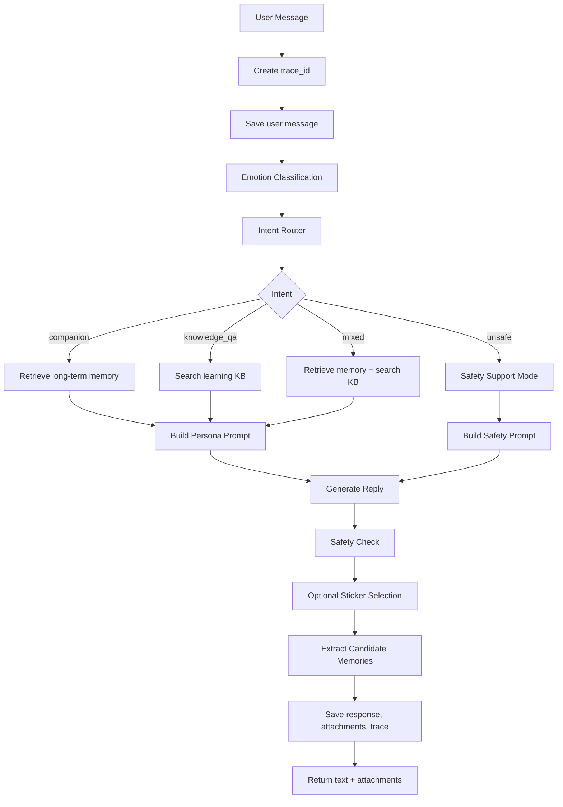
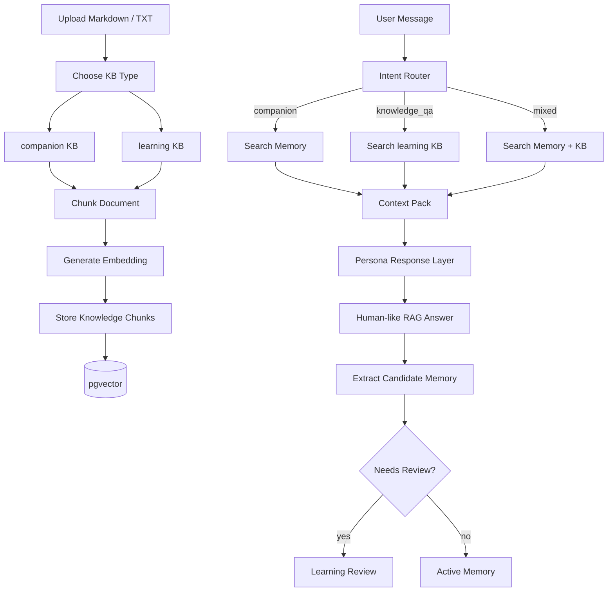
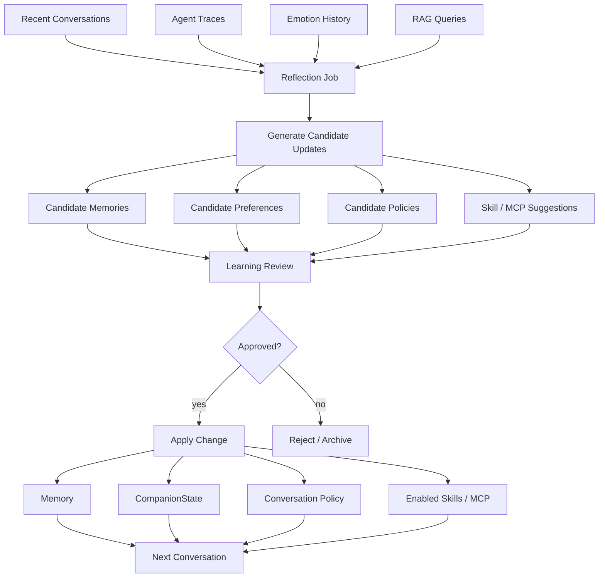
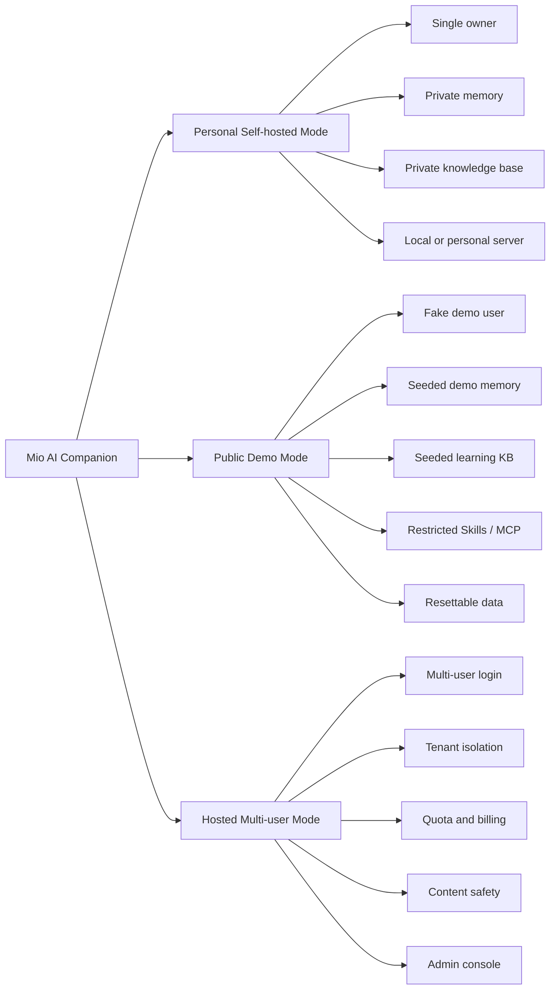
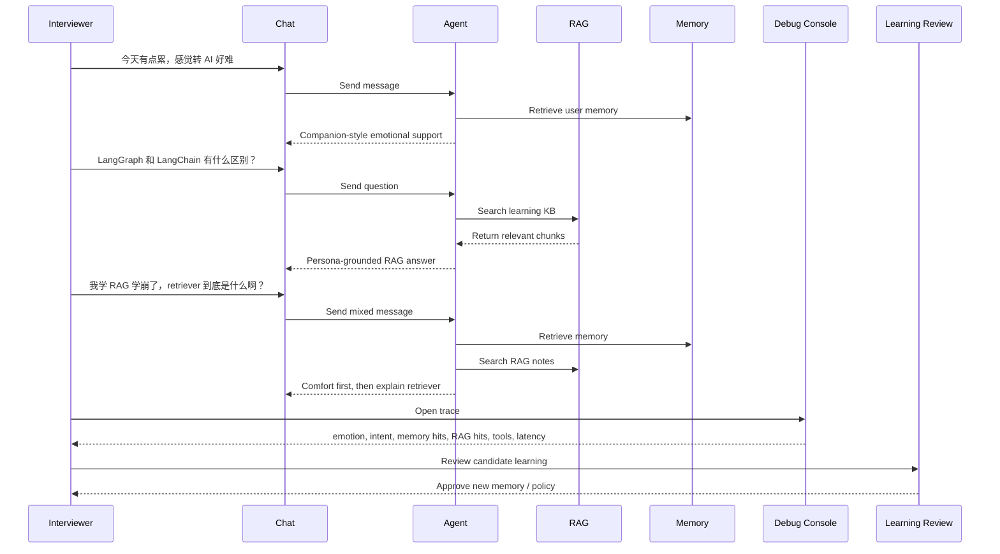
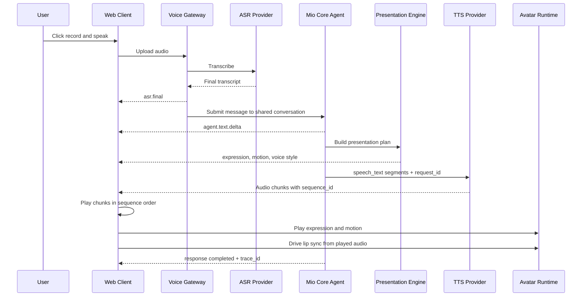
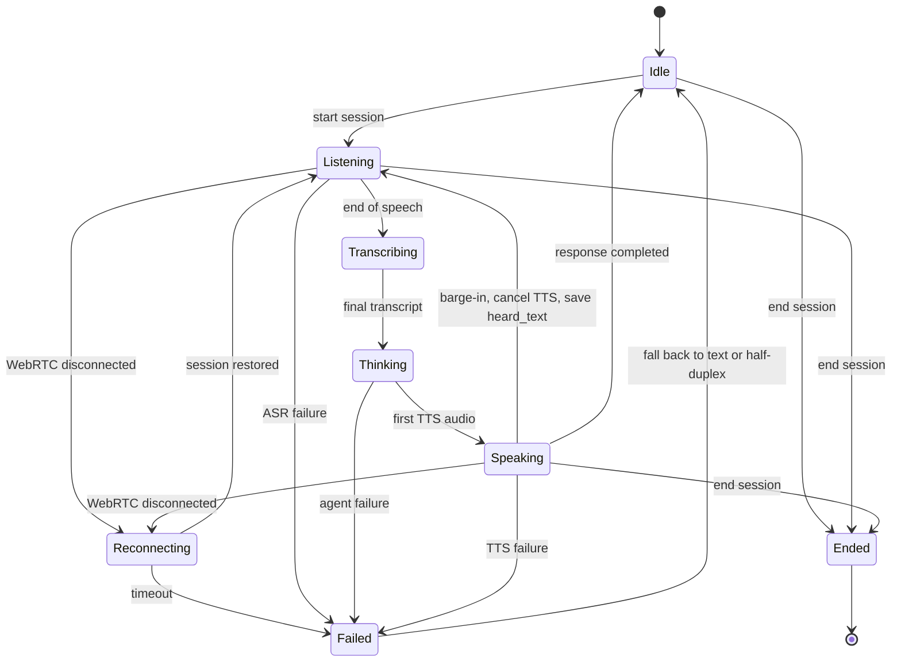

# Mio AI Companion Diagrams

## 1. System Architecture

```mermaid
flowchart TB
    user["User"]
    web["Web Chat"]
    admin["Admin / Debug Console"]
    wechat["WeChat Webhook Simulator"]

    api["FastAPI API Layer"]
    graph["LangGraph Agent Workflow"]

    persona["Persona Layer"]
    emotion["Emotion Layer"]
    memory["Memory Layer"]
    rag["RAG Knowledge Layer"]
    tools["Tool Layer"]
    safety["Safety Guard"]
    trace["Trace Layer"]

    llm["LLM Provider Layer"]
    mockllm["Mock LLM"]
    realllm["OpenAI-compatible LLM"]

    db[("PostgreSQL")]
    vector[("pgvector")]
    media[("Media Storage")]

    user --> web
    user --> wechat
    admin --> api
    web --> api
    wechat --> api
    api --> graph

    graph --> emotion
    graph --> memory
    graph --> rag
    graph --> tools
    graph --> persona
    graph --> safety
    graph --> trace
    persona --> llm

    llm --> mockllm
    llm --> realllm

    memory --> db
    rag --> db
    rag --> vector
    tools --> media
    trace --> db
    safety --> db
```

## 2. Agent Conversation Workflow



## 3. Core Module Map

```mermaid
flowchart LR
    subgraph Experience["Experience Layer"]
        chat["Chat"]
        personaSettings["Persona Settings"]
        kbPage["Knowledge Base"]
        memoryPage["Memory Center"]
        debugPage["Agent Debug"]
        skillPage["Skills / MCP"]
        learningReview["Learning Review"]
    end

    subgraph API["API Layer"]
        chatAPI["Chat API"]
        kbAPI["Knowledge API"]
        memoryAPI["Memory API"]
        personaAPI["Persona API"]
        traceAPI["Trace API"]
        webhookAPI["WeChat Webhook API"]
    end

    subgraph Agent["Agent Layer"]
        langgraph["LangGraph Workflow"]
        intent["Intent Router"]
        emotion["Emotion Classifier"]
        prompt["Prompt Builder"]
        guard["Safety Guard"]
    end

    subgraph Intelligence["Intelligence Layer"]
        persona["Persona Engine"]
        memory["Memory Service"]
        rag["RAG Service"]
        adaptive["Adaptive Learning"]
        tools["Tool Registry"]
        skills["Skill Registry"]
        mcp["MCP Tool Adapter"]
    end

    subgraph Storage["Storage Layer"]
        postgres[("PostgreSQL")]
        pgvector[("pgvector")]
        files[("Files / Stickers")]
    end

    Experience --> API
    API --> Agent
    Agent --> Intelligence
    Intelligence --> Storage
```



## 4. RAG And Memory Flow



## 5. Adaptive Learning Loop



## 6. Skill And MCP Extension Architecture

```mermaid
flowchart TB
    graph["LangGraph Workflow"] --> registry["Tool Registry"]

    registry --> builtin["Built-in Tools"]
    registry --> skills["Skill Registry"]
    registry --> mcpAdapter["MCP Tool Adapter"]

    builtin --> memoryTool["search_memory"]
    builtin --> kbTool["search_knowledge_base"]
    builtin --> stickerTool["select_sticker"]
    builtin --> reminderTool["create_reminder"]

    skills --> localStickerSkill["local-stickers Skill"]
    skills --> statusImageSkill["status-image Skill"]
    skills --> studyPlanSkill["study-plan Skill"]

    mcpAdapter --> mcpClient["MCP Client"]
    mcpClient --> fs["Filesystem MCP"]
    mcpClient --> notes["Notes MCP"]
    mcpClient --> calendar["Calendar MCP"]
    mcpClient --> github["GitHub MCP"]

    registry --> audit["Invocation Audit"]
    audit --> trace["Agent Trace"]
```

## 7. Deployment Modes



## 8. Interview Demo Flow



## 9. Avatar And Voice Architecture

```mermaid
flowchart TB
    user["User"]

    subgraph experience["Experience Layer"]
        chat["Web Chat"]
        call["Immersive Voice Call"]
        future["Future Desktop / Mobile"]
    end

    subgraph channels["Channel Layer"]
        textAdapter["Text Channel Adapter"]
        voiceAdapter["Voice Channel Adapter"]
    end

    subgraph voice["Voice Gateway"]
        session["Voice Session"]
        capture["Audio Upload / WebRTC"]
        vad["VAD"]
        asr["ASR Provider"]
        tts["TTS Provider"]
        interrupt["Interruption Controller"]
    end

    subgraph core["Mio Core Agent"]
        conversation["Conversation Service"]
        graph["LangGraph Workflow"]
        persona["Persona"]
        emotion["Emotion / Intent"]
        memory["Memory"]
        rag["RAG / Project Context"]
        safety["Safety"]
        trace["Agent Trace"]
    end

    subgraph presentation["Presentation Layer"]
        plan["Presentation Engine"]
        expression["Expression Mapper"]
        motion["Motion Mapper"]
        voiceStyle["Voice Style Mapper"]
    end

    subgraph runtime["Client Runtime"]
        controller["Avatar Controller"]
        renderer["Static / Live2D / VRM Renderer"]
        player["Audio Player"]
        lipsync["Audio Lip Sync"]
        subtitle["Subtitle Stream"]
        fallback["Static Avatar Fallback"]
    end

    user --> chat
    user --> call
    chat --> textAdapter
    call --> voiceAdapter
    future --> voiceAdapter

    textAdapter --> conversation
    voiceAdapter --> session
    session --> capture
    capture --> vad
    vad --> asr
    asr --> conversation

    conversation --> graph
    graph --> persona
    graph --> emotion
    graph --> memory
    graph --> rag
    graph --> safety
    graph --> trace

    graph --> plan
    plan --> expression
    plan --> motion
    plan --> voiceStyle

    voiceStyle --> tts
    tts --> player
    expression --> controller
    motion --> controller
    controller --> renderer
    player --> lipsync
    lipsync --> controller
    graph --> subtitle
    renderer -. load failure .-> fallback
    interrupt --> graph
    interrupt --> tts
```

## 10. Half-duplex Voice Turn



## 11. Realtime Voice State Machine


