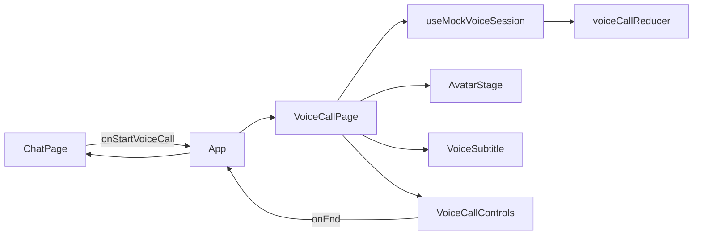
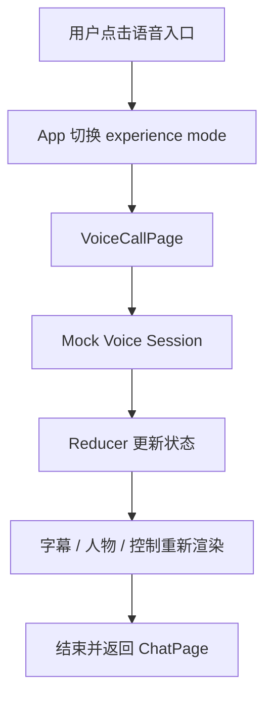

# Chat Polish and Immersive Voice Call Implementation Plan

> **For agentic workers:** REQUIRED SUB-SKILL: Use superpowers:subagent-driven-development (recommended) or superpowers:executing-plans to implement this plan task-by-task. Steps use checkbox (`- [ ]`) syntax for tracking.

**Goal:** Remove the always-visible avatar from chat, polish the warm-plum chat UI, and add a testable full-screen mock voice-call experience with the character on the right and subtitles below.

**Architecture:** Keep `ChatPage` responsible for text chat and keep it mounted while `App` overlays the full-screen voice-call experience. This preserves the current hook state, conversation, draft, and scroll position without moving chat orchestration. Add a self-contained `features/voice-call` module with a reducer-driven mock session so UI states can be tested without ASR, TTS, WebRTC, or backend changes. Reuse the existing `AvatarStage` only inside the voice-call page.

**Tech Stack:** React 19, TypeScript 5.8, Vite 7, Vitest, Testing Library, plain CSS, Phosphor Icons, existing Anime.js helpers.

**Source specification:** `docs/superpowers/specs/2026-06-11-chat-and-immersive-voice-design.md`

---

## Scope and Non-Goals

This plan implements:

- Chat-page avatar removal.
- Warm-plum visual simplification.
- Full-screen voice-call entry and exit.
- Mock permission, listening, thinking, speaking, muted, subtitles-hidden, and failed states.
- Static character fallback.
- Desktop and mobile responsive layouts.
- Frontend tests, architecture checks, documentation, and browser validation.

This plan does not implement:

- Real microphone capture.
- Browser permission prompts through `getUserMedia`.
- ASR, TTS, VAD, WebRTC, lip sync, or VoiceTrace backend persistence.
- New backend endpoints or database migrations.
- shadcn/ui, Tailwind, Radix, React Router, or a new state-management dependency.

The voice button must therefore be labelled as a preview/mock experience in development-facing documentation. The UI itself may use natural product copy without claiming real audio capture.

## File Map

### Create

- `frontend/src/features/voice-call/voice-call-types.ts`  
  Defines voice phases and reducer state.
- `frontend/src/features/voice-call/voice-call-reducer.ts`  
  Contains deterministic state transitions.
- `frontend/src/features/voice-call/voice-call-reducer.test.ts`  
  Tests transitions without rendering React.
- `frontend/src/features/voice-call/useMockVoiceSession.ts`  
  Owns mock timers and exposes UI actions.
- `frontend/src/features/voice-call/VoiceSubtitle.tsx`  
  Renders speaker-labelled subtitles.
- `frontend/src/features/voice-call/VoiceCallControls.tsx`  
  Renders mute, end, and subtitle controls.
- `frontend/src/features/voice-call/VoiceCallPage.tsx`  
  Composes the full-screen experience.
- `frontend/src/features/voice-call/VoiceCallPage.test.tsx`  
  Covers entry state, controls, accessibility, and failure recovery.
- `docs/learning/02-react-immersive-voice-ui.md`  
  Explains the frontend state model for a Java/Spring developer.

### Modify

- `frontend/src/App.tsx`  
  Keeps chat mounted and overlays the voice-call experience.
- `frontend/src/features/chat/ChatPage.tsx`  
  Removes avatar rendering and exposes `onStartVoiceCall`.
- `frontend/src/features/chat/MessageList.tsx`  
  Removes `avatarVisible` and the `has-avatar` class.
- `frontend/src/features/chat/useChatPreferences.ts`  
  Keeps sidebar state only.
- `frontend/src/components/avatar/AvatarStage.tsx`  
  Converts from chat-specific show/close behavior to a presentational voice-call avatar.
- `frontend/src/features/chat/chat-animations.ts`  
  Removes chat avatar animation helper or renames it for voice-call use.
- `frontend/src/architecture.test.ts`  
  Enforces new boundaries and retired selector removal.
- `frontend/src/styles.css`  
  Removes old avatar/chat-safe-area CSS, reduces decorative effects, and adds voice-call styles.
- `docs/development/frontend-backend-integration.md`  
  Corrects old avatar guidance and documents the mock voice UI boundary.
- `design/screens/chat.md`  
  Update only if implementation reveals a necessary correction to the already-approved spec.

### Delete

Do not delete `frontend/src/components/avatar/AvatarStage.tsx`; reuse it in voice call.

Do not add a router. There are only two local experience modes, so local overlay state in `App` is sufficient.

---

### Task 1: Establish Experience-Mode Tests

**Files:**

- Create: `frontend/src/App.test.tsx`
- Modify: `frontend/src/App.tsx`
- Modify: `frontend/src/features/chat/ChatPage.tsx`

- [ ] **Step 1: Write the failing app transition test**

Create `frontend/src/App.test.tsx`:

```tsx
import { render, screen } from "@testing-library/react";
import userEvent from "@testing-library/user-event";
import { describe, expect, it, vi } from "vitest";

vi.mock("./features/chat/useChatSession", () => ({
  useChatSession: () => ({
    boot: vi.fn(),
    bootState: "ready",
    companionName: "澪",
    conversations: [],
    createConversation: vi.fn(),
    currentConversation: {
      id: "conversation-1",
      title: "新对话",
      updated_at: "2026-06-11T00:00:00Z",
    },
    generating: false,
    messages: [],
    notice: null,
    onlineCopy: "在线",
    selectConversation: vi.fn(),
    sendMessage: vi.fn(),
    stopGeneration: vi.fn(),
  }),
}));

import App from "./App";

describe("App experience mode", () => {
  it("opens voice call from chat and returns to the same chat", async () => {
    const user = userEvent.setup();
    render(<App />);

    await user.click(screen.getByRole("button", { name: "开始语音通话" }));
    expect(
      screen.getByRole("heading", { name: "与澪通话中" }),
    ).toBeInTheDocument();

    await user.click(screen.getByRole("button", { name: "结束通话" }));
    expect(screen.getByLabelText("消息内容")).toBeInTheDocument();
  });
});
```

- [ ] **Step 2: Run the test and verify failure**

Run:

```bash
cd /Users/awei/Documents/mio-ai-companion/frontend
npm test -- App.test.tsx
```

Expected: FAIL because chat has no enabled “开始语音通话” button and `VoiceCallPage` does not exist.

- [ ] **Step 3: Add the minimal experience-mode shell**

Change `frontend/src/App.tsx` to keep chat mounted and overlay voice call:

```tsx
import { useState } from "react";

import { ChatPage } from "./features/chat/ChatPage";
import { VoiceCallPage } from "./features/voice-call/VoiceCallPage";

export default function App() {
  const [voiceCallOpen, setVoiceCallOpen] = useState(false);

  return (
    <>
      <ChatPage onStartVoiceCall={() => setVoiceCallOpen(true)} />
      {voiceCallOpen && (
        <VoiceCallPage onEnd={() => setVoiceCallOpen(false)} />
      )}
    </>
  );
}
```

`VoiceCallPage` must use a fixed full-viewport root and sit above chat. Do not unmount or recreate `ChatPage` while the call is open.

Change the `ChatPage` signature:

```tsx
interface ChatPageProps {
  onStartVoiceCall: () => void;
}

export function ChatPage({ onStartVoiceCall }: ChatPageProps) {
```

Replace the disabled topbar voice button with:

```tsx
<button
  className="icon-button voice-entry-button"
  type="button"
  aria-label="开始语音通话"
  onClick={onStartVoiceCall}
>
  <PhoneCall size={20} />
</button>
```

Import `PhoneCall` from `@phosphor-icons/react` and remove `MoonStars`.

Create a temporary `VoiceCallPage` sufficient for this test:

```tsx
interface VoiceCallPageProps {
  onEnd: () => void;
}

export function VoiceCallPage({ onEnd }: VoiceCallPageProps) {
  return (
    <main className="voice-call-page">
      <h1>与澪通话中</h1>
      <button type="button" onClick={onEnd} aria-label="结束通话">
        结束
      </button>
    </main>
  );
}
```

- [ ] **Step 4: Run the focused test**

Run:

```bash
npm test -- App.test.tsx
```

Expected: PASS.

- [ ] **Step 5: Commit when Git is available**

The project root currently has no `.git` directory. If Claude Code is running in a Git-initialized copy:

```bash
git add frontend/src/App.tsx frontend/src/App.test.tsx \
  frontend/src/features/chat/ChatPage.tsx \
  frontend/src/features/voice-call/VoiceCallPage.tsx
git commit -m "feat: add voice call experience mode"
```

Otherwise record “commit skipped: repository is not initialized” and continue.

---

### Task 2: Remove the Avatar from Normal Chat

**Files:**

- Modify: `frontend/src/features/chat/ChatPage.tsx`
- Modify: `frontend/src/features/chat/MessageList.tsx`
- Modify: `frontend/src/features/chat/useChatPreferences.ts`
- Modify: `frontend/src/architecture.test.ts`
- Modify: `frontend/src/styles.css`

- [ ] **Step 1: Add failing architecture assertions**

In `frontend/src/architecture.test.ts`, add:

```ts
it("keeps the normal chat experience free of avatar rendering", async () => {
  const chatPage = await readSource("./features/chat/ChatPage.tsx");
  const messageList = await readSource("./features/chat/MessageList.tsx");
  const preferences = await readSource("./features/chat/useChatPreferences.ts");

  expect(chatPage).not.toContain("AvatarStage");
  expect(chatPage).not.toContain("avatarVisible");
  expect(chatPage).not.toContain("显示澪");
  expect(messageList).not.toContain("has-avatar");
  expect(messageList).not.toContain("avatarVisible");
  expect(preferences).not.toContain("mio:avatar-visible");
});
```

Extend the retired selector list with:

```ts
".avatar-toggle",
".message-list.has-avatar",
".avatar-stage + .composer-shell",
```

Add a source-level CSS check for prefixes because nested/media selectors are not covered by `countSelector`:

```ts
expect(css).not.toMatch(/\.avatar-toggle\b/);
expect(css).not.toMatch(/\.message-list\.has-avatar\b/);
expect(css).not.toMatch(/\.avatar-stage\s*\+\s*\.composer-shell\b/);
```

- [ ] **Step 2: Run the architecture test and verify failure**

Run:

```bash
npm test -- architecture.test.ts
```

Expected: FAIL on avatar imports, props, local-storage preference, and CSS selectors.

- [ ] **Step 3: Remove avatar behavior from chat components**

In `ChatPage.tsx`:

- Remove the `AvatarStage` import and JSX.
- Remove the topbar avatar toggle.
- Stop reading avatar fields from `useChatPreferences`.
- Pass only messages, companion name, and retry callback to `MessageList`.

The final call must be:

```tsx
<MessageList
  messages={session.messages}
  companionName={session.companionName}
  onRetry={(text) => void session.sendMessage(text)}
/>
```

In `MessageList.tsx`, change props to:

```ts
interface MessageListProps {
  messages: ChatUiMessage[];
  companionName: string;
  onRetry: (text: string) => void;
}
```

Render:

```tsx
<div className="message-list" ref={rootRef}>
```

In `useChatPreferences.ts`, remove `useEffect`, `avatarVisible`, and avatar callbacks:

```ts
import { useState } from "react";

export function useChatPreferences() {
  const [sidebarOpen, setSidebarOpen] = useState(false);

  return {
    closeSidebar: () => setSidebarOpen(false),
    openSidebar: () => setSidebarOpen(true),
    sidebarOpen,
  };
}
```

- [ ] **Step 4: Remove retired chat-avatar CSS**

Delete complete rule blocks for:

- `.avatar-toggle` and its descendants/states.
- `.message-list.has-avatar`.
- `.avatar-stage + .composer-shell`.
- Their responsive overrides.

Do not delete `.avatar-stage` itself yet; Task 5 converts it for voice-call use.

- [ ] **Step 5: Run focused tests**

Run:

```bash
npm test -- architecture.test.ts App.test.tsx
```

Expected: PASS.

- [ ] **Step 6: Commit when Git is available**

```bash
git add frontend/src/features/chat/ChatPage.tsx \
  frontend/src/features/chat/MessageList.tsx \
  frontend/src/features/chat/useChatPreferences.ts \
  frontend/src/architecture.test.ts frontend/src/styles.css
git commit -m "refactor: remove avatar from normal chat"
```

---

### Task 3: Define the Mock Voice Session State Machine

**Files:**

- Create: `frontend/src/features/voice-call/voice-call-types.ts`
- Create: `frontend/src/features/voice-call/voice-call-reducer.ts`
- Create: `frontend/src/features/voice-call/voice-call-reducer.test.ts`

- [ ] **Step 1: Write reducer tests first**

Create `voice-call-reducer.test.ts`:

```ts
import { describe, expect, it } from "vitest";

import {
  initialVoiceCallState,
  voiceCallReducer,
} from "./voice-call-reducer";

describe("voiceCallReducer", () => {
  it("moves from permission to listening after approval", () => {
    const state = voiceCallReducer(initialVoiceCallState, {
      type: "permission.granted",
    });
    expect(state.phase).toBe("listening");
  });

  it("keeps mute and subtitle preferences across phase changes", () => {
    const muted = voiceCallReducer(initialVoiceCallState, {
      type: "mute.toggled",
    });
    const hidden = voiceCallReducer(muted, {
      type: "subtitles.toggled",
    });
    const speaking = voiceCallReducer(hidden, {
      type: "phase.changed",
      phase: "speaking",
      subtitle: "我在。",
      speaker: "assistant",
    });

    expect(speaking.muted).toBe(true);
    expect(speaking.subtitlesVisible).toBe(false);
    expect(speaking.phase).toBe("speaking");
  });

  it("exposes a recoverable failure", () => {
    const failed = voiceCallReducer(initialVoiceCallState, {
      type: "failed",
      message: "语音服务暂时不可用。",
    });
    expect(failed.phase).toBe("failed");
    expect(failed.errorMessage).toBe("语音服务暂时不可用。");
  });
});
```

- [ ] **Step 2: Run the reducer tests and verify failure**

Run:

```bash
npm test -- voice-call-reducer.test.ts
```

Expected: FAIL because the reducer files do not exist.

- [ ] **Step 3: Define state and action types**

Create `voice-call-types.ts`:

```ts
export type VoiceCallPhase =
  | "requesting_permission"
  | "listening"
  | "transcribing"
  | "thinking"
  | "speaking"
  | "failed";

export type VoiceSpeaker = "user" | "assistant";

export interface VoiceCallState {
  phase: VoiceCallPhase;
  muted: boolean;
  subtitlesVisible: boolean;
  subtitle: string;
  speaker: VoiceSpeaker;
  elapsedSeconds: number;
  errorMessage: string | null;
}

export type VoiceCallAction =
  | { type: "permission.granted" }
  | { type: "permission.denied" }
  | {
      type: "phase.changed";
      phase: VoiceCallPhase;
      subtitle: string;
      speaker: VoiceSpeaker;
    }
  | { type: "mute.toggled" }
  | { type: "subtitles.toggled" }
  | { type: "tick" }
  | { type: "failed"; message: string }
  | { type: "retry" };
```

- [ ] **Step 4: Implement the reducer**

Create `voice-call-reducer.ts`:

```ts
import type {
  VoiceCallAction,
  VoiceCallState,
} from "./voice-call-types";

export const initialVoiceCallState: VoiceCallState = {
  phase: "requesting_permission",
  muted: false,
  subtitlesVisible: true,
  subtitle: "准备好后，我们就开始。",
  speaker: "assistant",
  elapsedSeconds: 0,
  errorMessage: null,
};

export function voiceCallReducer(
  state: VoiceCallState,
  action: VoiceCallAction,
): VoiceCallState {
  switch (action.type) {
    case "permission.granted":
      return {
        ...state,
        phase: "listening",
        subtitle: "我在听。你可以慢慢说。",
        speaker: "assistant",
        errorMessage: null,
      };
    case "permission.denied":
      return {
        ...state,
        phase: "failed",
        errorMessage: "没有麦克风权限，暂时无法开始通话。",
      };
    case "phase.changed":
      return {
        ...state,
        phase: action.phase,
        subtitle: action.subtitle,
        speaker: action.speaker,
        errorMessage: null,
      };
    case "mute.toggled":
      return { ...state, muted: !state.muted };
    case "subtitles.toggled":
      return { ...state, subtitlesVisible: !state.subtitlesVisible };
    case "tick":
      return { ...state, elapsedSeconds: state.elapsedSeconds + 1 };
    case "failed":
      return { ...state, phase: "failed", errorMessage: action.message };
    case "retry":
      return {
        ...initialVoiceCallState,
        muted: state.muted,
        subtitlesVisible: state.subtitlesVisible,
      };
  }
}
```

- [ ] **Step 5: Run reducer tests**

Run:

```bash
npm test -- voice-call-reducer.test.ts
```

Expected: 3 tests PASS.

- [ ] **Step 6: Commit when Git is available**

```bash
git add frontend/src/features/voice-call/voice-call-types.ts \
  frontend/src/features/voice-call/voice-call-reducer.ts \
  frontend/src/features/voice-call/voice-call-reducer.test.ts
git commit -m "feat: model mock voice call states"
```

---

### Task 4: Implement the Mock Voice Session Hook

**Files:**

- Create: `frontend/src/features/voice-call/useMockVoiceSession.ts`
- Create: `frontend/src/features/voice-call/useMockVoiceSession.test.ts`

- [ ] **Step 1: Write the hook test**

Use fake timers and verify approval plus elapsed time:

```ts
import { act, renderHook } from "@testing-library/react";
import { afterEach, describe, expect, it, vi } from "vitest";

import { useMockVoiceSession } from "./useMockVoiceSession";

describe("useMockVoiceSession", () => {
  afterEach(() => vi.useRealTimers());

  it("starts listening and increments elapsed time", () => {
    vi.useFakeTimers();
    const { result } = renderHook(() => useMockVoiceSession());

    act(() => result.current.grantPermission());
    expect(result.current.state.phase).toBe("listening");

    act(() => vi.advanceTimersByTime(2000));
    expect(result.current.state.elapsedSeconds).toBe(2);
  });
});
```

- [ ] **Step 2: Verify the test fails**

Run:

```bash
npm test -- useMockVoiceSession.test.ts
```

Expected: FAIL because the hook does not exist.

- [ ] **Step 3: Implement the hook**

The hook must:

- Use `useReducer(voiceCallReducer, initialVoiceCallState)`.
- Start a one-second interval only after permission is granted.
- Clear every interval and timeout on unmount.
- Expose `grantPermission`, `denyPermission`, `toggleMute`, `toggleSubtitles`, `retry`, and `simulateNextPhase`.
- Keep mock phase cycling explicit and deterministic.

Use this phase sequence:

```ts
const MOCK_PHASES = [
  {
    phase: "transcribing",
    subtitle: "今天写代码的时候，我有点卡住了。",
    speaker: "user",
  },
  {
    phase: "thinking",
    subtitle: "让我想一下。",
    speaker: "assistant",
  },
  {
    phase: "speaking",
    subtitle: "嗯，我在听。你可以慢慢说，不用急着先把情绪整理好。",
    speaker: "assistant",
  },
  {
    phase: "listening",
    subtitle: "我在。继续说吧。",
    speaker: "assistant",
  },
] as const;
```

Do not auto-cycle phases with hidden timers. Expose a development-only “下一状态” control in Task 6 so visual states are manually inspectable and tests remain deterministic.

- [ ] **Step 4: Run hook and reducer tests**

Run:

```bash
npm test -- useMockVoiceSession.test.ts voice-call-reducer.test.ts
```

Expected: PASS.

- [ ] **Step 5: Commit when Git is available**

```bash
git add frontend/src/features/voice-call/useMockVoiceSession.ts \
  frontend/src/features/voice-call/useMockVoiceSession.test.ts
git commit -m "feat: add deterministic mock voice session"
```

---

### Task 5: Refactor AvatarStage for Voice-Only Presentation

**Files:**

- Modify: `frontend/src/components/avatar/AvatarStage.tsx`
- Modify: `frontend/src/features/chat/chat-animations.ts`
- Modify: `frontend/src/architecture.test.ts`

- [ ] **Step 1: Add an architecture assertion**

Add:

```ts
it("renders AvatarStage only from the voice-call feature", async () => {
  const chatPage = await readSource("./features/chat/ChatPage.tsx");
  const voicePage = await readSource(
    "./features/voice-call/VoiceCallPage.tsx",
  );

  expect(chatPage).not.toContain("AvatarStage");
  expect(voicePage).toContain("AvatarStage");
});
```

- [ ] **Step 2: Verify the test fails**

Run:

```bash
npm test -- architecture.test.ts
```

Expected: FAIL until `VoiceCallPage` imports `AvatarStage`.

- [ ] **Step 3: Make AvatarStage presentational**

Use props:

```ts
interface AvatarStageProps {
  active: boolean;
  fallback?: "figure" | "avatar" | "hidden";
}
```

Remove:

- `visible`.
- `onClose`.
- The close button.
- Chat-specific presence copy.

Keep:

- Static transparent figure.
- Ambient glow.
- A restrained active state.

Track image loading failure inside `AvatarStage`. When the `` fires `onError`, render a circular “澪” avatar fallback and preserve the ambient glow. Reserve `fallback="hidden"` for a deliberate no-character mode.

- [ ] **Step 4: Add a fallback rendering test**

Add `frontend/src/components/avatar/AvatarStage.test.tsx`:

```tsx
import { fireEvent, render, screen } from "@testing-library/react";
import { describe, expect, it } from "vitest";

import { AvatarStage } from "./AvatarStage";

describe("AvatarStage", () => {
  it("falls back to a labelled avatar when the figure fails", () => {
    render(<AvatarStage active={false} />);
    fireEvent.error(screen.getByRole("img", { name: "澪" }));
    expect(screen.getByLabelText("澪的头像降级显示")).toBeInTheDocument();
  });
});
```

Run:

```bash
npm test -- AvatarStage.test.tsx
```

Expected: PASS after the fallback is implemented.

- [ ] **Step 5: Move or rename animation helper**

In `chat-animations.ts`, remove `useAvatarEntranceAnimation` if it is no longer used by chat.

For the first implementation, prefer CSS-only `opacity` and `transform` transitions in voice call. Do not create a new animation abstraction unless `VoiceCallPage` genuinely needs imperative sequencing.

- [ ] **Step 6: Import AvatarStage from VoiceCallPage**

Add:

```tsx
<AvatarStage active={state.phase === "speaking"} />
```

- [ ] **Step 7: Run architecture and avatar tests**

Run:

```bash
npm test -- architecture.test.ts AvatarStage.test.tsx
```

Expected: PASS.

- [ ] **Step 8: Commit when Git is available**

```bash
git add frontend/src/components/avatar/AvatarStage.tsx \
  frontend/src/components/avatar/AvatarStage.test.tsx \
  frontend/src/features/chat/chat-animations.ts \
  frontend/src/features/voice-call/VoiceCallPage.tsx \
  frontend/src/architecture.test.ts
git commit -m "refactor: scope avatar presentation to voice calls"
```

---

### Task 6: Build Accessible Voice Subtitle and Controls

**Files:**

- Create: `frontend/src/features/voice-call/VoiceSubtitle.tsx`
- Create: `frontend/src/features/voice-call/VoiceCallControls.tsx`
- Create: `frontend/src/features/voice-call/VoiceCallPage.test.tsx`

- [ ] **Step 1: Write component behavior tests**

Create tests covering:

```tsx
it("toggles mute and subtitles and ends the call", async () => {
  const user = userEvent.setup();
  const onEnd = vi.fn();
  render(<VoiceCallPage onEnd={onEnd} />);

  await user.click(screen.getByRole("button", { name: "允许并开始" }));
  await user.click(screen.getByRole("button", { name: "静音麦克风" }));
  expect(
    screen.getByRole("button", { name: "取消静音" }),
  ).toHaveAttribute("aria-pressed", "true");

  await user.click(screen.getByRole("button", { name: "隐藏字幕" }));
  expect(screen.queryByRole("status")).not.toBeInTheDocument();

  await user.click(screen.getByRole("button", { name: "结束通话" }));
  expect(onEnd).toHaveBeenCalledTimes(1);
});

it("shows a recoverable permission failure", async () => {
  const user = userEvent.setup();
  render(<VoiceCallPage onEnd={vi.fn()} />);

  await user.click(screen.getByRole("button", { name: "暂不允许" }));
  expect(screen.getByText("没有麦克风权限，暂时无法开始通话。"))
    .toBeInTheDocument();
  expect(screen.getByRole("button", { name: "重试" })).toBeInTheDocument();
});
```

- [ ] **Step 2: Run and verify failure**

Run:

```bash
npm test -- VoiceCallPage.test.tsx
```

Expected: FAIL because controls and permission UI are incomplete.

- [ ] **Step 3: Implement VoiceSubtitle**

Use:

```tsx
interface VoiceSubtitleProps {
  speaker: "user" | "assistant";
  text: string;
}

export function VoiceSubtitle({ speaker, text }: VoiceSubtitleProps) {
  return (
    <div className="voice-subtitle" role="status" aria-live="polite">
      <strong>{speaker === "assistant" ? "澪" : "你"}</strong>
      <span>{text}</span>
    </div>
  );
}
```

- [ ] **Step 4: Implement VoiceCallControls**

Use Phosphor icons from the existing dependency:

- `MicrophoneSlash` / `Microphone`.
- `PhoneDisconnect`.
- `ClosedCaptioning` / `ClosedCaptioningSlash`.

Every icon button must include visible or visually hidden text and an explicit `aria-label`. Use `aria-pressed` for mute and subtitle toggles.

- [ ] **Step 5: Implement permission and failure overlays**

Permission overlay copy:

```text
开始语音通话
Mio 只会在你主动允许后使用麦克风。当前版本使用模拟语音状态，不会上传真实音频。
```

Actions:

- Primary: `允许并开始`.
- Secondary: `暂不允许`.

Failure actions:

- `重试`.
- `返回聊天`.

- [ ] **Step 6: Add development state controls**

Only when `import.meta.env.DEV` is true, render a small unobtrusive button:

```tsx
<button
  className="voice-debug-next"
  type="button"
  onClick={simulateNextPhase}
>
  下一状态
</button>
```

It must not appear in production builds.

- [ ] **Step 7: Run voice component tests**

Run:

```bash
npm test -- VoiceCallPage.test.tsx
```

Expected: PASS.

- [ ] **Step 8: Commit when Git is available**

```bash
git add frontend/src/features/voice-call/VoiceSubtitle.tsx \
  frontend/src/features/voice-call/VoiceCallControls.tsx \
  frontend/src/features/voice-call/VoiceCallPage.tsx \
  frontend/src/features/voice-call/VoiceCallPage.test.tsx
git commit -m "feat: add voice call controls and subtitles"
```

---

### Task 7: Implement the Warm-Room Voice Layout

**Files:**

- Modify: `frontend/src/features/voice-call/VoiceCallPage.tsx`
- Modify: `frontend/src/styles.css`

- [ ] **Step 1: Complete semantic page structure**

The page must contain:

```tsx
<main className={`voice-call-page phase-${state.phase}`}>
  <div className="voice-call-ambient voice-call-ambient-primary" />
  <div className="voice-call-ambient voice-call-ambient-secondary" />
  <header className="voice-call-header">...</header>
  <section className="voice-call-presence">...</section>
  <section className="voice-call-avatar-zone">...</section>
  {state.subtitlesVisible && <VoiceSubtitle ... />}
  <VoiceCallControls ... />
</main>
```

Use an `<h1>` containing `与澪通话中`. The close control at top-left must call the same `onEnd` callback as the bottom end button.

The root must be a true overlay:

```css
.voice-call-page {
  position: fixed;
  z-index: 100;
  inset: 0;
}
```

This preserves `ChatPage`, its current hook state, input draft, and scroll position underneath.

- [ ] **Step 2: Add time formatting**

Add a local pure function:

```ts
function formatElapsed(seconds: number) {
  const minutes = Math.floor(seconds / 60);
  const rest = seconds % 60;
  return `${String(minutes).padStart(2, "0")}:${String(rest).padStart(2, "0")}`;
}
```

Test it indirectly by advancing fake timers in `VoiceCallPage.test.tsx` and expecting `00:02`.

- [ ] **Step 3: Add scoped CSS tokens**

Add only reusable voice tokens to `:root`:

```css
--voice-canvas: #f1ece9;
--voice-surface: rgba(255, 253, 251, 0.84);
--voice-accent: #4b3541;
--voice-rose: #c79aab;
```

The voice page must:

- Use `min-height: 100dvh`.
- Hide overflow.
- Use low-contrast warm radial gradients.
- Keep the character on the right.
- Keep subtitles above controls.
- Animate only `transform` and `opacity`.
- Disable continuous motion under `prefers-reduced-motion`.

- [ ] **Step 4: Implement desktop layout**

Target:

- Header: `72–88px`.
- Presence copy: left `8–10%`, vertically around `30%`.
- Character: right `3–6%`, height `72–86%`.
- Subtitle: right-side width up to `56%`, bottom around `108–128px`.
- Controls: bottom center, at least `48px` touch targets.

Do not recreate the reference image’s black player chrome, seek bar, share/download menu, or project screenshot.

- [ ] **Step 5: Implement mobile layout**

At `< 768px`:

- Hide long presence paragraph.
- Move presence state upward.
- Character width around `72–82%` and lower it.
- Subtitle width `90%`, centered.
- Keep controls above the safe-area inset:

```css
bottom: max(20px, env(safe-area-inset-bottom));
```

- Hide elapsed time only when the header cannot fit.
- Ensure no horizontal scrolling at `390 × 844`.

- [ ] **Step 6: Add reduced-motion behavior**

```css
@media (prefers-reduced-motion: reduce) {
  .voice-call-page *,
  .voice-call-page *::before,
  .voice-call-page *::after {
    animation-duration: 0.01ms !important;
    animation-iteration-count: 1 !important;
    transition-duration: 0.01ms !important;
  }
}
```

- [ ] **Step 7: Run tests and build**

Run:

```bash
npm test -- VoiceCallPage.test.tsx App.test.tsx architecture.test.ts
npm run build
```

Expected: tests PASS and Vite build succeeds.

- [ ] **Step 8: Commit when Git is available**

```bash
git add frontend/src/features/voice-call/VoiceCallPage.tsx \
  frontend/src/features/voice-call/VoiceCallPage.test.tsx \
  frontend/src/styles.css
git commit -m "feat: style immersive warm-room voice call"
```

---

### Task 8: Polish the Normal Chat UI

**Files:**

- Modify: `frontend/src/styles.css`
- Modify: `frontend/src/features/chat/ChatPage.tsx`
- Modify: `frontend/src/features/chat/ConversationSidebar.tsx`

- [ ] **Step 1: Add structural CSS assertions**

In `architecture.test.ts`, assert:

```ts
expect(css).not.toContain("@keyframes shimmer-sweep");
expect(css).not.toMatch(/\.message-row\.user \.message-bubble::after\b/);
```

Also assert that the chat still contains:

```ts
expect(css).toMatch(/--plum:\s*#5b4652/);
expect(css).toMatch(/--canvas:\s*#f3efed/);
```

- [ ] **Step 2: Verify the new assertions fail**

Run:

```bash
npm test -- architecture.test.ts
```

Expected: FAIL on shimmer and user-bubble overlay.

- [ ] **Step 3: Reduce decorative intensity**

In `styles.css`:

- Remove user-message shimmer pseudo-element and `shimmer-sweep` keyframes.
- Remove hover translation from message bubbles.
- Reduce bubble shadows to one restrained shadow token.
- Reduce sidebar backdrop blur from `24px` to approximately `14px`.
- Replace most translucent sidebar/nav surfaces with warm solid or near-solid fills.
- Keep ambient background opacity below the chat content’s visual weight.
- Remove icon rotation from “new chat” hover.
- Keep press feedback at `translateY(1px)` or `scale(0.98)`, not both.

- [ ] **Step 4: Improve spacing and hierarchy**

Use these targets:

- Sidebar width: keep `248px`.
- Topbar: keep `72–74px`.
- Message column: max readable width around `900–980px`.
- Empty-state top margin: use `clamp(72px, 12vh, 132px)`.
- Message vertical gap: `20–24px`.
- Composer bottom gap: `20–28px`.
- Body text: `15px`, line-height `1.7`.

The empty state may keep one eyebrow. Do not add additional uppercase eyebrows elsewhere.

- [ ] **Step 5: Clarify the voice entry**

Keep the topbar phone icon, but add a tooltip/title:

```tsx
title="进入语音通话"
```

On small screens, retain a minimum `44 × 44px` target.

- [ ] **Step 6: Run frontend checks**

Run:

```bash
npm test -- architecture.test.ts App.test.tsx
npm run lint
npm run build
```

Expected: all commands succeed.

- [ ] **Step 7: Commit when Git is available**

```bash
git add frontend/src/styles.css \
  frontend/src/features/chat/ChatPage.tsx \
  frontend/src/features/chat/ConversationSidebar.tsx \
  frontend/src/architecture.test.ts
git commit -m "style: refine warm-plum chat experience"
```

---

### Task 9: Full Frontend Regression Suite

**Files:**

- Modify tests only if a real regression is discovered.

- [ ] **Step 1: Run formatting-equivalent checks**

The project has no formatter script. Do not introduce Prettier solely for this task. Use ESLint and TypeScript build:

```bash
cd /Users/awei/Documents/mio-ai-companion/frontend
npm run lint
npm run build
```

Expected: both commands exit `0`.

- [ ] **Step 2: Run the complete test suite**

```bash
npm test
```

Expected: all tests pass, including existing SSE, API client, bootstrap, and chat-session tests.

- [ ] **Step 3: Check dependency drift**

```bash
git diff -- frontend/package.json frontend/package-lock.json
```

Expected: no dependency changes. If the project is not a Git repository, compare timestamps or use:

```bash
npm ls --depth=0
```

Expected direct runtime dependencies remain React, React DOM, Phosphor Icons, and Anime.js.

- [ ] **Step 4: Fix only task-related regressions**

Do not refactor backend code, SSE behavior, API types, or unrelated styles while addressing failures.

---

### Task 10: Browser Visual and Responsive Verification

**Files:**

- Modify implementation files only for verified visual defects.

- [ ] **Step 1: Start services**

Backend:

```bash
cd /Users/awei/Documents/mio-ai-companion/backend
uv run uvicorn mio.main:app --host 127.0.0.1 --port 8000
```

Frontend:

```bash
cd /Users/awei/Documents/mio-ai-companion/frontend
npm run dev -- --host 127.0.0.1 --port 5173
```

Expected:

- Backend ready at `http://127.0.0.1:8000/api/health/ready`.
- Frontend at `http://127.0.0.1:5173`.

- [ ] **Step 2: Verify normal chat at desktop width**

Use the Browser plugin, not macOS `open`.

At approximately `1440 × 960`, verify:

- No character is visible.
- No “显示澪” toggle exists.
- Message and composer widths are centered and no avatar safe area remains.
- Voice entry is visible and enabled.
- Sidebar, topbar, empty state, and composer have clear hierarchy.
- There is no horizontal scroll.

Capture a screenshot.

- [ ] **Step 3: Verify every voice state**

Enter the voice call and use the development “下一状态” control to inspect:

- Permission.
- Listening.
- Transcribing.
- Thinking.
- Speaking.
- Failed/retry, using a development failure trigger only if one was implemented.
- Muted.
- Subtitles hidden.

Verify the character remains on the right and subtitles stay below it without covering controls.

Capture screenshots for permission, listening, and speaking.

- [ ] **Step 4: Verify mobile**

At `390 × 844`, verify:

- Chat remains single-column.
- Voice call has no horizontal scroll.
- Character does not cover subtitle text.
- Subtitle does not cover controls.
- Every interactive target is at least `44px`.
- Safe-area bottom spacing is respected.

Capture a mobile screenshot.

- [ ] **Step 5: Verify keyboard and reduced motion**

- Tab through close, permission, mute, end, and subtitle controls.
- Confirm visible focus indicators.
- Confirm `Escape` ends the call only if explicitly implemented and tested. Otherwise do not add undocumented keyboard behavior.
- Emulate `prefers-reduced-motion: reduce` and confirm continuous avatar/ambient motion stops.

- [ ] **Step 6: Check browser console**

Expected:

- No React key warnings.
- No failed asset requests.
- No state-update-after-unmount warnings.
- No accessibility-related runtime errors.

---

### Task 11: Update Engineering Documentation

**Files:**

- Modify: `docs/development/frontend-backend-integration.md`

- [ ] **Step 1: Correct obsolete implementation claims**

Replace the old `AvatarStage` section with:

```markdown
### 普通聊天与人物边界

普通聊天页不渲染人物，也不保存人物显示偏好。`AvatarStage` 只由全屏语音通话页使用，因此人物资源失败不会改变消息区布局。
```

Replace the old disabled voice-button guidance with:

```markdown
### Mock Voice Session

当前前端提供可演示的全屏 Mock Voice Session，用于验证页面切换、语音状态、字幕、人物降级和控制交互。它不会调用 `getUserMedia`，不会上传音频，也不代表 ASR/TTS/WebRTC 已实现。
```

- [ ] **Step 2: Document exact frontend call chain**

Add:



- [ ] **Step 3: Document test and debug commands**

Use exact commands:

```bash
cd /Users/awei/Documents/mio-ai-companion/frontend
npm test
npm run lint
npm run build
npm run dev
```

Document the development-only “下一状态” control and state that it is removed from production builds by `import.meta.env.DEV`.

- [ ] **Step 4: Fix stale setup text**

Remove any claim that “当前仓库尚无正式 React 工程”; the React/Vite frontend already exists.

- [ ] **Step 5: Validate referenced paths**

Run:

```bash
test -f frontend/src/features/voice-call/VoiceCallPage.tsx
test -f frontend/src/features/voice-call/useMockVoiceSession.ts
test -f frontend/src/components/avatar/AvatarStage.tsx
```

Expected: all commands exit `0`.

---

### Task 12: Write the Learning Chapter

**Files:**

- Create: `docs/learning/02-react-immersive-voice-ui.md`

- [ ] **Step 1: Write learning goals and prerequisites**

Cover:

- React component composition.
- Props and callback inversion.
- `useState`, `useReducer`, `useEffect`, and cleanup.
- Discriminated unions in TypeScript.
- Accessible stateful controls.
- Mock providers as an AI application engineering technique.

- [ ] **Step 2: Add accurate Java/Spring comparisons**

Explain:

- React props are not Spring dependency injection.
- A reducer resembles a small explicit state machine, not a mutable Spring singleton.
- `useEffect` cleanup is closer to lifecycle resource cleanup than `@PreDestroy`, but runs per component instance and dependency change.
- TypeScript unions provide compile-time narrowing but do not validate network data at runtime.
- Testing Library tests user-observable behavior rather than calling component internals.

- [ ] **Step 3: Explain the real project code**

Reference exact implemented files and line numbers after implementation:

- `frontend/src/App.tsx`
- `frontend/src/features/voice-call/voice-call-types.ts`
- `frontend/src/features/voice-call/voice-call-reducer.ts`
- `frontend/src/features/voice-call/useMockVoiceSession.ts`
- `frontend/src/features/voice-call/VoiceCallPage.tsx`
- `frontend/src/features/voice-call/VoiceCallControls.tsx`
- `frontend/src/features/voice-call/VoiceSubtitle.tsx`
- `frontend/src/components/avatar/AvatarStage.tsx`

Do not guess line numbers before the final code exists. Generate them with:

```bash
nl -ba frontend/src/features/voice-call/VoiceCallPage.tsx | sed -n '1,240p'
```

- [ ] **Step 4: Add a Mermaid call-flow diagram**

Include both the current mock flow and the future real flow:



Explain that future `VoiceGateway -> ASR -> ConversationService -> Agent -> TTS` replaces the mock producer without moving Persona or Memory into the frontend.

- [ ] **Step 5: Add troubleshooting, exercises, and self-test**

Required troubleshooting topics:

- Fake timers not restored.
- Intervals surviving unmount.
- `aria-pressed` not matching visual state.
- Subtitle/control overlap on mobile.
- Avatar asset failure.
- Accidentally claiming mock audio is real audio.

Exercises:

1. Add a speaker-output toggle.
2. Add a static-avatar fallback test.
3. Add a `reconnecting` state without changing component boundaries.

Include questions, answers, chapter summary, and next chapter transition to real ASR/TTS providers.

---

### Task 13: Final Documentation and Verification Audit

**Files:**

- Modify docs only when audit finds inaccuracies.

- [ ] **Step 1: Search for obsolete claims**

Run:

```bash
cd /Users/awei/Documents/mio-ai-companion
rg -n "显示澪|聊天页.*人物|人物开启|单页语音|不提供独立语音|按钮可以.*禁用|尚无正式 React 工程" \
  docs design frontend/src
```

Expected:

- Historical decision files may contain old wording only when clearly marked “已被替代”.
- Current development, design, and learning docs must describe full-screen voice call.
- Frontend source must not contain “显示澪”.

- [ ] **Step 2: Verify documentation links and line numbers**

For each documented local link:

- Confirm the file exists.
- Confirm the referenced symbol is on or near the stated line.
- Correct line numbers after final formatting.

- [ ] **Step 3: Run final frontend verification**

```bash
cd /Users/awei/Documents/mio-ai-companion/frontend
npm test
npm run lint
npm run build
```

Expected: all exit `0`.

- [ ] **Step 4: Record visual verification**

In `docs/development/frontend-backend-integration.md`, add a short “视觉验收” section with:

- Desktop viewport tested.
- Mobile viewport tested.
- States inspected.
- Reduced-motion result.
- Known limitation: mock session has no real audio.

- [ ] **Step 5: Final diff review**

If Git is available:

```bash
git status --short
git diff --check
git diff --stat
```

Expected:

- No whitespace errors.
- No unrelated backend changes.
- No package dependency changes.

If Git is unavailable, use:

```bash
find frontend/src docs design -type f -newermt "2026-06-11 00:00:00" -print
```

Then manually confirm only task-related files changed.

---

## Acceptance Checklist

- [ ] Normal chat has no avatar, avatar toggle, or avatar safe area.
- [ ] Warm gray, paper white, and plum remain the primary palette.
- [ ] Chat decoration is visibly reduced without losing hierarchy.
- [ ] Voice entry is enabled and explicitly user-triggered.
- [ ] Voice call is full-screen and hides app navigation.
- [ ] Character is on the right.
- [ ] Subtitle is below the character and above controls.
- [ ] Mute, end, and subtitle controls are keyboard accessible.
- [ ] Permission denial and generic failure are recoverable.
- [ ] Static character failure does not block the call UI.
- [ ] Returning from voice call preserves the existing chat component/session.
- [ ] Desktop and `390 × 844` layouts have no horizontal overflow.
- [ ] Reduced-motion users do not receive continuous ambient/avatar motion.
- [ ] Complete frontend tests, lint, and build pass.
- [ ] Development and learning documentation match the implementation.

## Handoff Notes for Claude Code

1. Read `AGENTS.md`.
2. Read `docs/superpowers/specs/2026-06-11-chat-and-immersive-voice-design.md`.
3. Use `superpowers:subagent-driven-development` or `superpowers:executing-plans`.
4. Follow tasks in order and mark each checkbox.
5. Do not add shadcn/Tailwind in this implementation.
6. Do not call browser microphone APIs; this milestone is a Mock Voice Session.
7. Use the Browser plugin for final visual validation.
8. Do not modify backend APIs or database schema.
