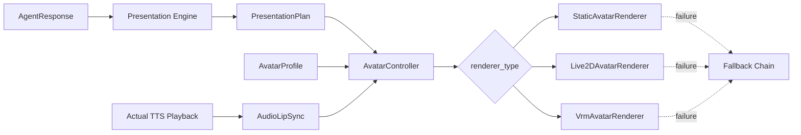

# Mio VRM / VRMA Avatar Renderer 设计

日期：2026-06-11

## 1. 决策摘要

Mio 将人物表现层设计为可插拔 Avatar Renderer，同时支持：

- `static`：静态透明立绘，作为首版和通用降级方案。
- `live2d`：适合二维角色和细腻面部表现。
- `vrm`：适合三维角色、VRMA 动作和后续桌面 Companion。

VRM 不替代 Live2D。两者共用 `AvatarProfile`、`PresentationPlan`、`AvatarEvent` 和 `AvatarRenderer` 契约，由 Companion 配置选择主渲染器。

根据 `design/decisions/2026-06-11-immersive-voice-call.md`，Web 端人物只在用户主动进入全屏语音通话后加载。普通聊天页不加载 Three.js、VRM 模型、Live2D SDK 或人物动作资源。

## 2. 目标与范围

### 2.1 目标

- 在不修改 Mio Core Agent 的前提下接入 VRM 3D 角色。
- 使用 VRMA 承载 `idle`、`thinking`、`greeting` 等身体动作。
- 使用 VRM Expression 承载表情、眨眼和基础嘴型。
- 保持静态立绘、Live2D 与 VRM 的表现语义一致。
- 人物加载或渲染失败时不阻断 ASR、TTS、字幕和 Conversation。
- 为后续 Electron 桌面 Companion 复用同一角色配置和动作映射。

### 2.2 本阶段不做

- 不把人物恢复到普通聊天页常驻显示。
- 不立即实现 WebRTC、VAD 或可打断实时通话。
- 不建设模型市场、在线模型编辑器或自动 VRM 生成流程。
- 不要求一套 VRMA 动作兼容所有非标准骨骼模型。
- 不将第三方动漫角色、模型或音色打包进 Public Demo。

## 3. 参考项目

### 3.1 后期重要参考

- 项目：[umikok7/roxy-agent](https://github.com/umikok7/roxy-agent)
- 调研日期：2026-06-11
- 重点参考：
  - React、Three.js 与 `@pixiv/three-vrm` 的 VRM 加载方式。
  - `@pixiv/three-vrm-animation` 加载 VRMA 并映射到 VRM 的方式。
  - 思考、环顾、害羞、生气、悲伤等动作状态切换。
  - TTS 播放期间驱动 VRM Expression 嘴型。
  - Electron 桌面角色与 Agent 状态事件的连接方式。

该项目是后期实现 VRM Renderer、动作播放和桌面 Companion 的重要工程参考，但不是 Mio 的代码或素材依赖。

### 3.2 授权边界

截至 2026-06-11：

- GitHub API 未识别该仓库许可证。
- 仓库根目录没有可读取的 `LICENSE` 文件。
- README 虽写有 MIT License，但不能据此推定其中 VRM、VRMA、语音、角色设定和动漫 IP 素材均可再分发。

因此 Mio 只参考公开架构与实现思路。任何代码复用都必须在引入时再次核对许可证；洛琪希相关 VRM、VRMA、语音、Persona 和其他角色素材不得默认提交到 Mio 仓库或随 Public Demo 发布。

个人自部署模式可以通过本地配置加载用户自行准备且有权使用的模型和音色。此类本地资产默认加入 Git 排除规则，不进入构建产物。

## 4. 总体架构



核心边界：

- Mio Core Agent 只输出抽象的情绪、策略和表现提示。
- Presentation Engine 只生成模型无关的表现计划。
- AvatarController 负责状态、事件顺序、冷却和 Renderer 生命周期。
- Renderer 只解释当前 AvatarProfile 中的具体资源映射。
- AudioLipSync 只读取实际播放的音频，不根据文本长度伪造嘴型。

## 5. 前端组件

```text
frontend/src/features/avatar/
  types.ts
  AvatarController.ts
  AvatarStage.tsx
  AudioLipSync.ts
  renderers/
    AvatarRenderer.ts
    StaticAvatarRenderer.ts
    Live2DAvatarRenderer.ts
    VrmAvatarRenderer.ts
  vrm/
    loadVrmModel.ts
    loadVrmaClip.ts
    VrmExpressionDriver.ts
    VrmMotionPlayer.ts
    VrmScene.ts

frontend/src/features/voice/
  VoiceCallPage.tsx
  VoiceCallControls.tsx
  VoiceSubtitle.tsx
  VoiceSession.ts
```

首版只需要实现 `StaticAvatarRenderer`。`Live2DAvatarRenderer` 和 `VrmAvatarRenderer` 在对应资源、依赖和许可证确认后分别加入，不要求同时完成。

## 6. AvatarRenderer 契约

```ts
interface AvatarRenderer {
  load(profile: AvatarProfile, host: HTMLElement): Promise<void>;
  setState(state: AvatarState): void;
  setExpression(key: string, weight?: number): void;
  playMotion(key: string, options?: MotionOptions): Promise<void>;
  setGaze(target: GazeTarget): void;
  setLipSync(value: number): void;
  resize(width: number, height: number, pixelRatio: number): void;
  dispose(): void;
}
```

约束：

- `load` 失败必须返回可识别错误，由 AvatarController 启动降级。
- `setExpression` 或 `playMotion` 找不到映射时回退到 `neutral` 或 `idle`，不得抛出导致通话结束的异常。
- `dispose` 必须停止动画帧、释放音频连接、纹理、材质、几何体、AnimationMixer 和 WebGL Renderer。
- Renderer 不直接请求 Agent、Memory、RAG 或 TTS Provider。

## 7. AvatarProfile

```json
{
  "id": "avatar_roxy_local",
  "companion_id": "companion_local",
  "renderer_type": "vrm",
  "model_uri": "/local-assets/characters/roxy/model.vrm",
  "model_version": "1",
  "license_metadata": {
    "source": "user_local_asset",
    "redistribution_allowed": false,
    "notes": "Personal self-hosted only"
  },
  "default_transform": {
    "scale": 1.0,
    "position": [0.18, -0.04, 0],
    "rotation": [0, 3.14159, 0]
  },
  "expression_map": {
    "neutral": "neutral",
    "quiet_happy": "happy",
    "soft_concern": "sad",
    "shy": "relaxed",
    "slightly_unhappy": "angry",
    "safety_neutral": "neutral"
  },
  "motion_map": {
    "idle": {"kind": "procedural"},
    "listening": {"kind": "vrma", "uri": "/local-assets/characters/roxy/listening.vrma"},
    "thinking": {"kind": "vrma", "uri": "/local-assets/characters/roxy/thinking.vrma"},
    "nod_small": {"kind": "vrma", "uri": "/local-assets/characters/roxy/nod-small.vrma"},
    "greeting": {"kind": "vrma", "uri": "/local-assets/characters/roxy/greeting.vrma"}
  },
  "parameter_map": {
    "blink": "blink",
    "mouth_aa": "aa",
    "mouth_oh": "oh"
  },
  "fallback_image_uri": "/assets/avatars/mio-static.png",
  "enabled": true
}
```

`model_uri` 和动作 URI 可以指向应用内已授权资源，也可以指向 Personal Self-hosted Mode 的本地资源服务。浏览器不得直接读取任意文件系统路径。

## 8. VRM 与 VRMA 映射

### 8.1 动作优先级

```text
safety override
  > voice session state
  > explicit one-shot motion
  > speaking posture
  > idle variation
```

- `thinking`、`listening` 可以循环或保持。
- `greeting`、`nod_small` 为一次性动作，结束后回到当前 Voice State 的基础动作。
- 一次只允许一个主身体动作具有完整权重。
- 动作切换使用短 Cross Fade，避免骨骼瞬移。
- 相同高辨识动作必须设置冷却时间。

### 8.2 表情

PresentationPlan 的表情键先通过 `expression_map` 转换为 VRM Expression 名称。模型缺少目标 Expression 时按以下顺序回退：

```text
requested expression
  -> neutral
  -> no expression override
```

表情权重与动作权重独立，避免 VRMA 动作覆盖面部状态。

### 8.3 待机动作

无需为所有细微表现准备 VRMA：

- 呼吸、轻微身体起伏可由程序生成。
- 眨眼使用随机间隔和短缓动。
- 视线可在 `listening` 时稳定朝向用户，在 `idle` 时低频偏移。
- 默认澪的动作幅度应克制，不能因使用 3D 模型而变成高频舞台表演。

## 9. 嘴型与音频同步

MVP 使用 Web Audio API 分析浏览器实际播放的 TTS 音频：

```text
Audio source
  -> AnalyserNode
  -> RMS / amplitude normalization
  -> attack and release smoothing
  -> AvatarController.setLipSync(value)
  -> VrmAvatarRenderer expression weights
```

VRM 首版使用 `aa` 为主、`oh` 为辅的振幅嘴型。模型不支持对应 Expression 时只播放音频，不将其视为 Voice Session 失败。

用户打断、静音、音频结束或播放失败时必须立即将嘴型平滑归零。后续可以增加音素或 viseme 驱动，但不属于首版。

## 10. 加载、性能与生命周期

### 10.1 按需加载

- 普通聊天页不得静态导入 Three.js、`@pixiv/three-vrm` 或模型文件。
- 进入 `VoiceCallPage` 后动态导入 `VrmAvatarRenderer`。
- 麦克风授权流程与模型加载可以并行，但模型加载失败不能影响授权和语音连接。
- 退出通话后释放 Renderer；短时间返回时是否缓存模型由后续性能测试决定。

### 10.2 初始性能预算

首版目标而非永久硬限制：

- Public Demo 主模型建议压缩后不超过 20 MB。
- 单个常用 VRMA 建议不超过 500 KB。
- 首屏先显示静态立绘，VRM 加载完成后再淡入替换。
- DPR 上限默认设为 2；低性能设备可降至 1。
- 移动端或 WebGL 不可用时直接使用静态立绘。
- 页面隐藏时降低或暂停渲染帧率。

### 10.3 资源清理

退出全屏通话或切换 AvatarProfile 时：

- 取消 `requestAnimationFrame`。
- 停止 AnimationMixer 和动作。
- 解除 ResizeObserver、事件订阅和音频节点。
- 释放 Geometry、Material、Texture 和 WebGLRenderer。
- 清理未完成的模型和动作加载结果。

## 11. 降级策略

降级顺序不以 Live2D 或 VRM 为固定第一项，而以当前 AvatarProfile 配置为准：

```text
configured renderer: vrm or live2d
  -> static transparent portrait
  -> circular avatar with ambient light
  -> voice and subtitles without avatar
```

降级触发条件：

- 浏览器不支持 WebGL。
- 模型、纹理或动作加载失败。
- WebGL Context 丢失且恢复失败。
- 设备性能或内存不足。
- AvatarProfile 被禁用或授权信息不满足当前部署模式。

降级必须记录 `PresentationTrace`，但不得结束 Voice Session。

## 12. 部署模式与资产策略

### Personal Self-hosted

- 允许配置本地 VRM、VRMA 和个人音色。
- 资源通过受限的本地静态资源端点提供，不开放任意路径读取。
- 用户负责确认个人资产的合法使用范围。
- 默认不提交 Git，不进入 Docker 公共镜像。

### Public Demo

- 只使用原创或明确允许再分发的模型、动作和音色。
- 构建阶段校验 `license_metadata.redistribution_allowed`。
- 可直接使用静态澪立绘作为稳定降级。

### Hosted Multi-user

- 后续增加模型上传扫描、配额、租户隔离、内容审核和删除流程。
- 不属于当前实现范围。

## 13. Trace

Avatar 和 VRM 相关 Trace 至少记录：

- `avatar_profile_id`
- `renderer_type`
- `model_version`
- `load_started_at`
- `load_duration_ms`
- `load_result`
- `fallback_level`
- `expression_key`
- `motion_key`
- `motion_asset`
- `webgl_context_lost`
- `dispose_duration_ms`

Trace 不记录模型二进制、完整本地文件路径或授权凭证。

## 14. 测试策略

### 单元测试

- PresentationPlan 到 AvatarProfile 映射。
- 缺失表情和动作时的回退。
- 过期 `sequence` 事件被忽略。
- 一次性动作结束后恢复 Voice State。
- 嘴型在音频结束和中断后归零。
- `dispose` 可重复调用且不抛异常。

### 组件测试

- `VoiceCallPage` 进入后才加载 Renderer。
- VRM 加载失败时切换静态立绘。
- 静态立绘失败时进入无人物模式。
- 结束通话后保留原 `conversation_id`。

### 浏览器测试

- Chrome 桌面端正常加载、缩放和释放 VRM。
- `390 x 844` 视口无横向滚动。
- 模拟 WebGL Context 丢失后降级。
- 慢速网络下先显示静态立绘，语音控制仍可使用。
- 多次进入和退出通话后无持续增加的 Canvas、AudioNode 或动画循环。

## 15. 分阶段实施

### Phase A：沉浸式通话静态闭环

- 移除普通聊天页常驻人物。
- 完成 `VoiceCallPage`、Mock Voice Session 和静态人物。
- 验证进入、退出、字幕、状态和原会话恢复。

### Phase B：Renderer 抽象

- 定义 AvatarProfile、AvatarRenderer 和 AvatarController。
- 完成 StaticAvatarRenderer、降级链和 Presentation Trace。
- 使用 Mock Presentation Event 验证动作语义。

### Phase C：VRM / VRMA

- 动态引入 Three.js、`@pixiv/three-vrm` 和 `@pixiv/three-vrm-animation`。
- 实现模型加载、VRMA 播放、Cross Fade、表情、眨眼和视线。
- 接入实际音频振幅嘴型。
- 完成性能和资源释放测试。

### Phase D：Live2D 与多角色

- 在依赖和模型授权明确后实现 Live2DAvatarRenderer。
- Persona Settings 允许选择已授权 AvatarProfile。
- 同一 PresentationPlan 在 Static、VRM 和 Live2D 上保持可接受表现。

### Phase E：桌面 Companion

- 在 Electron 中复用 VrmAvatarRenderer 和 AvatarProfile。
- 增加透明窗口、托盘、桌面动作与主动关怀事件。
- 保持桌面端仍调用同一个 Mio Core API。

## 16. 验收标准

- 普通聊天页不加载或显示 VRM、Live2D 和 AvatarStage。
- 全屏通话可以按 AvatarProfile 选择 Static、VRM 或 Live2D Renderer。
- VRM 可以执行最小状态动作、基础表情、眨眼和音频嘴型。
- VRMA 加载失败只影响对应动作，不影响人物待机和语音通话。
- Renderer 完全失败时按降级链继续字幕和语音。
- 退出通话后无残留渲染循环和音频节点。
- Public Demo 不包含授权不明的洛琪希模型、动作、语音或 Persona 素材。
- `umikok7/roxy-agent` 被保留为后期工程参考，并在真正复用代码前重新核对许可证。
